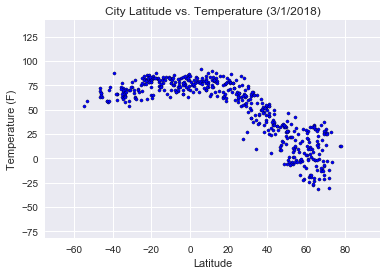
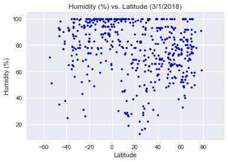
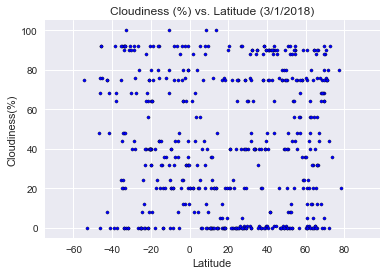
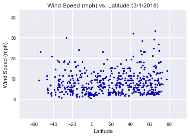

```python
# Steven Pham
# T-TH Class
# Unit 6 | Assignment - What's the Weather Like?
# 2018 March 1
```

# Analysis

- The higher the latitude, the lower the temperature gets. This is because each point higher is getting closer to the north pole, which gives it a downward curve pattern with increasing latitude.
    - Citipy relies on nearest city. Perhaps this is why there is a lack of southern cities to have a results from regions below -40. 


- Wind speeds are stable around 0-10 mphs among all latitude numbers. However, there is a clear pattern for outliers, as the outliers has a increasing pattern of higher wind speeds as latitude increases. 
    

- Humdity is concentratred heavily between 80-100% However, there are more outliers with lower humdities (in the lower 40% humdity range) around 0-25 latitude. 


```python
# Import Dependencies
import requests as req
import json
from citipy import citipy
from random import uniform
import pandas as pd
import csv
import matplotlib.pyplot as plt
import numpy as np
import pandas as pd
import os
import seaborn as sns
```


```python
# API config info
api_key = "2bfb4461629a2f57b3ed258345c343b9"

# Current weather data URL: 
# http://api.openweathermap.org/data/2.5/weather?q={city name},{country code}&appid=2bfb4461629a2f57b3ed258345c343b9
url = "http://api.openweathermap.org/data/2.5/weather?"
```


```python
# Functions for generating random latitude
def randLat():
   return uniform(-90, 90)

# Function for generating random longitude
def randLong():
   return uniform(-180,180)
```


```python
# Creating Dataframe
weather_data_df = pd.DataFrame(columns=["City","Country","Temperature (F)","Humidity (%)","Cloudiness(%)","Wind Speed (mph)", "Latitude"])

# Creating Query Counter
counter = 1


print("==========================")
print("Starting Data Retrieval")
print("==========================")


# Loop Summary:
# Loop will run and add data to weather dataframe and will end if length . 
# Each iteration of loop will drop duplicates (if any)
# The loop will continue until it reaches the limit

while len(weather_data_df) != 500:
        
    # grabbing city with random lat lng
    city = citipy.nearest_city(randLat(), randLong())

    # cleaning city - replacing spaces with +
    cleanCity = city.city_name.replace(" ", "+")

    # compiling and running URL and converting to JSON
    compile_URL = url + "appid=" + api_key + "&q=" + cleanCity + "," + city.country_code + "&units=imperial"
    weather_response = req.get(compile_URL)
    weather_json = weather_response.json()


    # Run this if loop only json returns a 200 (success code) 
    if weather_json["cod"] == 200:
    
        # add to weather DF
        weather_data_df = weather_data_df.append([{"City": weather_json["name"],
                                                   "Country": weather_json["sys"]["country"],
                                                   "Temperature (F)": weather_json["main"]["temp"],
                                                   "Humidity (%)": weather_json["main"]["humidity"],
                                                   "Cloudiness(%)": weather_json["clouds"]["all"],
                                                   "Wind Speed (mph)": weather_json["wind"]["speed"],
                                                   "Latitude": weather_json["coord"]["lat"]
                                                   }])
        # Outputting to console 
        print("Processing Query " +str(counter) +"    |    ID# " +str(weather_json["id"]) + "      City: " + str(weather_json["name"]))
        print(compile_URL)
    
        # Incrementing by 1 to count query in console 
        counter = counter + 1
        
        # Will drop any duplicates (and ensure loop will continue if there are dupes found)
        weather_data_df = weather_data_df.drop_duplicates(['City'])
    
        
print("==========================")
print("Data Processing Complete")
print("==========================")
```

    ==========================
    Starting Data Retrieval
    ==========================
    Processing Query 1    |    ID# 2108502      City: Honiara
    http://api.openweathermap.org/data/2.5/weather?appid=2bfb4461629a2f57b3ed258345c343b9&q=honiara,sb&units=imperial
    Processing Query 2    |    ID# 3874787      City: Punta Arenas
    http://api.openweathermap.org/data/2.5/weather?appid=2bfb4461629a2f57b3ed258345c343b9&q=punta+arenas,cl&units=imperial
    Processing Query 3    |    ID# 6320062      City: Vila Velha
    http://api.openweathermap.org/data/2.5/weather?appid=2bfb4461629a2f57b3ed258345c343b9&q=vila+velha,br&units=imperial
    Processing Query 4    |    ID# 3448454      City: Belmonte
    http://api.openweathermap.org/data/2.5/weather?appid=2bfb4461629a2f57b3ed258345c343b9&q=belmonte,br&units=imperial
    Processing Query 5    |    ID# 3833367      City: Ushuaia
    http://api.openweathermap.org/data/2.5/weather?appid=2bfb4461629a2f57b3ed258345c343b9&q=ushuaia,ar&units=imperial
    Processing Query 6    |    ID# 4252975      City: Barrow
    http://api.openweathermap.org/data/2.5/weather?appid=2bfb4461629a2f57b3ed258345c343b9&q=barrow,us&units=imperial
    Processing Query 7    |    ID# 2017155      City: Saskylakh
    http://api.openweathermap.org/data/2.5/weather?appid=2bfb4461629a2f57b3ed258345c343b9&q=saskylakh,ru&units=imperial
    Processing Query 8    |    ID# 3421319      City: Nuuk
    http://api.openweathermap.org/data/2.5/weather?appid=2bfb4461629a2f57b3ed258345c343b9&q=nuuk,gl&units=imperial
    Processing Query 9    |    ID# 3421719      City: Narsaq
    http://api.openweathermap.org/data/2.5/weather?appid=2bfb4461629a2f57b3ed258345c343b9&q=narsaq,gl&units=imperial
    Processing Query 10    |    ID# 1152202      City: Mae Ramat
    http://api.openweathermap.org/data/2.5/weather?appid=2bfb4461629a2f57b3ed258345c343b9&q=mae+ramat,th&units=imperial
    Processing Query 11    |    ID# 2021017      City: Kysyl-Syr
    http://api.openweathermap.org/data/2.5/weather?appid=2bfb4461629a2f57b3ed258345c343b9&q=kysyl-syr,ru&units=imperial
    Processing Query 12    |    ID# 4036284      City: Alofi
    http://api.openweathermap.org/data/2.5/weather?appid=2bfb4461629a2f57b3ed258345c343b9&q=alofi,nu&units=imperial
    Processing Query 13    |    ID# 2075265      City: Busselton
    http://api.openweathermap.org/data/2.5/weather?appid=2bfb4461629a2f57b3ed258345c343b9&q=busselton,au&units=imperial
    Processing Query 14    |    ID# 3874787      City: Punta Arenas
    http://api.openweathermap.org/data/2.5/weather?appid=2bfb4461629a2f57b3ed258345c343b9&q=punta+arenas,cl&units=imperial
    Processing Query 15    |    ID# 5096699      City: Clifton
    http://api.openweathermap.org/data/2.5/weather?appid=2bfb4461629a2f57b3ed258345c343b9&q=clifton,us&units=imperial
    Processing Query 16    |    ID# 3369157      City: Cape Town
    http://api.openweathermap.org/data/2.5/weather?appid=2bfb4461629a2f57b3ed258345c343b9&q=cape+town,za&units=imperial
    Processing Query 17    |    ID# 3652764      City: Puerto Ayora
    http://api.openweathermap.org/data/2.5/weather?appid=2bfb4461629a2f57b3ed258345c343b9&q=puerto+ayora,ec&units=imperial
    Processing Query 18    |    ID# 2015306      City: Tiksi
    http://api.openweathermap.org/data/2.5/weather?appid=2bfb4461629a2f57b3ed258345c343b9&q=tiksi,ru&units=imperial
    Processing Query 19    |    ID# 4030556      City: Rikitea
    http://api.openweathermap.org/data/2.5/weather?appid=2bfb4461629a2f57b3ed258345c343b9&q=rikitea,pf&units=imperial
    Processing Query 20    |    ID# 6067747      City: Matagami
    http://api.openweathermap.org/data/2.5/weather?appid=2bfb4461629a2f57b3ed258345c343b9&q=matagami,ca&units=imperial
    Processing Query 21    |    ID# 2063036      City: Port Lincoln
    http://api.openweathermap.org/data/2.5/weather?appid=2bfb4461629a2f57b3ed258345c343b9&q=port+lincoln,au&units=imperial
    Processing Query 22    |    ID# 4004293      City: Ixtapa
    http://api.openweathermap.org/data/2.5/weather?appid=2bfb4461629a2f57b3ed258345c343b9&q=ixtapa,mx&units=imperial
    Processing Query 23    |    ID# 1490256      City: Talnakh
    http://api.openweathermap.org/data/2.5/weather?appid=2bfb4461629a2f57b3ed258345c343b9&q=talnakh,ru&units=imperial
    Processing Query 24    |    ID# 2077963      City: Albany
    http://api.openweathermap.org/data/2.5/weather?appid=2bfb4461629a2f57b3ed258345c343b9&q=albany,au&units=imperial
    Processing Query 25    |    ID# 2123814      City: Leningradskiy
    http://api.openweathermap.org/data/2.5/weather?appid=2bfb4461629a2f57b3ed258345c343b9&q=leningradskiy,ru&units=imperial
    Processing Query 26    |    ID# 2077963      City: Albany
    http://api.openweathermap.org/data/2.5/weather?appid=2bfb4461629a2f57b3ed258345c343b9&q=albany,au&units=imperial
    Processing Query 27    |    ID# 6185377      City: Yellowknife
    http://api.openweathermap.org/data/2.5/weather?appid=2bfb4461629a2f57b3ed258345c343b9&q=yellowknife,ca&units=imperial
    Processing Query 28    |    ID# 3418910      City: Upernavik
    http://api.openweathermap.org/data/2.5/weather?appid=2bfb4461629a2f57b3ed258345c343b9&q=upernavik,gl&units=imperial
    Processing Query 29    |    ID# 5983607      City: Inuvik
    http://api.openweathermap.org/data/2.5/weather?appid=2bfb4461629a2f57b3ed258345c343b9&q=inuvik,ca&units=imperial
    Processing Query 30    |    ID# 4020109      City: Atuona
    http://api.openweathermap.org/data/2.5/weather?appid=2bfb4461629a2f57b3ed258345c343b9&q=atuona,pf&units=imperial
    Processing Query 31    |    ID# 2017155      City: Saskylakh
    http://api.openweathermap.org/data/2.5/weather?appid=2bfb4461629a2f57b3ed258345c343b9&q=saskylakh,ru&units=imperial
    Processing Query 32    |    ID# 1865309      City: Katsuura
    http://api.openweathermap.org/data/2.5/weather?appid=2bfb4461629a2f57b3ed258345c343b9&q=katsuura,jp&units=imperial
    Processing Query 33    |    ID# 5931800      City: Cranbrook
    http://api.openweathermap.org/data/2.5/weather?appid=2bfb4461629a2f57b3ed258345c343b9&q=cranbrook,ca&units=imperial
    Processing Query 34    |    ID# 4030556      City: Rikitea
    http://api.openweathermap.org/data/2.5/weather?appid=2bfb4461629a2f57b3ed258345c343b9&q=rikitea,pf&units=imperial
    Processing Query 35    |    ID# 5983720      City: Iqaluit
    http://api.openweathermap.org/data/2.5/weather?appid=2bfb4461629a2f57b3ed258345c343b9&q=iqaluit,ca&units=imperial
    Processing Query 36    |    ID# 3369157      City: Cape Town
    http://api.openweathermap.org/data/2.5/weather?appid=2bfb4461629a2f57b3ed258345c343b9&q=cape+town,za&units=imperial
    Processing Query 37    |    ID# 5848280      City: Kapaa
    http://api.openweathermap.org/data/2.5/weather?appid=2bfb4461629a2f57b3ed258345c343b9&q=kapaa,us&units=imperial
    Processing Query 38    |    ID# 3045190      City: Sopron
    http://api.openweathermap.org/data/2.5/weather?appid=2bfb4461629a2f57b3ed258345c343b9&q=sopron,hu&units=imperial
    Processing Query 39    |    ID# 1495586      City: Parabel
    http://api.openweathermap.org/data/2.5/weather?appid=2bfb4461629a2f57b3ed258345c343b9&q=parabel,ru&units=imperial
    Processing Query 40    |    ID# 3517970      City: Pochutla
    http://api.openweathermap.org/data/2.5/weather?appid=2bfb4461629a2f57b3ed258345c343b9&q=pochutla,mx&units=imperial
    Processing Query 41    |    ID# 3831208      City: Qaanaaq
    http://api.openweathermap.org/data/2.5/weather?appid=2bfb4461629a2f57b3ed258345c343b9&q=qaanaaq,gl&units=imperial
    Processing Query 42    |    ID# 4020109      City: Atuona
    http://api.openweathermap.org/data/2.5/weather?appid=2bfb4461629a2f57b3ed258345c343b9&q=atuona,pf&units=imperial
    Processing Query 43    |    ID# 1006984      City: East London
    http://api.openweathermap.org/data/2.5/weather?appid=2bfb4461629a2f57b3ed258345c343b9&q=east+london,za&units=imperial
    Processing Query 44    |    ID# 777019      City: Vardo
    http://api.openweathermap.org/data/2.5/weather?appid=2bfb4461629a2f57b3ed258345c343b9&q=vardo,no&units=imperial
    Processing Query 45    |    ID# 935215      City: Saint-Philippe
    http://api.openweathermap.org/data/2.5/weather?appid=2bfb4461629a2f57b3ed258345c343b9&q=saint-philippe,re&units=imperial
    Processing Query 46    |    ID# 2236967      City: Soyo
    http://api.openweathermap.org/data/2.5/weather?appid=2bfb4461629a2f57b3ed258345c343b9&q=soyo,ao&units=imperial
    Processing Query 47    |    ID# 3671450      City: Inirida
    http://api.openweathermap.org/data/2.5/weather?appid=2bfb4461629a2f57b3ed258345c343b9&q=inirida,co&units=imperial
    Processing Query 48    |    ID# 2077963      City: Albany
    http://api.openweathermap.org/data/2.5/weather?appid=2bfb4461629a2f57b3ed258345c343b9&q=albany,au&units=imperial
    Processing Query 49    |    ID# 2071860      City: Esperance
    http://api.openweathermap.org/data/2.5/weather?appid=2bfb4461629a2f57b3ed258345c343b9&q=esperance,au&units=imperial
    Processing Query 50    |    ID# 934322      City: Mahebourg
    http://api.openweathermap.org/data/2.5/weather?appid=2bfb4461629a2f57b3ed258345c343b9&q=mahebourg,mu&units=imperial
    Processing Query 51    |    ID# 4252975      City: Barrow
    http://api.openweathermap.org/data/2.5/weather?appid=2bfb4461629a2f57b3ed258345c343b9&q=barrow,us&units=imperial
    Processing Query 52    |    ID# 931755      City: Blantyre
    http://api.openweathermap.org/data/2.5/weather?appid=2bfb4461629a2f57b3ed258345c343b9&q=blantyre,mw&units=imperial
    Processing Query 53    |    ID# 6180550      City: Whitehorse
    http://api.openweathermap.org/data/2.5/weather?appid=2bfb4461629a2f57b3ed258345c343b9&q=whitehorse,ca&units=imperial
    Processing Query 54    |    ID# 1040938      City: Manjacaze
    http://api.openweathermap.org/data/2.5/weather?appid=2bfb4461629a2f57b3ed258345c343b9&q=manjacaze,mz&units=imperial
    Processing Query 55    |    ID# 3533462      City: Acapulco
    http://api.openweathermap.org/data/2.5/weather?appid=2bfb4461629a2f57b3ed258345c343b9&q=acapulco,mx&units=imperial
    Processing Query 56    |    ID# 2618795      City: Klaksvik
    http://api.openweathermap.org/data/2.5/weather?appid=2bfb4461629a2f57b3ed258345c343b9&q=klaksvik,fo&units=imperial
    Processing Query 57    |    ID# 2138555      City: Poum
    http://api.openweathermap.org/data/2.5/weather?appid=2bfb4461629a2f57b3ed258345c343b9&q=poum,nc&units=imperial
    Processing Query 58    |    ID# 4020109      City: Atuona
    http://api.openweathermap.org/data/2.5/weather?appid=2bfb4461629a2f57b3ed258345c343b9&q=atuona,pf&units=imperial
    Processing Query 59    |    ID# 3675504      City: Manaure
    http://api.openweathermap.org/data/2.5/weather?appid=2bfb4461629a2f57b3ed258345c343b9&q=manaure,co&units=imperial
    Processing Query 60    |    ID# 964432      City: Port Alfred
    http://api.openweathermap.org/data/2.5/weather?appid=2bfb4461629a2f57b3ed258345c343b9&q=port+alfred,za&units=imperial
    Processing Query 61    |    ID# 1651461      City: Amuntai
    http://api.openweathermap.org/data/2.5/weather?appid=2bfb4461629a2f57b3ed258345c343b9&q=amuntai,id&units=imperial
    Processing Query 62    |    ID# 3665098      City: Barcelos
    http://api.openweathermap.org/data/2.5/weather?appid=2bfb4461629a2f57b3ed258345c343b9&q=barcelos,br&units=imperial
    Processing Query 63    |    ID# 2139521      City: Noumea
    http://api.openweathermap.org/data/2.5/weather?appid=2bfb4461629a2f57b3ed258345c343b9&q=noumea,nc&units=imperial
    Processing Query 64    |    ID# 1244926      City: Hambantota
    http://api.openweathermap.org/data/2.5/weather?appid=2bfb4461629a2f57b3ed258345c343b9&q=hambantota,lk&units=imperial
    Processing Query 65    |    ID# 5924351      City: Clyde River
    http://api.openweathermap.org/data/2.5/weather?appid=2bfb4461629a2f57b3ed258345c343b9&q=clyde+river,ca&units=imperial
    Processing Query 66    |    ID# 1256117      City: Sinor
    http://api.openweathermap.org/data/2.5/weather?appid=2bfb4461629a2f57b3ed258345c343b9&q=sinor,in&units=imperial
    Processing Query 67    |    ID# 3831208      City: Qaanaaq
    http://api.openweathermap.org/data/2.5/weather?appid=2bfb4461629a2f57b3ed258345c343b9&q=qaanaaq,gl&units=imperial
    Processing Query 68    |    ID# 2022572      City: Khatanga
    http://api.openweathermap.org/data/2.5/weather?appid=2bfb4461629a2f57b3ed258345c343b9&q=khatanga,ru&units=imperial
    Processing Query 69    |    ID# 4020109      City: Atuona
    http://api.openweathermap.org/data/2.5/weather?appid=2bfb4461629a2f57b3ed258345c343b9&q=atuona,pf&units=imperial
    Processing Query 70    |    ID# 3370903      City: Jamestown
    http://api.openweathermap.org/data/2.5/weather?appid=2bfb4461629a2f57b3ed258345c343b9&q=jamestown,sh&units=imperial
    Processing Query 71    |    ID# 3896218      City: Castro
    http://api.openweathermap.org/data/2.5/weather?appid=2bfb4461629a2f57b3ed258345c343b9&q=castro,cl&units=imperial
    Processing Query 72    |    ID# 6185377      City: Yellowknife
    http://api.openweathermap.org/data/2.5/weather?appid=2bfb4461629a2f57b3ed258345c343b9&q=yellowknife,ca&units=imperial
    Processing Query 73    |    ID# 2121385      City: Severo-Kurilsk
    http://api.openweathermap.org/data/2.5/weather?appid=2bfb4461629a2f57b3ed258345c343b9&q=severo-kurilsk,ru&units=imperial
    Processing Query 74    |    ID# 3166350      City: Sorrento
    http://api.openweathermap.org/data/2.5/weather?appid=2bfb4461629a2f57b3ed258345c343b9&q=sorrento,it&units=imperial
    Processing Query 75    |    ID# 5563397      City: Eureka
    http://api.openweathermap.org/data/2.5/weather?appid=2bfb4461629a2f57b3ed258345c343b9&q=eureka,us&units=imperial
    Processing Query 76    |    ID# 2022572      City: Khatanga
    http://api.openweathermap.org/data/2.5/weather?appid=2bfb4461629a2f57b3ed258345c343b9&q=khatanga,ru&units=imperial
    Processing Query 77    |    ID# 517111      City: Novyye Lyady
    http://api.openweathermap.org/data/2.5/weather?appid=2bfb4461629a2f57b3ed258345c343b9&q=novyye+lyady,ru&units=imperial
    Processing Query 78    |    ID# 5848280      City: Kapaa
    http://api.openweathermap.org/data/2.5/weather?appid=2bfb4461629a2f57b3ed258345c343b9&q=kapaa,us&units=imperial
    Processing Query 79    |    ID# 4032243      City: Vaini
    http://api.openweathermap.org/data/2.5/weather?appid=2bfb4461629a2f57b3ed258345c343b9&q=vaini,to&units=imperial
    Processing Query 80    |    ID# 2169068      City: Deniliquin
    http://api.openweathermap.org/data/2.5/weather?appid=2bfb4461629a2f57b3ed258345c343b9&q=deniliquin,au&units=imperial
    Processing Query 81    |    ID# 6111862      City: Port Hardy
    http://api.openweathermap.org/data/2.5/weather?appid=2bfb4461629a2f57b3ed258345c343b9&q=port+hardy,ca&units=imperial
    Processing Query 82    |    ID# 1214488      City: Meulaboh
    http://api.openweathermap.org/data/2.5/weather?appid=2bfb4461629a2f57b3ed258345c343b9&q=meulaboh,id&units=imperial
    Processing Query 83    |    ID# 3369157      City: Cape Town
    http://api.openweathermap.org/data/2.5/weather?appid=2bfb4461629a2f57b3ed258345c343b9&q=cape+town,za&units=imperial
    Processing Query 84    |    ID# 1282256      City: Hithadhoo
    http://api.openweathermap.org/data/2.5/weather?appid=2bfb4461629a2f57b3ed258345c343b9&q=hithadhoo,mv&units=imperial
    Processing Query 85    |    ID# 4407665      City: Kodiak
    http://api.openweathermap.org/data/2.5/weather?appid=2bfb4461629a2f57b3ed258345c343b9&q=kodiak,us&units=imperial
    Processing Query 86    |    ID# 3874787      City: Punta Arenas
    http://api.openweathermap.org/data/2.5/weather?appid=2bfb4461629a2f57b3ed258345c343b9&q=punta+arenas,cl&units=imperial
    Processing Query 87    |    ID# 525426      City: Sobolevo
    http://api.openweathermap.org/data/2.5/weather?appid=2bfb4461629a2f57b3ed258345c343b9&q=sobolevo,ru&units=imperial
    Processing Query 88    |    ID# 2155415      City: New Norfolk
    http://api.openweathermap.org/data/2.5/weather?appid=2bfb4461629a2f57b3ed258345c343b9&q=new+norfolk,au&units=imperial
    Processing Query 89    |    ID# 3115824      City: Muros
    http://api.openweathermap.org/data/2.5/weather?appid=2bfb4461629a2f57b3ed258345c343b9&q=muros,es&units=imperial
    Processing Query 90    |    ID# 3667070      City: Timbiqui
    http://api.openweathermap.org/data/2.5/weather?appid=2bfb4461629a2f57b3ed258345c343b9&q=timbiqui,co&units=imperial
    Processing Query 91    |    ID# 3374346      City: Ponta do Sol
    http://api.openweathermap.org/data/2.5/weather?appid=2bfb4461629a2f57b3ed258345c343b9&q=ponta+do+sol,cv&units=imperial
    Processing Query 92    |    ID# 3109718      City: Santander
    http://api.openweathermap.org/data/2.5/weather?appid=2bfb4461629a2f57b3ed258345c343b9&q=santander,es&units=imperial
    Processing Query 93    |    ID# 5855927      City: Hilo
    http://api.openweathermap.org/data/2.5/weather?appid=2bfb4461629a2f57b3ed258345c343b9&q=hilo,us&units=imperial
    Processing Query 94    |    ID# 6144312      City: Sept-Iles
    http://api.openweathermap.org/data/2.5/weather?appid=2bfb4461629a2f57b3ed258345c343b9&q=sept-iles,ca&units=imperial
    Processing Query 95    |    ID# 6165406      City: Thompson
    http://api.openweathermap.org/data/2.5/weather?appid=2bfb4461629a2f57b3ed258345c343b9&q=thompson,ca&units=imperial
    Processing Query 96    |    ID# 4235193      City: Carbondale
    http://api.openweathermap.org/data/2.5/weather?appid=2bfb4461629a2f57b3ed258345c343b9&q=carbondale,us&units=imperial
    Processing Query 97    |    ID# 2112802      City: Hasaki
    http://api.openweathermap.org/data/2.5/weather?appid=2bfb4461629a2f57b3ed258345c343b9&q=hasaki,jp&units=imperial
    Processing Query 98    |    ID# 546105      City: Nikolskoye
    http://api.openweathermap.org/data/2.5/weather?appid=2bfb4461629a2f57b3ed258345c343b9&q=nikolskoye,ru&units=imperial
    Processing Query 99    |    ID# 4020109      City: Atuona
    http://api.openweathermap.org/data/2.5/weather?appid=2bfb4461629a2f57b3ed258345c343b9&q=atuona,pf&units=imperial
    Processing Query 100    |    ID# 3698359      City: Chicama
    http://api.openweathermap.org/data/2.5/weather?appid=2bfb4461629a2f57b3ed258345c343b9&q=chicama,pe&units=imperial
    Processing Query 101    |    ID# 3347019      City: Namibe
    http://api.openweathermap.org/data/2.5/weather?appid=2bfb4461629a2f57b3ed258345c343b9&q=namibe,ao&units=imperial
    Processing Query 102    |    ID# 1015776      City: Bredasdorp
    http://api.openweathermap.org/data/2.5/weather?appid=2bfb4461629a2f57b3ed258345c343b9&q=bredasdorp,za&units=imperial
    Processing Query 103    |    ID# 2448085      City: Agadez
    http://api.openweathermap.org/data/2.5/weather?appid=2bfb4461629a2f57b3ed258345c343b9&q=agadez,ne&units=imperial
    Processing Query 104    |    ID# 1731248      City: Alugan
    http://api.openweathermap.org/data/2.5/weather?appid=2bfb4461629a2f57b3ed258345c343b9&q=alugan,ph&units=imperial
    Processing Query 105    |    ID# 2335204      City: Kano
    http://api.openweathermap.org/data/2.5/weather?appid=2bfb4461629a2f57b3ed258345c343b9&q=kano,ng&units=imperial
    Processing Query 106    |    ID# 4035715      City: Avarua
    http://api.openweathermap.org/data/2.5/weather?appid=2bfb4461629a2f57b3ed258345c343b9&q=avarua,ck&units=imperial
    Processing Query 107    |    ID# 2317765      City: Zaria
    http://api.openweathermap.org/data/2.5/weather?appid=2bfb4461629a2f57b3ed258345c343b9&q=zaria,ng&units=imperial
    Processing Query 108    |    ID# 5847411      City: Kahului
    http://api.openweathermap.org/data/2.5/weather?appid=2bfb4461629a2f57b3ed258345c343b9&q=kahului,us&units=imperial
    Processing Query 109    |    ID# 3896218      City: Castro
    http://api.openweathermap.org/data/2.5/weather?appid=2bfb4461629a2f57b3ed258345c343b9&q=castro,cl&units=imperial
    Processing Query 110    |    ID# 286245      City: Sur
    http://api.openweathermap.org/data/2.5/weather?appid=2bfb4461629a2f57b3ed258345c343b9&q=sur,om&units=imperial
    Processing Query 111    |    ID# 245669      City: Adre
    http://api.openweathermap.org/data/2.5/weather?appid=2bfb4461629a2f57b3ed258345c343b9&q=adre,td&units=imperial
    Processing Query 112    |    ID# 2163355      City: Hobart
    http://api.openweathermap.org/data/2.5/weather?appid=2bfb4461629a2f57b3ed258345c343b9&q=hobart,au&units=imperial
    Processing Query 113    |    ID# 2075265      City: Busselton
    http://api.openweathermap.org/data/2.5/weather?appid=2bfb4461629a2f57b3ed258345c343b9&q=busselton,au&units=imperial
    Processing Query 114    |    ID# 1015776      City: Bredasdorp
    http://api.openweathermap.org/data/2.5/weather?appid=2bfb4461629a2f57b3ed258345c343b9&q=bredasdorp,za&units=imperial
    Processing Query 115    |    ID# 2155415      City: New Norfolk
    http://api.openweathermap.org/data/2.5/weather?appid=2bfb4461629a2f57b3ed258345c343b9&q=new+norfolk,au&units=imperial
    Processing Query 116    |    ID# 964420      City: Port Elizabeth
    http://api.openweathermap.org/data/2.5/weather?appid=2bfb4461629a2f57b3ed258345c343b9&q=port+elizabeth,za&units=imperial
    Processing Query 117    |    ID# 5855927      City: Hilo
    http://api.openweathermap.org/data/2.5/weather?appid=2bfb4461629a2f57b3ed258345c343b9&q=hilo,us&units=imperial
    Processing Query 118    |    ID# 4030556      City: Rikitea
    http://api.openweathermap.org/data/2.5/weather?appid=2bfb4461629a2f57b3ed258345c343b9&q=rikitea,pf&units=imperial
    Processing Query 119    |    ID# 3874787      City: Punta Arenas
    http://api.openweathermap.org/data/2.5/weather?appid=2bfb4461629a2f57b3ed258345c343b9&q=punta+arenas,cl&units=imperial
    Processing Query 120    |    ID# 3663529      City: Manacapuru
    http://api.openweathermap.org/data/2.5/weather?appid=2bfb4461629a2f57b3ed258345c343b9&q=manacapuru,br&units=imperial
    Processing Query 121    |    ID# 2163355      City: Hobart
    http://api.openweathermap.org/data/2.5/weather?appid=2bfb4461629a2f57b3ed258345c343b9&q=hobart,au&units=imperial
    Processing Query 122    |    ID# 4035715      City: Avarua
    http://api.openweathermap.org/data/2.5/weather?appid=2bfb4461629a2f57b3ed258345c343b9&q=avarua,ck&units=imperial
    Processing Query 123    |    ID# 2075265      City: Busselton
    http://api.openweathermap.org/data/2.5/weather?appid=2bfb4461629a2f57b3ed258345c343b9&q=busselton,au&units=imperial
    Processing Query 124    |    ID# 3466165      City: Cidreira
    http://api.openweathermap.org/data/2.5/weather?appid=2bfb4461629a2f57b3ed258345c343b9&q=cidreira,br&units=imperial
    Processing Query 125    |    ID# 5367788      City: Lompoc
    http://api.openweathermap.org/data/2.5/weather?appid=2bfb4461629a2f57b3ed258345c343b9&q=lompoc,us&units=imperial
    Processing Query 126    |    ID# 3833367      City: Ushuaia
    http://api.openweathermap.org/data/2.5/weather?appid=2bfb4461629a2f57b3ed258345c343b9&q=ushuaia,ar&units=imperial
    Processing Query 127    |    ID# 2075265      City: Busselton
    http://api.openweathermap.org/data/2.5/weather?appid=2bfb4461629a2f57b3ed258345c343b9&q=busselton,au&units=imperial
    Processing Query 128    |    ID# 2618795      City: Klaksvik
    http://api.openweathermap.org/data/2.5/weather?appid=2bfb4461629a2f57b3ed258345c343b9&q=klaksvik,fo&units=imperial
    Processing Query 129    |    ID# 2411397      City: Georgetown
    http://api.openweathermap.org/data/2.5/weather?appid=2bfb4461629a2f57b3ed258345c343b9&q=georgetown,sh&units=imperial
    Processing Query 130    |    ID# 3883457      City: Lebu
    http://api.openweathermap.org/data/2.5/weather?appid=2bfb4461629a2f57b3ed258345c343b9&q=lebu,cl&units=imperial
    Processing Query 131    |    ID# 1490256      City: Talnakh
    http://api.openweathermap.org/data/2.5/weather?appid=2bfb4461629a2f57b3ed258345c343b9&q=talnakh,ru&units=imperial
    Processing Query 132    |    ID# 3831208      City: Qaanaaq
    http://api.openweathermap.org/data/2.5/weather?appid=2bfb4461629a2f57b3ed258345c343b9&q=qaanaaq,gl&units=imperial
    Processing Query 133    |    ID# 1282256      City: Hithadhoo
    http://api.openweathermap.org/data/2.5/weather?appid=2bfb4461629a2f57b3ed258345c343b9&q=hithadhoo,mv&units=imperial
    Processing Query 134    |    ID# 2152659      City: Port Macquarie
    http://api.openweathermap.org/data/2.5/weather?appid=2bfb4461629a2f57b3ed258345c343b9&q=port+macquarie,au&units=imperial
    Processing Query 135    |    ID# 2075265      City: Busselton
    http://api.openweathermap.org/data/2.5/weather?appid=2bfb4461629a2f57b3ed258345c343b9&q=busselton,au&units=imperial
    Processing Query 136    |    ID# 863061      City: Usinsk
    http://api.openweathermap.org/data/2.5/weather?appid=2bfb4461629a2f57b3ed258345c343b9&q=usinsk,ru&units=imperial
    Processing Query 137    |    ID# 1128239      City: Rudbar
    http://api.openweathermap.org/data/2.5/weather?appid=2bfb4461629a2f57b3ed258345c343b9&q=rudbar,af&units=imperial
    Processing Query 138    |    ID# 1850144      City: Nishihara
    http://api.openweathermap.org/data/2.5/weather?appid=2bfb4461629a2f57b3ed258345c343b9&q=nishihara,jp&units=imperial
    Processing Query 139    |    ID# 3899695      City: Ancud
    http://api.openweathermap.org/data/2.5/weather?appid=2bfb4461629a2f57b3ed258345c343b9&q=ancud,cl&units=imperial
    Processing Query 140    |    ID# 4020109      City: Atuona
    http://api.openweathermap.org/data/2.5/weather?appid=2bfb4461629a2f57b3ed258345c343b9&q=atuona,pf&units=imperial
    Processing Query 141    |    ID# 3355672      City: Luderitz
    http://api.openweathermap.org/data/2.5/weather?appid=2bfb4461629a2f57b3ed258345c343b9&q=luderitz,na&units=imperial
    Processing Query 142    |    ID# 4470244      City: Havelock
    http://api.openweathermap.org/data/2.5/weather?appid=2bfb4461629a2f57b3ed258345c343b9&q=havelock,us&units=imperial
    Processing Query 143    |    ID# 2077963      City: Albany
    http://api.openweathermap.org/data/2.5/weather?appid=2bfb4461629a2f57b3ed258345c343b9&q=albany,au&units=imperial
    Processing Query 144    |    ID# 107304      City: Buraydah
    http://api.openweathermap.org/data/2.5/weather?appid=2bfb4461629a2f57b3ed258345c343b9&q=buraydah,sa&units=imperial
    Processing Query 145    |    ID# 2075265      City: Busselton
    http://api.openweathermap.org/data/2.5/weather?appid=2bfb4461629a2f57b3ed258345c343b9&q=busselton,au&units=imperial
    Processing Query 146    |    ID# 3833367      City: Ushuaia
    http://api.openweathermap.org/data/2.5/weather?appid=2bfb4461629a2f57b3ed258345c343b9&q=ushuaia,ar&units=imperial
    Processing Query 147    |    ID# 3652567      City: San Cristobal
    http://api.openweathermap.org/data/2.5/weather?appid=2bfb4461629a2f57b3ed258345c343b9&q=san+cristobal,ec&units=imperial
    Processing Query 148    |    ID# 2077963      City: Albany
    http://api.openweathermap.org/data/2.5/weather?appid=2bfb4461629a2f57b3ed258345c343b9&q=albany,au&units=imperial
    Processing Query 149    |    ID# 5855927      City: Hilo
    http://api.openweathermap.org/data/2.5/weather?appid=2bfb4461629a2f57b3ed258345c343b9&q=hilo,us&units=imperial
    Processing Query 150    |    ID# 1685422      City: Sulangan
    http://api.openweathermap.org/data/2.5/weather?appid=2bfb4461629a2f57b3ed258345c343b9&q=sulangan,ph&units=imperial
    Processing Query 151    |    ID# 5367788      City: Lompoc
    http://api.openweathermap.org/data/2.5/weather?appid=2bfb4461629a2f57b3ed258345c343b9&q=lompoc,us&units=imperial
    Processing Query 152    |    ID# 53654      City: Mogadishu
    http://api.openweathermap.org/data/2.5/weather?appid=2bfb4461629a2f57b3ed258345c343b9&q=mogadishu,so&units=imperial
    Processing Query 153    |    ID# 986717      City: Kruisfontein
    http://api.openweathermap.org/data/2.5/weather?appid=2bfb4461629a2f57b3ed258345c343b9&q=kruisfontein,za&units=imperial
    Processing Query 154    |    ID# 3443061      City: Chuy
    http://api.openweathermap.org/data/2.5/weather?appid=2bfb4461629a2f57b3ed258345c343b9&q=chuy,uy&units=imperial
    Processing Query 155    |    ID# 1529484      City: Hami
    http://api.openweathermap.org/data/2.5/weather?appid=2bfb4461629a2f57b3ed258345c343b9&q=hami,cn&units=imperial
    Processing Query 156    |    ID# 2121385      City: Severo-Kurilsk
    http://api.openweathermap.org/data/2.5/weather?appid=2bfb4461629a2f57b3ed258345c343b9&q=severo-kurilsk,ru&units=imperial
    Processing Query 157    |    ID# 777682      City: Skjervoy
    http://api.openweathermap.org/data/2.5/weather?appid=2bfb4461629a2f57b3ed258345c343b9&q=skjervoy,no&units=imperial
    Processing Query 158    |    ID# 3369157      City: Cape Town
    http://api.openweathermap.org/data/2.5/weather?appid=2bfb4461629a2f57b3ed258345c343b9&q=cape+town,za&units=imperial
    Processing Query 159    |    ID# 6185377      City: Yellowknife
    http://api.openweathermap.org/data/2.5/weather?appid=2bfb4461629a2f57b3ed258345c343b9&q=yellowknife,ca&units=imperial
    Processing Query 160    |    ID# 3874787      City: Punta Arenas
    http://api.openweathermap.org/data/2.5/weather?appid=2bfb4461629a2f57b3ed258345c343b9&q=punta+arenas,cl&units=imperial
    Processing Query 161    |    ID# 3361934      City: Saldanha
    http://api.openweathermap.org/data/2.5/weather?appid=2bfb4461629a2f57b3ed258345c343b9&q=saldanha,za&units=imperial
    Processing Query 162    |    ID# 3366880      City: Hermanus
    http://api.openweathermap.org/data/2.5/weather?appid=2bfb4461629a2f57b3ed258345c343b9&q=hermanus,za&units=imperial
    Processing Query 163    |    ID# 2126123      City: Chokurdakh
    http://api.openweathermap.org/data/2.5/weather?appid=2bfb4461629a2f57b3ed258345c343b9&q=chokurdakh,ru&units=imperial
    Processing Query 164    |    ID# 3351014      City: Camacupa
    http://api.openweathermap.org/data/2.5/weather?appid=2bfb4461629a2f57b3ed258345c343b9&q=camacupa,ao&units=imperial
    Processing Query 165    |    ID# 553725      City: Kamenka
    http://api.openweathermap.org/data/2.5/weather?appid=2bfb4461629a2f57b3ed258345c343b9&q=kamenka,ru&units=imperial
    Processing Query 166    |    ID# 2122783      City: Katangli
    http://api.openweathermap.org/data/2.5/weather?appid=2bfb4461629a2f57b3ed258345c343b9&q=katangli,ru&units=imperial
    Processing Query 167    |    ID# 1865309      City: Katsuura
    http://api.openweathermap.org/data/2.5/weather?appid=2bfb4461629a2f57b3ed258345c343b9&q=katsuura,jp&units=imperial
    Processing Query 168    |    ID# 934649      City: Cap Malheureux
    http://api.openweathermap.org/data/2.5/weather?appid=2bfb4461629a2f57b3ed258345c343b9&q=cap+malheureux,mu&units=imperial
    Processing Query 169    |    ID# 4407665      City: Kodiak
    http://api.openweathermap.org/data/2.5/weather?appid=2bfb4461629a2f57b3ed258345c343b9&q=kodiak,us&units=imperial
    Processing Query 170    |    ID# 2156643      City: Mount Gambier
    http://api.openweathermap.org/data/2.5/weather?appid=2bfb4461629a2f57b3ed258345c343b9&q=mount+gambier,au&units=imperial
    Processing Query 171    |    ID# 4407665      City: Kodiak
    http://api.openweathermap.org/data/2.5/weather?appid=2bfb4461629a2f57b3ed258345c343b9&q=kodiak,us&units=imperial
    Processing Query 172    |    ID# 2015306      City: Tiksi
    http://api.openweathermap.org/data/2.5/weather?appid=2bfb4461629a2f57b3ed258345c343b9&q=tiksi,ru&units=imperial
    Processing Query 173    |    ID# 1282256      City: Hithadhoo
    http://api.openweathermap.org/data/2.5/weather?appid=2bfb4461629a2f57b3ed258345c343b9&q=hithadhoo,mv&units=imperial
    Processing Query 174    |    ID# 3833367      City: Ushuaia
    http://api.openweathermap.org/data/2.5/weather?appid=2bfb4461629a2f57b3ed258345c343b9&q=ushuaia,ar&units=imperial
    Processing Query 175    |    ID# 2122090      City: Pevek
    http://api.openweathermap.org/data/2.5/weather?appid=2bfb4461629a2f57b3ed258345c343b9&q=pevek,ru&units=imperial
    Processing Query 176    |    ID# 2110227      City: Butaritari
    http://api.openweathermap.org/data/2.5/weather?appid=2bfb4461629a2f57b3ed258345c343b9&q=butaritari,ki&units=imperial
    Processing Query 177    |    ID# 3833367      City: Ushuaia
    http://api.openweathermap.org/data/2.5/weather?appid=2bfb4461629a2f57b3ed258345c343b9&q=ushuaia,ar&units=imperial
    Processing Query 178    |    ID# 2075265      City: Busselton
    http://api.openweathermap.org/data/2.5/weather?appid=2bfb4461629a2f57b3ed258345c343b9&q=busselton,au&units=imperial
    Processing Query 179    |    ID# 1282256      City: Hithadhoo
    http://api.openweathermap.org/data/2.5/weather?appid=2bfb4461629a2f57b3ed258345c343b9&q=hithadhoo,mv&units=imperial
    Processing Query 180    |    ID# 6170031      City: Tuktoyaktuk
    http://api.openweathermap.org/data/2.5/weather?appid=2bfb4461629a2f57b3ed258345c343b9&q=tuktoyaktuk,ca&units=imperial
    Processing Query 181    |    ID# 1505579      City: Inta
    http://api.openweathermap.org/data/2.5/weather?appid=2bfb4461629a2f57b3ed258345c343b9&q=inta,ru&units=imperial
    Processing Query 182    |    ID# 3831208      City: Qaanaaq
    http://api.openweathermap.org/data/2.5/weather?appid=2bfb4461629a2f57b3ed258345c343b9&q=qaanaaq,gl&units=imperial
    Processing Query 183    |    ID# 3374210      City: Sao Filipe
    http://api.openweathermap.org/data/2.5/weather?appid=2bfb4461629a2f57b3ed258345c343b9&q=sao+filipe,cv&units=imperial
    Processing Query 184    |    ID# 778707      City: Mehamn
    http://api.openweathermap.org/data/2.5/weather?appid=2bfb4461629a2f57b3ed258345c343b9&q=mehamn,no&units=imperial
    Processing Query 185    |    ID# 5849297      City: Kihei
    http://api.openweathermap.org/data/2.5/weather?appid=2bfb4461629a2f57b3ed258345c343b9&q=kihei,us&units=imperial
    Processing Query 186    |    ID# 1626703      City: Soe
    http://api.openweathermap.org/data/2.5/weather?appid=2bfb4461629a2f57b3ed258345c343b9&q=soe,id&units=imperial
    Processing Query 187    |    ID# 1797132      City: Rizhao
    http://api.openweathermap.org/data/2.5/weather?appid=2bfb4461629a2f57b3ed258345c343b9&q=rizhao,cn&units=imperial
    Processing Query 188    |    ID# 1106677      City: Bambous Virieux
    http://api.openweathermap.org/data/2.5/weather?appid=2bfb4461629a2f57b3ed258345c343b9&q=bambous+virieux,mu&units=imperial
    Processing Query 189    |    ID# 4020109      City: Atuona
    http://api.openweathermap.org/data/2.5/weather?appid=2bfb4461629a2f57b3ed258345c343b9&q=atuona,pf&units=imperial
    Processing Query 190    |    ID# 610529      City: Atyrau
    http://api.openweathermap.org/data/2.5/weather?appid=2bfb4461629a2f57b3ed258345c343b9&q=atyrau,kz&units=imperial
    Processing Query 191    |    ID# 3366880      City: Hermanus
    http://api.openweathermap.org/data/2.5/weather?appid=2bfb4461629a2f57b3ed258345c343b9&q=hermanus,za&units=imperial
    Processing Query 192    |    ID# 4732862      City: Nome
    http://api.openweathermap.org/data/2.5/weather?appid=2bfb4461629a2f57b3ed258345c343b9&q=nome,us&units=imperial
    Processing Query 193    |    ID# 3652764      City: Puerto Ayora
    http://api.openweathermap.org/data/2.5/weather?appid=2bfb4461629a2f57b3ed258345c343b9&q=puerto+ayora,ec&units=imperial
    Processing Query 194    |    ID# 2112802      City: Hasaki
    http://api.openweathermap.org/data/2.5/weather?appid=2bfb4461629a2f57b3ed258345c343b9&q=hasaki,jp&units=imperial
    Processing Query 195    |    ID# 1259385      City: Port Blair
    http://api.openweathermap.org/data/2.5/weather?appid=2bfb4461629a2f57b3ed258345c343b9&q=port+blair,in&units=imperial
    Processing Query 196    |    ID# 3412093      City: Vestmannaeyjar
    http://api.openweathermap.org/data/2.5/weather?appid=2bfb4461629a2f57b3ed258345c343b9&q=vestmannaeyjar,is&units=imperial
    Processing Query 197    |    ID# 3466165      City: Cidreira
    http://api.openweathermap.org/data/2.5/weather?appid=2bfb4461629a2f57b3ed258345c343b9&q=cidreira,br&units=imperial
    Processing Query 198    |    ID# 2155415      City: New Norfolk
    http://api.openweathermap.org/data/2.5/weather?appid=2bfb4461629a2f57b3ed258345c343b9&q=new+norfolk,au&units=imperial
    Processing Query 199    |    ID# 3863379      City: Mar del Plata
    http://api.openweathermap.org/data/2.5/weather?appid=2bfb4461629a2f57b3ed258345c343b9&q=mar+del+plata,ar&units=imperial
    Processing Query 200    |    ID# 2160735      City: Lakes Entrance
    http://api.openweathermap.org/data/2.5/weather?appid=2bfb4461629a2f57b3ed258345c343b9&q=lakes+entrance,au&units=imperial
    Processing Query 201    |    ID# 3354071      City: Oranjemund
    http://api.openweathermap.org/data/2.5/weather?appid=2bfb4461629a2f57b3ed258345c343b9&q=oranjemund,na&units=imperial
    Processing Query 202    |    ID# 2618795      City: Klaksvik
    http://api.openweathermap.org/data/2.5/weather?appid=2bfb4461629a2f57b3ed258345c343b9&q=klaksvik,fo&units=imperial
    Processing Query 203    |    ID# 3899695      City: Ancud
    http://api.openweathermap.org/data/2.5/weather?appid=2bfb4461629a2f57b3ed258345c343b9&q=ancud,cl&units=imperial
    Processing Query 204    |    ID# 5367788      City: Lompoc
    http://api.openweathermap.org/data/2.5/weather?appid=2bfb4461629a2f57b3ed258345c343b9&q=lompoc,us&units=imperial
    Processing Query 205    |    ID# 2630299      City: Hofn
    http://api.openweathermap.org/data/2.5/weather?appid=2bfb4461629a2f57b3ed258345c343b9&q=hofn,is&units=imperial
    Processing Query 206    |    ID# 934322      City: Mahebourg
    http://api.openweathermap.org/data/2.5/weather?appid=2bfb4461629a2f57b3ed258345c343b9&q=mahebourg,mu&units=imperial
    Processing Query 207    |    ID# 2399697      City: Libreville
    http://api.openweathermap.org/data/2.5/weather?appid=2bfb4461629a2f57b3ed258345c343b9&q=libreville,ga&units=imperial
    Processing Query 208    |    ID# 2173323      City: Bundaberg
    http://api.openweathermap.org/data/2.5/weather?appid=2bfb4461629a2f57b3ed258345c343b9&q=bundaberg,au&units=imperial
    Processing Query 209    |    ID# 777019      City: Vardo
    http://api.openweathermap.org/data/2.5/weather?appid=2bfb4461629a2f57b3ed258345c343b9&q=vardo,no&units=imperial
    Processing Query 210    |    ID# 4034551      City: Faanui
    http://api.openweathermap.org/data/2.5/weather?appid=2bfb4461629a2f57b3ed258345c343b9&q=faanui,pf&units=imperial
    Processing Query 211    |    ID# 4407665      City: Kodiak
    http://api.openweathermap.org/data/2.5/weather?appid=2bfb4461629a2f57b3ed258345c343b9&q=kodiak,us&units=imperial
    Processing Query 212    |    ID# 4030556      City: Rikitea
    http://api.openweathermap.org/data/2.5/weather?appid=2bfb4461629a2f57b3ed258345c343b9&q=rikitea,pf&units=imperial
    Processing Query 213    |    ID# 1015776      City: Bredasdorp
    http://api.openweathermap.org/data/2.5/weather?appid=2bfb4461629a2f57b3ed258345c343b9&q=bredasdorp,za&units=imperial
    Processing Query 214    |    ID# 6165406      City: Thompson
    http://api.openweathermap.org/data/2.5/weather?appid=2bfb4461629a2f57b3ed258345c343b9&q=thompson,ca&units=imperial
    Processing Query 215    |    ID# 1507390      City: Dikson
    http://api.openweathermap.org/data/2.5/weather?appid=2bfb4461629a2f57b3ed258345c343b9&q=dikson,ru&units=imperial
    Processing Query 216    |    ID# 3883457      City: Lebu
    http://api.openweathermap.org/data/2.5/weather?appid=2bfb4461629a2f57b3ed258345c343b9&q=lebu,cl&units=imperial
    Processing Query 217    |    ID# 2077963      City: Albany
    http://api.openweathermap.org/data/2.5/weather?appid=2bfb4461629a2f57b3ed258345c343b9&q=albany,au&units=imperial
    Processing Query 218    |    ID# 3370903      City: Jamestown
    http://api.openweathermap.org/data/2.5/weather?appid=2bfb4461629a2f57b3ed258345c343b9&q=jamestown,sh&units=imperial
    Processing Query 219    |    ID# 2264557      City: Ponta do Sol
    http://api.openweathermap.org/data/2.5/weather?appid=2bfb4461629a2f57b3ed258345c343b9&q=ponta+do+sol,pt&units=imperial
    Processing Query 220    |    ID# 3573374      City: The Valley
    http://api.openweathermap.org/data/2.5/weather?appid=2bfb4461629a2f57b3ed258345c343b9&q=the+valley,ai&units=imperial
    Processing Query 221    |    ID# 5855927      City: Hilo
    http://api.openweathermap.org/data/2.5/weather?appid=2bfb4461629a2f57b3ed258345c343b9&q=hilo,us&units=imperial
    Processing Query 222    |    ID# 4030556      City: Rikitea
    http://api.openweathermap.org/data/2.5/weather?appid=2bfb4461629a2f57b3ed258345c343b9&q=rikitea,pf&units=imperial
    Processing Query 223    |    ID# 2012530      City: Zhigansk
    http://api.openweathermap.org/data/2.5/weather?appid=2bfb4461629a2f57b3ed258345c343b9&q=zhigansk,ru&units=imperial
    Processing Query 224    |    ID# 921906      City: Domoni
    http://api.openweathermap.org/data/2.5/weather?appid=2bfb4461629a2f57b3ed258345c343b9&q=domoni,km&units=imperial
    Processing Query 225    |    ID# 3652764      City: Puerto Ayora
    http://api.openweathermap.org/data/2.5/weather?appid=2bfb4461629a2f57b3ed258345c343b9&q=puerto+ayora,ec&units=imperial
    Processing Query 226    |    ID# 103630      City: Najran
    http://api.openweathermap.org/data/2.5/weather?appid=2bfb4461629a2f57b3ed258345c343b9&q=najran,sa&units=imperial
    Processing Query 227    |    ID# 1510377      City: Belyy Yar
    http://api.openweathermap.org/data/2.5/weather?appid=2bfb4461629a2f57b3ed258345c343b9&q=belyy+yar,ru&units=imperial
    Processing Query 228    |    ID# 2075265      City: Busselton
    http://api.openweathermap.org/data/2.5/weather?appid=2bfb4461629a2f57b3ed258345c343b9&q=busselton,au&units=imperial
    Processing Query 229    |    ID# 962367      City: Richards Bay
    http://api.openweathermap.org/data/2.5/weather?appid=2bfb4461629a2f57b3ed258345c343b9&q=richards+bay,za&units=imperial
    Processing Query 230    |    ID# 6165406      City: Thompson
    http://api.openweathermap.org/data/2.5/weather?appid=2bfb4461629a2f57b3ed258345c343b9&q=thompson,ca&units=imperial
    Processing Query 231    |    ID# 2134814      City: Sola
    http://api.openweathermap.org/data/2.5/weather?appid=2bfb4461629a2f57b3ed258345c343b9&q=sola,vu&units=imperial
    Processing Query 232    |    ID# 4032243      City: Vaini
    http://api.openweathermap.org/data/2.5/weather?appid=2bfb4461629a2f57b3ed258345c343b9&q=vaini,to&units=imperial
    Processing Query 233    |    ID# 5871146      City: Palmer
    http://api.openweathermap.org/data/2.5/weather?appid=2bfb4461629a2f57b3ed258345c343b9&q=palmer,us&units=imperial
    Processing Query 234    |    ID# 2163355      City: Hobart
    http://api.openweathermap.org/data/2.5/weather?appid=2bfb4461629a2f57b3ed258345c343b9&q=hobart,au&units=imperial
    Processing Query 235    |    ID# 1267390      City: Kavaratti
    http://api.openweathermap.org/data/2.5/weather?appid=2bfb4461629a2f57b3ed258345c343b9&q=kavaratti,in&units=imperial
    Processing Query 236    |    ID# 473910      City: Vetluga
    http://api.openweathermap.org/data/2.5/weather?appid=2bfb4461629a2f57b3ed258345c343b9&q=vetluga,ru&units=imperial
    Processing Query 237    |    ID# 3372707      City: Ribeira Grande
    http://api.openweathermap.org/data/2.5/weather?appid=2bfb4461629a2f57b3ed258345c343b9&q=ribeira+grande,pt&units=imperial
    Processing Query 238    |    ID# 1259385      City: Port Blair
    http://api.openweathermap.org/data/2.5/weather?appid=2bfb4461629a2f57b3ed258345c343b9&q=port+blair,in&units=imperial
    Processing Query 239    |    ID# 1503037      City: Kodinsk
    http://api.openweathermap.org/data/2.5/weather?appid=2bfb4461629a2f57b3ed258345c343b9&q=kodinsk,ru&units=imperial
    Processing Query 240    |    ID# 2206939      City: Bluff
    http://api.openweathermap.org/data/2.5/weather?appid=2bfb4461629a2f57b3ed258345c343b9&q=bluff,nz&units=imperial
    Processing Query 241    |    ID# 2077963      City: Albany
    http://api.openweathermap.org/data/2.5/weather?appid=2bfb4461629a2f57b3ed258345c343b9&q=albany,au&units=imperial
    Processing Query 242    |    ID# 1106677      City: Bambous Virieux
    http://api.openweathermap.org/data/2.5/weather?appid=2bfb4461629a2f57b3ed258345c343b9&q=bambous+virieux,mu&units=imperial
    Processing Query 243    |    ID# 4030556      City: Rikitea
    http://api.openweathermap.org/data/2.5/weather?appid=2bfb4461629a2f57b3ed258345c343b9&q=rikitea,pf&units=imperial
    Processing Query 244    |    ID# 6185377      City: Yellowknife
    http://api.openweathermap.org/data/2.5/weather?appid=2bfb4461629a2f57b3ed258345c343b9&q=yellowknife,ca&units=imperial
    Processing Query 245    |    ID# 2110227      City: Butaritari
    http://api.openweathermap.org/data/2.5/weather?appid=2bfb4461629a2f57b3ed258345c343b9&q=butaritari,ki&units=imperial
    Processing Query 246    |    ID# 4732862      City: Nome
    http://api.openweathermap.org/data/2.5/weather?appid=2bfb4461629a2f57b3ed258345c343b9&q=nome,us&units=imperial
    Processing Query 247    |    ID# 5859699      City: College
    http://api.openweathermap.org/data/2.5/weather?appid=2bfb4461629a2f57b3ed258345c343b9&q=college,us&units=imperial
    Processing Query 248    |    ID# 4030556      City: Rikitea
    http://api.openweathermap.org/data/2.5/weather?appid=2bfb4461629a2f57b3ed258345c343b9&q=rikitea,pf&units=imperial
    Processing Query 249    |    ID# 6355222      City: Yulara
    http://api.openweathermap.org/data/2.5/weather?appid=2bfb4461629a2f57b3ed258345c343b9&q=yulara,au&units=imperial
    Processing Query 250    |    ID# 5955902      City: Fort Nelson
    http://api.openweathermap.org/data/2.5/weather?appid=2bfb4461629a2f57b3ed258345c343b9&q=fort+nelson,ca&units=imperial
    Processing Query 251    |    ID# 3833367      City: Ushuaia
    http://api.openweathermap.org/data/2.5/weather?appid=2bfb4461629a2f57b3ed258345c343b9&q=ushuaia,ar&units=imperial
    Processing Query 252    |    ID# 2411397      City: Georgetown
    http://api.openweathermap.org/data/2.5/weather?appid=2bfb4461629a2f57b3ed258345c343b9&q=georgetown,sh&units=imperial
    Processing Query 253    |    ID# 1488903      City: Turukhansk
    http://api.openweathermap.org/data/2.5/weather?appid=2bfb4461629a2f57b3ed258345c343b9&q=turukhansk,ru&units=imperial
    Processing Query 254    |    ID# 211647      City: Lodja
    http://api.openweathermap.org/data/2.5/weather?appid=2bfb4461629a2f57b3ed258345c343b9&q=lodja,cd&units=imperial
    Processing Query 255    |    ID# 4030556      City: Rikitea
    http://api.openweathermap.org/data/2.5/weather?appid=2bfb4461629a2f57b3ed258345c343b9&q=rikitea,pf&units=imperial
    Processing Query 256    |    ID# 5855927      City: Hilo
    http://api.openweathermap.org/data/2.5/weather?appid=2bfb4461629a2f57b3ed258345c343b9&q=hilo,us&units=imperial
    Processing Query 257    |    ID# 3831208      City: Qaanaaq
    http://api.openweathermap.org/data/2.5/weather?appid=2bfb4461629a2f57b3ed258345c343b9&q=qaanaaq,gl&units=imperial
    Processing Query 258    |    ID# 2077963      City: Albany
    http://api.openweathermap.org/data/2.5/weather?appid=2bfb4461629a2f57b3ed258345c343b9&q=albany,au&units=imperial
    Processing Query 259    |    ID# 4020109      City: Atuona
    http://api.openweathermap.org/data/2.5/weather?appid=2bfb4461629a2f57b3ed258345c343b9&q=atuona,pf&units=imperial
    Processing Query 260    |    ID# 2022572      City: Khatanga
    http://api.openweathermap.org/data/2.5/weather?appid=2bfb4461629a2f57b3ed258345c343b9&q=khatanga,ru&units=imperial
    Processing Query 261    |    ID# 2077963      City: Albany
    http://api.openweathermap.org/data/2.5/weather?appid=2bfb4461629a2f57b3ed258345c343b9&q=albany,au&units=imperial
    Processing Query 262    |    ID# 2026895      City: Belogorsk
    http://api.openweathermap.org/data/2.5/weather?appid=2bfb4461629a2f57b3ed258345c343b9&q=belogorsk,ru&units=imperial
    Processing Query 263    |    ID# 3863379      City: Mar del Plata
    http://api.openweathermap.org/data/2.5/weather?appid=2bfb4461629a2f57b3ed258345c343b9&q=mar+del+plata,ar&units=imperial
    Processing Query 264    |    ID# 3471451      City: Arraial do Cabo
    http://api.openweathermap.org/data/2.5/weather?appid=2bfb4461629a2f57b3ed258345c343b9&q=arraial+do+cabo,br&units=imperial
    Processing Query 265    |    ID# 2077963      City: Albany
    http://api.openweathermap.org/data/2.5/weather?appid=2bfb4461629a2f57b3ed258345c343b9&q=albany,au&units=imperial
    Processing Query 266    |    ID# 6185377      City: Yellowknife
    http://api.openweathermap.org/data/2.5/weather?appid=2bfb4461629a2f57b3ed258345c343b9&q=yellowknife,ca&units=imperial
    Processing Query 267    |    ID# 2126199      City: Cherskiy
    http://api.openweathermap.org/data/2.5/weather?appid=2bfb4461629a2f57b3ed258345c343b9&q=cherskiy,ru&units=imperial
    Processing Query 268    |    ID# 3421719      City: Narsaq
    http://api.openweathermap.org/data/2.5/weather?appid=2bfb4461629a2f57b3ed258345c343b9&q=narsaq,gl&units=imperial
    Processing Query 269    |    ID# 934322      City: Mahebourg
    http://api.openweathermap.org/data/2.5/weather?appid=2bfb4461629a2f57b3ed258345c343b9&q=mahebourg,mu&units=imperial
    Processing Query 270    |    ID# 2136825      City: Isangel
    http://api.openweathermap.org/data/2.5/weather?appid=2bfb4461629a2f57b3ed258345c343b9&q=isangel,vu&units=imperial
    Processing Query 271    |    ID# 1500665      City: Leninsk-Kuznetskiy
    http://api.openweathermap.org/data/2.5/weather?appid=2bfb4461629a2f57b3ed258345c343b9&q=leninsk-kuznetskiy,ru&units=imperial
    Processing Query 272    |    ID# 3353715      City: Outjo
    http://api.openweathermap.org/data/2.5/weather?appid=2bfb4461629a2f57b3ed258345c343b9&q=outjo,na&units=imperial
    Processing Query 273    |    ID# 3833367      City: Ushuaia
    http://api.openweathermap.org/data/2.5/weather?appid=2bfb4461629a2f57b3ed258345c343b9&q=ushuaia,ar&units=imperial
    Processing Query 274    |    ID# 1015776      City: Bredasdorp
    http://api.openweathermap.org/data/2.5/weather?appid=2bfb4461629a2f57b3ed258345c343b9&q=bredasdorp,za&units=imperial
    Processing Query 275    |    ID# 1678228      City: Keelung
    http://api.openweathermap.org/data/2.5/weather?appid=2bfb4461629a2f57b3ed258345c343b9&q=keelung,tw&units=imperial
    Processing Query 276    |    ID# 162158      City: Baherden
    http://api.openweathermap.org/data/2.5/weather?appid=2bfb4461629a2f57b3ed258345c343b9&q=baherden,tm&units=imperial
    Processing Query 277    |    ID# 3831208      City: Qaanaaq
    http://api.openweathermap.org/data/2.5/weather?appid=2bfb4461629a2f57b3ed258345c343b9&q=qaanaaq,gl&units=imperial
    Processing Query 278    |    ID# 6320062      City: Vila Velha
    http://api.openweathermap.org/data/2.5/weather?appid=2bfb4461629a2f57b3ed258345c343b9&q=vila+velha,br&units=imperial
    Processing Query 279    |    ID# 1626936      City: Singaparna
    http://api.openweathermap.org/data/2.5/weather?appid=2bfb4461629a2f57b3ed258345c343b9&q=singaparna,id&units=imperial
    Processing Query 280    |    ID# 6111862      City: Port Hardy
    http://api.openweathermap.org/data/2.5/weather?appid=2bfb4461629a2f57b3ed258345c343b9&q=port+hardy,ca&units=imperial
    Processing Query 281    |    ID# 3652567      City: San Cristobal
    http://api.openweathermap.org/data/2.5/weather?appid=2bfb4461629a2f57b3ed258345c343b9&q=san+cristobal,ec&units=imperial
    Processing Query 282    |    ID# 2112802      City: Hasaki
    http://api.openweathermap.org/data/2.5/weather?appid=2bfb4461629a2f57b3ed258345c343b9&q=hasaki,jp&units=imperial
    Processing Query 283    |    ID# 3370903      City: Jamestown
    http://api.openweathermap.org/data/2.5/weather?appid=2bfb4461629a2f57b3ed258345c343b9&q=jamestown,sh&units=imperial
    Processing Query 284    |    ID# 57000      City: Hobyo
    http://api.openweathermap.org/data/2.5/weather?appid=2bfb4461629a2f57b3ed258345c343b9&q=hobyo,so&units=imperial
    Processing Query 285    |    ID# 3703523      City: Palmas Bellas
    http://api.openweathermap.org/data/2.5/weather?appid=2bfb4461629a2f57b3ed258345c343b9&q=palmas+bellas,pa&units=imperial
    Processing Query 286    |    ID# 3370903      City: Jamestown
    http://api.openweathermap.org/data/2.5/weather?appid=2bfb4461629a2f57b3ed258345c343b9&q=jamestown,sh&units=imperial
    Processing Query 287    |    ID# 3855065      City: General Roca
    http://api.openweathermap.org/data/2.5/weather?appid=2bfb4461629a2f57b3ed258345c343b9&q=general+roca,ar&units=imperial
    Processing Query 288    |    ID# 1006984      City: East London
    http://api.openweathermap.org/data/2.5/weather?appid=2bfb4461629a2f57b3ed258345c343b9&q=east+london,za&units=imperial
    Processing Query 289    |    ID# 3440777      City: Rocha
    http://api.openweathermap.org/data/2.5/weather?appid=2bfb4461629a2f57b3ed258345c343b9&q=rocha,uy&units=imperial
    Processing Query 290    |    ID# 359792      City: Aswan
    http://api.openweathermap.org/data/2.5/weather?appid=2bfb4461629a2f57b3ed258345c343b9&q=aswan,eg&units=imperial
    Processing Query 291    |    ID# 371745      City: Kutum
    http://api.openweathermap.org/data/2.5/weather?appid=2bfb4461629a2f57b3ed258345c343b9&q=kutum,sd&units=imperial
    Processing Query 292    |    ID# 2411397      City: Georgetown
    http://api.openweathermap.org/data/2.5/weather?appid=2bfb4461629a2f57b3ed258345c343b9&q=georgetown,sh&units=imperial
    Processing Query 293    |    ID# 3460355      City: Jaciara
    http://api.openweathermap.org/data/2.5/weather?appid=2bfb4461629a2f57b3ed258345c343b9&q=jaciara,br&units=imperial
    Processing Query 294    |    ID# 2267254      City: Lagoa
    http://api.openweathermap.org/data/2.5/weather?appid=2bfb4461629a2f57b3ed258345c343b9&q=lagoa,pt&units=imperial
    Processing Query 295    |    ID# 2065594      City: Mount Isa
    http://api.openweathermap.org/data/2.5/weather?appid=2bfb4461629a2f57b3ed258345c343b9&q=mount+isa,au&units=imperial
    Processing Query 296    |    ID# 2155415      City: New Norfolk
    http://api.openweathermap.org/data/2.5/weather?appid=2bfb4461629a2f57b3ed258345c343b9&q=new+norfolk,au&units=imperial
    Processing Query 297    |    ID# 4034188      City: Moerai
    http://api.openweathermap.org/data/2.5/weather?appid=2bfb4461629a2f57b3ed258345c343b9&q=moerai,pf&units=imperial
    Processing Query 298    |    ID# 3461370      City: Imbituba
    http://api.openweathermap.org/data/2.5/weather?appid=2bfb4461629a2f57b3ed258345c343b9&q=imbituba,br&units=imperial
    Processing Query 299    |    ID# 621754      City: Slonim
    http://api.openweathermap.org/data/2.5/weather?appid=2bfb4461629a2f57b3ed258345c343b9&q=slonim,by&units=imperial
    Processing Query 300    |    ID# 1282256      City: Hithadhoo
    http://api.openweathermap.org/data/2.5/weather?appid=2bfb4461629a2f57b3ed258345c343b9&q=hithadhoo,mv&units=imperial
    Processing Query 301    |    ID# 2411397      City: Georgetown
    http://api.openweathermap.org/data/2.5/weather?appid=2bfb4461629a2f57b3ed258345c343b9&q=georgetown,sh&units=imperial
    Processing Query 302    |    ID# 6160362      City: Swan River
    http://api.openweathermap.org/data/2.5/weather?appid=2bfb4461629a2f57b3ed258345c343b9&q=swan+river,ca&units=imperial
    Processing Query 303    |    ID# 57000      City: Hobyo
    http://api.openweathermap.org/data/2.5/weather?appid=2bfb4461629a2f57b3ed258345c343b9&q=hobyo,so&units=imperial
    Processing Query 304    |    ID# 3369157      City: Cape Town
    http://api.openweathermap.org/data/2.5/weather?appid=2bfb4461629a2f57b3ed258345c343b9&q=cape+town,za&units=imperial
    Processing Query 305    |    ID# 2077963      City: Albany
    http://api.openweathermap.org/data/2.5/weather?appid=2bfb4461629a2f57b3ed258345c343b9&q=albany,au&units=imperial
    Processing Query 306    |    ID# 2206939      City: Bluff
    http://api.openweathermap.org/data/2.5/weather?appid=2bfb4461629a2f57b3ed258345c343b9&q=bluff,nz&units=imperial
    Processing Query 307    |    ID# 2077963      City: Albany
    http://api.openweathermap.org/data/2.5/weather?appid=2bfb4461629a2f57b3ed258345c343b9&q=albany,au&units=imperial
    Processing Query 308    |    ID# 1282256      City: Hithadhoo
    http://api.openweathermap.org/data/2.5/weather?appid=2bfb4461629a2f57b3ed258345c343b9&q=hithadhoo,mv&units=imperial
    Processing Query 309    |    ID# 3370903      City: Jamestown
    http://api.openweathermap.org/data/2.5/weather?appid=2bfb4461629a2f57b3ed258345c343b9&q=jamestown,sh&units=imperial
    Processing Query 310    |    ID# 5720495      City: Coos Bay
    http://api.openweathermap.org/data/2.5/weather?appid=2bfb4461629a2f57b3ed258345c343b9&q=coos+bay,us&units=imperial
    Processing Query 311    |    ID# 2077963      City: Albany
    http://api.openweathermap.org/data/2.5/weather?appid=2bfb4461629a2f57b3ed258345c343b9&q=albany,au&units=imperial
    Processing Query 312    |    ID# 6170031      City: Tuktoyaktuk
    http://api.openweathermap.org/data/2.5/weather?appid=2bfb4461629a2f57b3ed258345c343b9&q=tuktoyaktuk,ca&units=imperial
    Processing Query 313    |    ID# 3378644      City: Georgetown
    http://api.openweathermap.org/data/2.5/weather?appid=2bfb4461629a2f57b3ed258345c343b9&q=georgetown,gy&units=imperial
    Processing Query 314    |    ID# 4030556      City: Rikitea
    http://api.openweathermap.org/data/2.5/weather?appid=2bfb4461629a2f57b3ed258345c343b9&q=rikitea,pf&units=imperial
    Processing Query 315    |    ID# 2077963      City: Albany
    http://api.openweathermap.org/data/2.5/weather?appid=2bfb4461629a2f57b3ed258345c343b9&q=albany,au&units=imperial
    Processing Query 316    |    ID# 4030556      City: Rikitea
    http://api.openweathermap.org/data/2.5/weather?appid=2bfb4461629a2f57b3ed258345c343b9&q=rikitea,pf&units=imperial
    Processing Query 317    |    ID# 1633419      City: Padang
    http://api.openweathermap.org/data/2.5/weather?appid=2bfb4461629a2f57b3ed258345c343b9&q=padang,id&units=imperial
    Processing Query 318    |    ID# 2167426      City: Emerald
    http://api.openweathermap.org/data/2.5/weather?appid=2bfb4461629a2f57b3ed258345c343b9&q=emerald,au&units=imperial
    Processing Query 319    |    ID# 6165406      City: Thompson
    http://api.openweathermap.org/data/2.5/weather?appid=2bfb4461629a2f57b3ed258345c343b9&q=thompson,ca&units=imperial
    Processing Query 320    |    ID# 3833367      City: Ushuaia
    http://api.openweathermap.org/data/2.5/weather?appid=2bfb4461629a2f57b3ed258345c343b9&q=ushuaia,ar&units=imperial
    Processing Query 321    |    ID# 964432      City: Port Alfred
    http://api.openweathermap.org/data/2.5/weather?appid=2bfb4461629a2f57b3ed258345c343b9&q=port+alfred,za&units=imperial
    Processing Query 322    |    ID# 4020109      City: Atuona
    http://api.openweathermap.org/data/2.5/weather?appid=2bfb4461629a2f57b3ed258345c343b9&q=atuona,pf&units=imperial
    Processing Query 323    |    ID# 1847947      City: Shingu
    http://api.openweathermap.org/data/2.5/weather?appid=2bfb4461629a2f57b3ed258345c343b9&q=shingu,jp&units=imperial
    Processing Query 324    |    ID# 1519385      City: Sergeyevka
    http://api.openweathermap.org/data/2.5/weather?appid=2bfb4461629a2f57b3ed258345c343b9&q=sergeyevka,kz&units=imperial
    Processing Query 325    |    ID# 6170031      City: Tuktoyaktuk
    http://api.openweathermap.org/data/2.5/weather?appid=2bfb4461629a2f57b3ed258345c343b9&q=tuktoyaktuk,ca&units=imperial
    Processing Query 326    |    ID# 2411397      City: Georgetown
    http://api.openweathermap.org/data/2.5/weather?appid=2bfb4461629a2f57b3ed258345c343b9&q=georgetown,sh&units=imperial
    Processing Query 327    |    ID# 4030556      City: Rikitea
    http://api.openweathermap.org/data/2.5/weather?appid=2bfb4461629a2f57b3ed258345c343b9&q=rikitea,pf&units=imperial
    Processing Query 328    |    ID# 3932145      City: Pisco
    http://api.openweathermap.org/data/2.5/weather?appid=2bfb4461629a2f57b3ed258345c343b9&q=pisco,pe&units=imperial
    Processing Query 329    |    ID# 2092164      City: Lorengau
    http://api.openweathermap.org/data/2.5/weather?appid=2bfb4461629a2f57b3ed258345c343b9&q=lorengau,pg&units=imperial
    Processing Query 330    |    ID# 933995      City: Souillac
    http://api.openweathermap.org/data/2.5/weather?appid=2bfb4461629a2f57b3ed258345c343b9&q=souillac,mu&units=imperial
    Processing Query 331    |    ID# 3896218      City: Castro
    http://api.openweathermap.org/data/2.5/weather?appid=2bfb4461629a2f57b3ed258345c343b9&q=castro,cl&units=imperial
    Processing Query 332    |    ID# 2136825      City: Isangel
    http://api.openweathermap.org/data/2.5/weather?appid=2bfb4461629a2f57b3ed258345c343b9&q=isangel,vu&units=imperial
    Processing Query 333    |    ID# 2163355      City: Hobart
    http://api.openweathermap.org/data/2.5/weather?appid=2bfb4461629a2f57b3ed258345c343b9&q=hobart,au&units=imperial
    Processing Query 334    |    ID# 2163355      City: Hobart
    http://api.openweathermap.org/data/2.5/weather?appid=2bfb4461629a2f57b3ed258345c343b9&q=hobart,au&units=imperial
    Processing Query 335    |    ID# 2267254      City: Lagoa
    http://api.openweathermap.org/data/2.5/weather?appid=2bfb4461629a2f57b3ed258345c343b9&q=lagoa,pt&units=imperial
    Processing Query 336    |    ID# 5848280      City: Kapaa
    http://api.openweathermap.org/data/2.5/weather?appid=2bfb4461629a2f57b3ed258345c343b9&q=kapaa,us&units=imperial
    Processing Query 337    |    ID# 2075265      City: Busselton
    http://api.openweathermap.org/data/2.5/weather?appid=2bfb4461629a2f57b3ed258345c343b9&q=busselton,au&units=imperial
    Processing Query 338    |    ID# 2136825      City: Isangel
    http://api.openweathermap.org/data/2.5/weather?appid=2bfb4461629a2f57b3ed258345c343b9&q=isangel,vu&units=imperial
    Processing Query 339    |    ID# 2121385      City: Severo-Kurilsk
    http://api.openweathermap.org/data/2.5/weather?appid=2bfb4461629a2f57b3ed258345c343b9&q=severo-kurilsk,ru&units=imperial
    Processing Query 340    |    ID# 4035715      City: Avarua
    http://api.openweathermap.org/data/2.5/weather?appid=2bfb4461629a2f57b3ed258345c343b9&q=avarua,ck&units=imperial
    Processing Query 341    |    ID# 2126199      City: Cherskiy
    http://api.openweathermap.org/data/2.5/weather?appid=2bfb4461629a2f57b3ed258345c343b9&q=cherskiy,ru&units=imperial
    Processing Query 342    |    ID# 3652567      City: San Cristobal
    http://api.openweathermap.org/data/2.5/weather?appid=2bfb4461629a2f57b3ed258345c343b9&q=san+cristobal,ec&units=imperial
    Processing Query 343    |    ID# 2267254      City: Lagoa
    http://api.openweathermap.org/data/2.5/weather?appid=2bfb4461629a2f57b3ed258345c343b9&q=lagoa,pt&units=imperial
    Processing Query 344    |    ID# 6165406      City: Thompson
    http://api.openweathermap.org/data/2.5/weather?appid=2bfb4461629a2f57b3ed258345c343b9&q=thompson,ca&units=imperial
    Processing Query 345    |    ID# 241131      City: Victoria
    http://api.openweathermap.org/data/2.5/weather?appid=2bfb4461629a2f57b3ed258345c343b9&q=victoria,sc&units=imperial
    Processing Query 346    |    ID# 2184564      City: Piopio
    http://api.openweathermap.org/data/2.5/weather?appid=2bfb4461629a2f57b3ed258345c343b9&q=piopio,nz&units=imperial
    Processing Query 347    |    ID# 2152659      City: Port Macquarie
    http://api.openweathermap.org/data/2.5/weather?appid=2bfb4461629a2f57b3ed258345c343b9&q=port+macquarie,au&units=imperial
    Processing Query 348    |    ID# 3652764      City: Puerto Ayora
    http://api.openweathermap.org/data/2.5/weather?appid=2bfb4461629a2f57b3ed258345c343b9&q=puerto+ayora,ec&units=imperial
    Processing Query 349    |    ID# 2127202      City: Anadyr
    http://api.openweathermap.org/data/2.5/weather?appid=2bfb4461629a2f57b3ed258345c343b9&q=anadyr,ru&units=imperial
    Processing Query 350    |    ID# 1623197      City: Tual
    http://api.openweathermap.org/data/2.5/weather?appid=2bfb4461629a2f57b3ed258345c343b9&q=tual,id&units=imperial
    Processing Query 351    |    ID# 1282256      City: Hithadhoo
    http://api.openweathermap.org/data/2.5/weather?appid=2bfb4461629a2f57b3ed258345c343b9&q=hithadhoo,mv&units=imperial
    Processing Query 352    |    ID# 770966      City: Hrubieszow
    http://api.openweathermap.org/data/2.5/weather?appid=2bfb4461629a2f57b3ed258345c343b9&q=hrubieszow,pl&units=imperial
    Processing Query 353    |    ID# 2155415      City: New Norfolk
    http://api.openweathermap.org/data/2.5/weather?appid=2bfb4461629a2f57b3ed258345c343b9&q=new+norfolk,au&units=imperial
    Processing Query 354    |    ID# 4030556      City: Rikitea
    http://api.openweathermap.org/data/2.5/weather?appid=2bfb4461629a2f57b3ed258345c343b9&q=rikitea,pf&units=imperial
    Processing Query 355    |    ID# 1529484      City: Hami
    http://api.openweathermap.org/data/2.5/weather?appid=2bfb4461629a2f57b3ed258345c343b9&q=hami,cn&units=imperial
    Processing Query 356    |    ID# 3471451      City: Arraial do Cabo
    http://api.openweathermap.org/data/2.5/weather?appid=2bfb4461629a2f57b3ed258345c343b9&q=arraial+do+cabo,br&units=imperial
    Processing Query 357    |    ID# 2964782      City: Dingle
    http://api.openweathermap.org/data/2.5/weather?appid=2bfb4461629a2f57b3ed258345c343b9&q=dingle,ie&units=imperial
    Processing Query 358    |    ID# 3418910      City: Upernavik
    http://api.openweathermap.org/data/2.5/weather?appid=2bfb4461629a2f57b3ed258345c343b9&q=upernavik,gl&units=imperial
    Processing Query 359    |    ID# 3374210      City: Sao Filipe
    http://api.openweathermap.org/data/2.5/weather?appid=2bfb4461629a2f57b3ed258345c343b9&q=sao+filipe,cv&units=imperial
    Processing Query 360    |    ID# 2075265      City: Busselton
    http://api.openweathermap.org/data/2.5/weather?appid=2bfb4461629a2f57b3ed258345c343b9&q=busselton,au&units=imperial
    Processing Query 361    |    ID# 2077963      City: Albany
    http://api.openweathermap.org/data/2.5/weather?appid=2bfb4461629a2f57b3ed258345c343b9&q=albany,au&units=imperial
    Processing Query 362    |    ID# 3370903      City: Jamestown
    http://api.openweathermap.org/data/2.5/weather?appid=2bfb4461629a2f57b3ed258345c343b9&q=jamestown,sh&units=imperial
    Processing Query 363    |    ID# 4723422      City: Rockport
    http://api.openweathermap.org/data/2.5/weather?appid=2bfb4461629a2f57b3ed258345c343b9&q=rockport,us&units=imperial
    Processing Query 364    |    ID# 3833367      City: Ushuaia
    http://api.openweathermap.org/data/2.5/weather?appid=2bfb4461629a2f57b3ed258345c343b9&q=ushuaia,ar&units=imperial
    Processing Query 365    |    ID# 2017155      City: Saskylakh
    http://api.openweathermap.org/data/2.5/weather?appid=2bfb4461629a2f57b3ed258345c343b9&q=saskylakh,ru&units=imperial
    Processing Query 366    |    ID# 3424607      City: Tasiilaq
    http://api.openweathermap.org/data/2.5/weather?appid=2bfb4461629a2f57b3ed258345c343b9&q=tasiilaq,gl&units=imperial
    Processing Query 367    |    ID# 3443061      City: Chuy
    http://api.openweathermap.org/data/2.5/weather?appid=2bfb4461629a2f57b3ed258345c343b9&q=chuy,uy&units=imperial
    Processing Query 368    |    ID# 3421719      City: Narsaq
    http://api.openweathermap.org/data/2.5/weather?appid=2bfb4461629a2f57b3ed258345c343b9&q=narsaq,gl&units=imperial
    Processing Query 369    |    ID# 5554072      City: Juneau
    http://api.openweathermap.org/data/2.5/weather?appid=2bfb4461629a2f57b3ed258345c343b9&q=juneau,us&units=imperial
    Processing Query 370    |    ID# 3863379      City: Mar del Plata
    http://api.openweathermap.org/data/2.5/weather?appid=2bfb4461629a2f57b3ed258345c343b9&q=mar+del+plata,ar&units=imperial
    Processing Query 371    |    ID# 3573061      City: Saint George
    http://api.openweathermap.org/data/2.5/weather?appid=2bfb4461629a2f57b3ed258345c343b9&q=saint+george,bm&units=imperial
    Processing Query 372    |    ID# 3557689      City: Guantanamo
    http://api.openweathermap.org/data/2.5/weather?appid=2bfb4461629a2f57b3ed258345c343b9&q=guantanamo,cu&units=imperial
    Processing Query 373    |    ID# 1607398      City: Plaeng Yao
    http://api.openweathermap.org/data/2.5/weather?appid=2bfb4461629a2f57b3ed258345c343b9&q=plaeng+yao,th&units=imperial
    Processing Query 374    |    ID# 5848280      City: Kapaa
    http://api.openweathermap.org/data/2.5/weather?appid=2bfb4461629a2f57b3ed258345c343b9&q=kapaa,us&units=imperial
    Processing Query 375    |    ID# 3361934      City: Saldanha
    http://api.openweathermap.org/data/2.5/weather?appid=2bfb4461629a2f57b3ed258345c343b9&q=saldanha,za&units=imperial
    Processing Query 376    |    ID# 1847947      City: Shingu
    http://api.openweathermap.org/data/2.5/weather?appid=2bfb4461629a2f57b3ed258345c343b9&q=shingu,jp&units=imperial
    Processing Query 377    |    ID# 3833367      City: Ushuaia
    http://api.openweathermap.org/data/2.5/weather?appid=2bfb4461629a2f57b3ed258345c343b9&q=ushuaia,ar&units=imperial
    Processing Query 378    |    ID# 1217734      City: Boysun
    http://api.openweathermap.org/data/2.5/weather?appid=2bfb4461629a2f57b3ed258345c343b9&q=boysun,uz&units=imperial
    Processing Query 379    |    ID# 3833367      City: Ushuaia
    http://api.openweathermap.org/data/2.5/weather?appid=2bfb4461629a2f57b3ed258345c343b9&q=ushuaia,ar&units=imperial
    Processing Query 380    |    ID# 6167817      City: Torbay
    http://api.openweathermap.org/data/2.5/weather?appid=2bfb4461629a2f57b3ed258345c343b9&q=torbay,ca&units=imperial
    Processing Query 381    |    ID# 1082243      City: Ambilobe
    http://api.openweathermap.org/data/2.5/weather?appid=2bfb4461629a2f57b3ed258345c343b9&q=ambilobe,mg&units=imperial
    Processing Query 382    |    ID# 304854      City: Manavgat
    http://api.openweathermap.org/data/2.5/weather?appid=2bfb4461629a2f57b3ed258345c343b9&q=manavgat,tr&units=imperial
    Processing Query 383    |    ID# 6185377      City: Yellowknife
    http://api.openweathermap.org/data/2.5/weather?appid=2bfb4461629a2f57b3ed258345c343b9&q=yellowknife,ca&units=imperial
    Processing Query 384    |    ID# 2013279      City: Vostok
    http://api.openweathermap.org/data/2.5/weather?appid=2bfb4461629a2f57b3ed258345c343b9&q=vostok,ru&units=imperial
    Processing Query 385    |    ID# 3466980      City: Caravelas
    http://api.openweathermap.org/data/2.5/weather?appid=2bfb4461629a2f57b3ed258345c343b9&q=caravelas,br&units=imperial
    Processing Query 386    |    ID# 5855927      City: Hilo
    http://api.openweathermap.org/data/2.5/weather?appid=2bfb4461629a2f57b3ed258345c343b9&q=hilo,us&units=imperial
    Processing Query 387    |    ID# 1056899      City: Sambava
    http://api.openweathermap.org/data/2.5/weather?appid=2bfb4461629a2f57b3ed258345c343b9&q=sambava,mg&units=imperial
    Processing Query 388    |    ID# 2287298      City: Katiola
    http://api.openweathermap.org/data/2.5/weather?appid=2bfb4461629a2f57b3ed258345c343b9&q=katiola,ci&units=imperial
    Processing Query 389    |    ID# 6170031      City: Tuktoyaktuk
    http://api.openweathermap.org/data/2.5/weather?appid=2bfb4461629a2f57b3ed258345c343b9&q=tuktoyaktuk,ca&units=imperial
    Processing Query 390    |    ID# 2138555      City: Poum
    http://api.openweathermap.org/data/2.5/weather?appid=2bfb4461629a2f57b3ed258345c343b9&q=poum,nc&units=imperial
    Processing Query 391    |    ID# 2070998      City: Geraldton
    http://api.openweathermap.org/data/2.5/weather?appid=2bfb4461629a2f57b3ed258345c343b9&q=geraldton,au&units=imperial
    Processing Query 392    |    ID# 2112802      City: Hasaki
    http://api.openweathermap.org/data/2.5/weather?appid=2bfb4461629a2f57b3ed258345c343b9&q=hasaki,jp&units=imperial
    Processing Query 393    |    ID# 3369157      City: Cape Town
    http://api.openweathermap.org/data/2.5/weather?appid=2bfb4461629a2f57b3ed258345c343b9&q=cape+town,za&units=imperial
    Processing Query 394    |    ID# 3980161      City: Rosarito
    http://api.openweathermap.org/data/2.5/weather?appid=2bfb4461629a2f57b3ed258345c343b9&q=rosarito,mx&units=imperial
    Processing Query 395    |    ID# 1015776      City: Bredasdorp
    http://api.openweathermap.org/data/2.5/weather?appid=2bfb4461629a2f57b3ed258345c343b9&q=bredasdorp,za&units=imperial
    Processing Query 396    |    ID# 3985710      City: Cabo San Lucas
    http://api.openweathermap.org/data/2.5/weather?appid=2bfb4461629a2f57b3ed258345c343b9&q=cabo+san+lucas,mx&units=imperial
    Processing Query 397    |    ID# 3870243      City: Taltal
    http://api.openweathermap.org/data/2.5/weather?appid=2bfb4461629a2f57b3ed258345c343b9&q=taltal,cl&units=imperial
    Processing Query 398    |    ID# 778707      City: Mehamn
    http://api.openweathermap.org/data/2.5/weather?appid=2bfb4461629a2f57b3ed258345c343b9&q=mehamn,no&units=imperial
    Processing Query 399    |    ID# 6167817      City: Torbay
    http://api.openweathermap.org/data/2.5/weather?appid=2bfb4461629a2f57b3ed258345c343b9&q=torbay,ca&units=imperial
    Processing Query 400    |    ID# 5848280      City: Kapaa
    http://api.openweathermap.org/data/2.5/weather?appid=2bfb4461629a2f57b3ed258345c343b9&q=kapaa,us&units=imperial
    Processing Query 401    |    ID# 1011918      City: Danielskuil
    http://api.openweathermap.org/data/2.5/weather?appid=2bfb4461629a2f57b3ed258345c343b9&q=danielskuil,za&units=imperial
    Processing Query 402    |    ID# 2138555      City: Poum
    http://api.openweathermap.org/data/2.5/weather?appid=2bfb4461629a2f57b3ed258345c343b9&q=poum,nc&units=imperial
    Processing Query 403    |    ID# 2367568      City: Bassar
    http://api.openweathermap.org/data/2.5/weather?appid=2bfb4461629a2f57b3ed258345c343b9&q=bassar,tg&units=imperial
    Processing Query 404    |    ID# 3833367      City: Ushuaia
    http://api.openweathermap.org/data/2.5/weather?appid=2bfb4461629a2f57b3ed258345c343b9&q=ushuaia,ar&units=imperial
    Processing Query 405    |    ID# 2191562      City: Dunedin
    http://api.openweathermap.org/data/2.5/weather?appid=2bfb4461629a2f57b3ed258345c343b9&q=dunedin,nz&units=imperial
    Processing Query 406    |    ID# 5989403      City: Kapuskasing
    http://api.openweathermap.org/data/2.5/weather?appid=2bfb4461629a2f57b3ed258345c343b9&q=kapuskasing,ca&units=imperial
    Processing Query 407    |    ID# 2077963      City: Albany
    http://api.openweathermap.org/data/2.5/weather?appid=2bfb4461629a2f57b3ed258345c343b9&q=albany,au&units=imperial
    Processing Query 408    |    ID# 4020109      City: Atuona
    http://api.openweathermap.org/data/2.5/weather?appid=2bfb4461629a2f57b3ed258345c343b9&q=atuona,pf&units=imperial
    Processing Query 409    |    ID# 3372707      City: Ribeira Grande
    http://api.openweathermap.org/data/2.5/weather?appid=2bfb4461629a2f57b3ed258345c343b9&q=ribeira+grande,pt&units=imperial
    Processing Query 410    |    ID# 57000      City: Hobyo
    http://api.openweathermap.org/data/2.5/weather?appid=2bfb4461629a2f57b3ed258345c343b9&q=hobyo,so&units=imperial
    Processing Query 411    |    ID# 3573061      City: Saint George
    http://api.openweathermap.org/data/2.5/weather?appid=2bfb4461629a2f57b3ed258345c343b9&q=saint+george,bm&units=imperial
    Processing Query 412    |    ID# 4021858      City: Guerrero Negro
    http://api.openweathermap.org/data/2.5/weather?appid=2bfb4461629a2f57b3ed258345c343b9&q=guerrero+negro,mx&units=imperial
    Processing Query 413    |    ID# 2206939      City: Bluff
    http://api.openweathermap.org/data/2.5/weather?appid=2bfb4461629a2f57b3ed258345c343b9&q=bluff,nz&units=imperial
    Processing Query 414    |    ID# 5528182      City: Pecos
    http://api.openweathermap.org/data/2.5/weather?appid=2bfb4461629a2f57b3ed258345c343b9&q=pecos,us&units=imperial
    Processing Query 415    |    ID# 101312      City: Turayf
    http://api.openweathermap.org/data/2.5/weather?appid=2bfb4461629a2f57b3ed258345c343b9&q=turayf,sa&units=imperial
    Processing Query 416    |    ID# 3996234      City: Lazaro Cardenas
    http://api.openweathermap.org/data/2.5/weather?appid=2bfb4461629a2f57b3ed258345c343b9&q=lazaro+cardenas,mx&units=imperial
    Processing Query 417    |    ID# 2206939      City: Bluff
    http://api.openweathermap.org/data/2.5/weather?appid=2bfb4461629a2f57b3ed258345c343b9&q=bluff,nz&units=imperial
    Processing Query 418    |    ID# 2077963      City: Albany
    http://api.openweathermap.org/data/2.5/weather?appid=2bfb4461629a2f57b3ed258345c343b9&q=albany,au&units=imperial
    Processing Query 419    |    ID# 3369157      City: Cape Town
    http://api.openweathermap.org/data/2.5/weather?appid=2bfb4461629a2f57b3ed258345c343b9&q=cape+town,za&units=imperial
    Processing Query 420    |    ID# 4036284      City: Alofi
    http://api.openweathermap.org/data/2.5/weather?appid=2bfb4461629a2f57b3ed258345c343b9&q=alofi,nu&units=imperial
    Processing Query 421    |    ID# 1490796      City: Strezhevoy
    http://api.openweathermap.org/data/2.5/weather?appid=2bfb4461629a2f57b3ed258345c343b9&q=strezhevoy,ru&units=imperial
    Processing Query 422    |    ID# 2077963      City: Albany
    http://api.openweathermap.org/data/2.5/weather?appid=2bfb4461629a2f57b3ed258345c343b9&q=albany,au&units=imperial
    Processing Query 423    |    ID# 3831208      City: Qaanaaq
    http://api.openweathermap.org/data/2.5/weather?appid=2bfb4461629a2f57b3ed258345c343b9&q=qaanaaq,gl&units=imperial
    Processing Query 424    |    ID# 986822      City: Krugersdorp
    http://api.openweathermap.org/data/2.5/weather?appid=2bfb4461629a2f57b3ed258345c343b9&q=krugersdorp,za&units=imperial
    Processing Query 425    |    ID# 3833367      City: Ushuaia
    http://api.openweathermap.org/data/2.5/weather?appid=2bfb4461629a2f57b3ed258345c343b9&q=ushuaia,ar&units=imperial
    Processing Query 426    |    ID# 3491161      City: Bull Savanna
    http://api.openweathermap.org/data/2.5/weather?appid=2bfb4461629a2f57b3ed258345c343b9&q=bull+savanna,jm&units=imperial
    Processing Query 427    |    ID# 1788268      City: Dongsheng
    http://api.openweathermap.org/data/2.5/weather?appid=2bfb4461629a2f57b3ed258345c343b9&q=dongsheng,cn&units=imperial
    Processing Query 428    |    ID# 934322      City: Mahebourg
    http://api.openweathermap.org/data/2.5/weather?appid=2bfb4461629a2f57b3ed258345c343b9&q=mahebourg,mu&units=imperial
    Processing Query 429    |    ID# 2630299      City: Hofn
    http://api.openweathermap.org/data/2.5/weather?appid=2bfb4461629a2f57b3ed258345c343b9&q=hofn,is&units=imperial
    Processing Query 430    |    ID# 5880568      City: Bethel
    http://api.openweathermap.org/data/2.5/weather?appid=2bfb4461629a2f57b3ed258345c343b9&q=bethel,us&units=imperial
    Processing Query 431    |    ID# 3698359      City: Chicama
    http://api.openweathermap.org/data/2.5/weather?appid=2bfb4461629a2f57b3ed258345c343b9&q=chicama,pe&units=imperial
    Processing Query 432    |    ID# 1282256      City: Hithadhoo
    http://api.openweathermap.org/data/2.5/weather?appid=2bfb4461629a2f57b3ed258345c343b9&q=hithadhoo,mv&units=imperial
    Processing Query 433    |    ID# 2212775      City: Sabha
    http://api.openweathermap.org/data/2.5/weather?appid=2bfb4461629a2f57b3ed258345c343b9&q=sabha,ly&units=imperial
    Processing Query 434    |    ID# 964432      City: Port Alfred
    http://api.openweathermap.org/data/2.5/weather?appid=2bfb4461629a2f57b3ed258345c343b9&q=port+alfred,za&units=imperial
    Processing Query 435    |    ID# 2071860      City: Esperance
    http://api.openweathermap.org/data/2.5/weather?appid=2bfb4461629a2f57b3ed258345c343b9&q=esperance,au&units=imperial
    Processing Query 436    |    ID# 4030556      City: Rikitea
    http://api.openweathermap.org/data/2.5/weather?appid=2bfb4461629a2f57b3ed258345c343b9&q=rikitea,pf&units=imperial
    Processing Query 437    |    ID# 1106677      City: Bambous Virieux
    http://api.openweathermap.org/data/2.5/weather?appid=2bfb4461629a2f57b3ed258345c343b9&q=bambous+virieux,mu&units=imperial
    Processing Query 438    |    ID# 4030556      City: Rikitea
    http://api.openweathermap.org/data/2.5/weather?appid=2bfb4461629a2f57b3ed258345c343b9&q=rikitea,pf&units=imperial
    Processing Query 439    |    ID# 2291136      City: Bondoukou
    http://api.openweathermap.org/data/2.5/weather?appid=2bfb4461629a2f57b3ed258345c343b9&q=bondoukou,ci&units=imperial
    Processing Query 440    |    ID# 1006984      City: East London
    http://api.openweathermap.org/data/2.5/weather?appid=2bfb4461629a2f57b3ed258345c343b9&q=east+london,za&units=imperial
    Processing Query 441    |    ID# 4034496      City: Fare
    http://api.openweathermap.org/data/2.5/weather?appid=2bfb4461629a2f57b3ed258345c343b9&q=fare,pf&units=imperial
    Processing Query 442    |    ID# 2022572      City: Khatanga
    http://api.openweathermap.org/data/2.5/weather?appid=2bfb4461629a2f57b3ed258345c343b9&q=khatanga,ru&units=imperial
    Processing Query 443    |    ID# 5848280      City: Kapaa
    http://api.openweathermap.org/data/2.5/weather?appid=2bfb4461629a2f57b3ed258345c343b9&q=kapaa,us&units=imperial
    Processing Query 444    |    ID# 2507480      City: Algiers
    http://api.openweathermap.org/data/2.5/weather?appid=2bfb4461629a2f57b3ed258345c343b9&q=algiers,dz&units=imperial
    Processing Query 445    |    ID# 3896218      City: Castro
    http://api.openweathermap.org/data/2.5/weather?appid=2bfb4461629a2f57b3ed258345c343b9&q=castro,cl&units=imperial
    Processing Query 446    |    ID# 5880568      City: Bethel
    http://api.openweathermap.org/data/2.5/weather?appid=2bfb4461629a2f57b3ed258345c343b9&q=bethel,us&units=imperial
    Processing Query 447    |    ID# 2077963      City: Albany
    http://api.openweathermap.org/data/2.5/weather?appid=2bfb4461629a2f57b3ed258345c343b9&q=albany,au&units=imperial
    Processing Query 448    |    ID# 3874787      City: Punta Arenas
    http://api.openweathermap.org/data/2.5/weather?appid=2bfb4461629a2f57b3ed258345c343b9&q=punta+arenas,cl&units=imperial
    Processing Query 449    |    ID# 4020109      City: Atuona
    http://api.openweathermap.org/data/2.5/weather?appid=2bfb4461629a2f57b3ed258345c343b9&q=atuona,pf&units=imperial
    Processing Query 450    |    ID# 1213855      City: Sibolga
    http://api.openweathermap.org/data/2.5/weather?appid=2bfb4461629a2f57b3ed258345c343b9&q=sibolga,id&units=imperial
    Processing Query 451    |    ID# 3424607      City: Tasiilaq
    http://api.openweathermap.org/data/2.5/weather?appid=2bfb4461629a2f57b3ed258345c343b9&q=tasiilaq,gl&units=imperial
    Processing Query 452    |    ID# 546105      City: Nikolskoye
    http://api.openweathermap.org/data/2.5/weather?appid=2bfb4461629a2f57b3ed258345c343b9&q=nikolskoye,ru&units=imperial
    Processing Query 453    |    ID# 3448454      City: Belmonte
    http://api.openweathermap.org/data/2.5/weather?appid=2bfb4461629a2f57b3ed258345c343b9&q=belmonte,br&units=imperial
    Processing Query 454    |    ID# 4030556      City: Rikitea
    http://api.openweathermap.org/data/2.5/weather?appid=2bfb4461629a2f57b3ed258345c343b9&q=rikitea,pf&units=imperial
    Processing Query 455    |    ID# 1529651      City: Altay
    http://api.openweathermap.org/data/2.5/weather?appid=2bfb4461629a2f57b3ed258345c343b9&q=altay,cn&units=imperial
    Processing Query 456    |    ID# 3395981      City: Maceio
    http://api.openweathermap.org/data/2.5/weather?appid=2bfb4461629a2f57b3ed258345c343b9&q=maceio,br&units=imperial
    Processing Query 457    |    ID# 3370903      City: Jamestown
    http://api.openweathermap.org/data/2.5/weather?appid=2bfb4461629a2f57b3ed258345c343b9&q=jamestown,sh&units=imperial
    Processing Query 458    |    ID# 577240      City: Bereznik
    http://api.openweathermap.org/data/2.5/weather?appid=2bfb4461629a2f57b3ed258345c343b9&q=bereznik,ru&units=imperial
    Processing Query 459    |    ID# 986717      City: Kruisfontein
    http://api.openweathermap.org/data/2.5/weather?appid=2bfb4461629a2f57b3ed258345c343b9&q=kruisfontein,za&units=imperial
    Processing Query 460    |    ID# 935215      City: Saint-Philippe
    http://api.openweathermap.org/data/2.5/weather?appid=2bfb4461629a2f57b3ed258345c343b9&q=saint-philippe,re&units=imperial
    Processing Query 461    |    ID# 2729907      City: Longyearbyen
    http://api.openweathermap.org/data/2.5/weather?appid=2bfb4461629a2f57b3ed258345c343b9&q=longyearbyen,sj&units=imperial
    Processing Query 462    |    ID# 1512019      City: Aksarka
    http://api.openweathermap.org/data/2.5/weather?appid=2bfb4461629a2f57b3ed258345c343b9&q=aksarka,ru&units=imperial
    Processing Query 463    |    ID# 2013279      City: Vostok
    http://api.openweathermap.org/data/2.5/weather?appid=2bfb4461629a2f57b3ed258345c343b9&q=vostok,ru&units=imperial
    Processing Query 464    |    ID# 964420      City: Port Elizabeth
    http://api.openweathermap.org/data/2.5/weather?appid=2bfb4461629a2f57b3ed258345c343b9&q=port+elizabeth,za&units=imperial
    Processing Query 465    |    ID# 2110227      City: Butaritari
    http://api.openweathermap.org/data/2.5/weather?appid=2bfb4461629a2f57b3ed258345c343b9&q=butaritari,ki&units=imperial
    Processing Query 466    |    ID# 6165406      City: Thompson
    http://api.openweathermap.org/data/2.5/weather?appid=2bfb4461629a2f57b3ed258345c343b9&q=thompson,ca&units=imperial
    Processing Query 467    |    ID# 1525376      City: Bestobe
    http://api.openweathermap.org/data/2.5/weather?appid=2bfb4461629a2f57b3ed258345c343b9&q=bestobe,kz&units=imperial
    Processing Query 468    |    ID# 4252975      City: Barrow
    http://api.openweathermap.org/data/2.5/weather?appid=2bfb4461629a2f57b3ed258345c343b9&q=barrow,us&units=imperial
    Processing Query 469    |    ID# 3369157      City: Cape Town
    http://api.openweathermap.org/data/2.5/weather?appid=2bfb4461629a2f57b3ed258345c343b9&q=cape+town,za&units=imperial
    Processing Query 470    |    ID# 3652567      City: San Cristobal
    http://api.openweathermap.org/data/2.5/weather?appid=2bfb4461629a2f57b3ed258345c343b9&q=san+cristobal,ec&units=imperial
    Processing Query 471    |    ID# 3163146      City: Andenes
    http://api.openweathermap.org/data/2.5/weather?appid=2bfb4461629a2f57b3ed258345c343b9&q=andenes,no&units=imperial
    Processing Query 472    |    ID# 2123814      City: Leningradskiy
    http://api.openweathermap.org/data/2.5/weather?appid=2bfb4461629a2f57b3ed258345c343b9&q=leningradskiy,ru&units=imperial
    Processing Query 473    |    ID# 964420      City: Port Elizabeth
    http://api.openweathermap.org/data/2.5/weather?appid=2bfb4461629a2f57b3ed258345c343b9&q=port+elizabeth,za&units=imperial
    Processing Query 474    |    ID# 2181625      City: Te Anau
    http://api.openweathermap.org/data/2.5/weather?appid=2bfb4461629a2f57b3ed258345c343b9&q=te+anau,nz&units=imperial
    Processing Query 475    |    ID# 2208248      City: Kaitangata
    http://api.openweathermap.org/data/2.5/weather?appid=2bfb4461629a2f57b3ed258345c343b9&q=kaitangata,nz&units=imperial
    Processing Query 476    |    ID# 5983720      City: Iqaluit
    http://api.openweathermap.org/data/2.5/weather?appid=2bfb4461629a2f57b3ed258345c343b9&q=iqaluit,ca&units=imperial
    Processing Query 477    |    ID# 2065594      City: Mount Isa
    http://api.openweathermap.org/data/2.5/weather?appid=2bfb4461629a2f57b3ed258345c343b9&q=mount+isa,au&units=imperial
    Processing Query 478    |    ID# 1850144      City: Nishihara
    http://api.openweathermap.org/data/2.5/weather?appid=2bfb4461629a2f57b3ed258345c343b9&q=nishihara,jp&units=imperial
    Processing Query 479    |    ID# 2729907      City: Longyearbyen
    http://api.openweathermap.org/data/2.5/weather?appid=2bfb4461629a2f57b3ed258345c343b9&q=longyearbyen,sj&units=imperial
    Processing Query 480    |    ID# 523051      City: Nebolchi
    http://api.openweathermap.org/data/2.5/weather?appid=2bfb4461629a2f57b3ed258345c343b9&q=nebolchi,ru&units=imperial
    Processing Query 481    |    ID# 3668605      City: Santa Marta
    http://api.openweathermap.org/data/2.5/weather?appid=2bfb4461629a2f57b3ed258345c343b9&q=santa+marta,co&units=imperial
    Processing Query 482    |    ID# 1006984      City: East London
    http://api.openweathermap.org/data/2.5/weather?appid=2bfb4461629a2f57b3ed258345c343b9&q=east+london,za&units=imperial
    Processing Query 483    |    ID# 935215      City: Saint-Philippe
    http://api.openweathermap.org/data/2.5/weather?appid=2bfb4461629a2f57b3ed258345c343b9&q=saint-philippe,re&units=imperial
    Processing Query 484    |    ID# 4035715      City: Avarua
    http://api.openweathermap.org/data/2.5/weather?appid=2bfb4461629a2f57b3ed258345c343b9&q=avarua,ck&units=imperial
    Processing Query 485    |    ID# 4030556      City: Rikitea
    http://api.openweathermap.org/data/2.5/weather?appid=2bfb4461629a2f57b3ed258345c343b9&q=rikitea,pf&units=imperial
    Processing Query 486    |    ID# 2411397      City: Georgetown
    http://api.openweathermap.org/data/2.5/weather?appid=2bfb4461629a2f57b3ed258345c343b9&q=georgetown,sh&units=imperial
    Processing Query 487    |    ID# 3146487      City: Raudeberg
    http://api.openweathermap.org/data/2.5/weather?appid=2bfb4461629a2f57b3ed258345c343b9&q=raudeberg,no&units=imperial
    Processing Query 488    |    ID# 935215      City: Saint-Philippe
    http://api.openweathermap.org/data/2.5/weather?appid=2bfb4461629a2f57b3ed258345c343b9&q=saint-philippe,re&units=imperial
    Processing Query 489    |    ID# 5855927      City: Hilo
    http://api.openweathermap.org/data/2.5/weather?appid=2bfb4461629a2f57b3ed258345c343b9&q=hilo,us&units=imperial
    Processing Query 490    |    ID# 2033196      City: Zhangjiakou
    http://api.openweathermap.org/data/2.5/weather?appid=2bfb4461629a2f57b3ed258345c343b9&q=zhangjiakou,cn&units=imperial
    Processing Query 491    |    ID# 2126682      City: Bilibino
    http://api.openweathermap.org/data/2.5/weather?appid=2bfb4461629a2f57b3ed258345c343b9&q=bilibino,ru&units=imperial
    Processing Query 492    |    ID# 3369157      City: Cape Town
    http://api.openweathermap.org/data/2.5/weather?appid=2bfb4461629a2f57b3ed258345c343b9&q=cape+town,za&units=imperial
    Processing Query 493    |    ID# 5855927      City: Hilo
    http://api.openweathermap.org/data/2.5/weather?appid=2bfb4461629a2f57b3ed258345c343b9&q=hilo,us&units=imperial
    Processing Query 494    |    ID# 3374346      City: Ponta do Sol
    http://api.openweathermap.org/data/2.5/weather?appid=2bfb4461629a2f57b3ed258345c343b9&q=ponta+do+sol,cv&units=imperial
    Processing Query 495    |    ID# 514734      City: Orsk
    http://api.openweathermap.org/data/2.5/weather?appid=2bfb4461629a2f57b3ed258345c343b9&q=orsk,ru&units=imperial
    Processing Query 496    |    ID# 5118226      City: Garden City
    http://api.openweathermap.org/data/2.5/weather?appid=2bfb4461629a2f57b3ed258345c343b9&q=garden+city,us&units=imperial
    Processing Query 497    |    ID# 5848280      City: Kapaa
    http://api.openweathermap.org/data/2.5/weather?appid=2bfb4461629a2f57b3ed258345c343b9&q=kapaa,us&units=imperial
    Processing Query 498    |    ID# 1015776      City: Bredasdorp
    http://api.openweathermap.org/data/2.5/weather?appid=2bfb4461629a2f57b3ed258345c343b9&q=bredasdorp,za&units=imperial
    Processing Query 499    |    ID# 3370903      City: Jamestown
    http://api.openweathermap.org/data/2.5/weather?appid=2bfb4461629a2f57b3ed258345c343b9&q=jamestown,sh&units=imperial
    Processing Query 500    |    ID# 2012956      City: Yerbogachen
    http://api.openweathermap.org/data/2.5/weather?appid=2bfb4461629a2f57b3ed258345c343b9&q=yerbogachen,ru&units=imperial
    Processing Query 501    |    ID# 2654970      City: Brae
    http://api.openweathermap.org/data/2.5/weather?appid=2bfb4461629a2f57b3ed258345c343b9&q=brae,gb&units=imperial
    Processing Query 502    |    ID# 3366880      City: Hermanus
    http://api.openweathermap.org/data/2.5/weather?appid=2bfb4461629a2f57b3ed258345c343b9&q=hermanus,za&units=imperial
    Processing Query 503    |    ID# 3194133      City: Olovo
    http://api.openweathermap.org/data/2.5/weather?appid=2bfb4461629a2f57b3ed258345c343b9&q=olovo,ba&units=imperial
    Processing Query 504    |    ID# 3833367      City: Ushuaia
    http://api.openweathermap.org/data/2.5/weather?appid=2bfb4461629a2f57b3ed258345c343b9&q=ushuaia,ar&units=imperial
    Processing Query 505    |    ID# 3547930      City: Mantua
    http://api.openweathermap.org/data/2.5/weather?appid=2bfb4461629a2f57b3ed258345c343b9&q=mantua,cu&units=imperial
    Processing Query 506    |    ID# 3831208      City: Qaanaaq
    http://api.openweathermap.org/data/2.5/weather?appid=2bfb4461629a2f57b3ed258345c343b9&q=qaanaaq,gl&units=imperial
    Processing Query 507    |    ID# 53654      City: Mogadishu
    http://api.openweathermap.org/data/2.5/weather?appid=2bfb4461629a2f57b3ed258345c343b9&q=mogadishu,so&units=imperial
    Processing Query 508    |    ID# 2729907      City: Longyearbyen
    http://api.openweathermap.org/data/2.5/weather?appid=2bfb4461629a2f57b3ed258345c343b9&q=longyearbyen,sj&units=imperial
    Processing Query 509    |    ID# 3529654      City: Dzilam Gonzalez
    http://api.openweathermap.org/data/2.5/weather?appid=2bfb4461629a2f57b3ed258345c343b9&q=dzilam+gonzalez,mx&units=imperial
    Processing Query 510    |    ID# 5848280      City: Kapaa
    http://api.openweathermap.org/data/2.5/weather?appid=2bfb4461629a2f57b3ed258345c343b9&q=kapaa,us&units=imperial
    Processing Query 511    |    ID# 5880568      City: Bethel
    http://api.openweathermap.org/data/2.5/weather?appid=2bfb4461629a2f57b3ed258345c343b9&q=bethel,us&units=imperial
    Processing Query 512    |    ID# 2206939      City: Bluff
    http://api.openweathermap.org/data/2.5/weather?appid=2bfb4461629a2f57b3ed258345c343b9&q=bluff,nz&units=imperial
    Processing Query 513    |    ID# 1270711      City: Guna
    http://api.openweathermap.org/data/2.5/weather?appid=2bfb4461629a2f57b3ed258345c343b9&q=guna,in&units=imperial
    Processing Query 514    |    ID# 5866063      City: Kenai
    http://api.openweathermap.org/data/2.5/weather?appid=2bfb4461629a2f57b3ed258345c343b9&q=kenai,us&units=imperial
    Processing Query 515    |    ID# 3372760      City: Praia da Vitoria
    http://api.openweathermap.org/data/2.5/weather?appid=2bfb4461629a2f57b3ed258345c343b9&q=praia+da+vitoria,pt&units=imperial
    Processing Query 516    |    ID# 935215      City: Saint-Philippe
    http://api.openweathermap.org/data/2.5/weather?appid=2bfb4461629a2f57b3ed258345c343b9&q=saint-philippe,re&units=imperial
    Processing Query 517    |    ID# 2229761      City: Kribi
    http://api.openweathermap.org/data/2.5/weather?appid=2bfb4461629a2f57b3ed258345c343b9&q=kribi,cm&units=imperial
    Processing Query 518    |    ID# 2075265      City: Busselton
    http://api.openweathermap.org/data/2.5/weather?appid=2bfb4461629a2f57b3ed258345c343b9&q=busselton,au&units=imperial
    Processing Query 519    |    ID# 546105      City: Nikolskoye
    http://api.openweathermap.org/data/2.5/weather?appid=2bfb4461629a2f57b3ed258345c343b9&q=nikolskoye,ru&units=imperial
    Processing Query 520    |    ID# 5563839      City: Fortuna
    http://api.openweathermap.org/data/2.5/weather?appid=2bfb4461629a2f57b3ed258345c343b9&q=fortuna,us&units=imperial
    Processing Query 521    |    ID# 2077963      City: Albany
    http://api.openweathermap.org/data/2.5/weather?appid=2bfb4461629a2f57b3ed258345c343b9&q=albany,au&units=imperial
    Processing Query 522    |    ID# 1015776      City: Bredasdorp
    http://api.openweathermap.org/data/2.5/weather?appid=2bfb4461629a2f57b3ed258345c343b9&q=bredasdorp,za&units=imperial
    Processing Query 523    |    ID# 4030556      City: Rikitea
    http://api.openweathermap.org/data/2.5/weather?appid=2bfb4461629a2f57b3ed258345c343b9&q=rikitea,pf&units=imperial
    Processing Query 524    |    ID# 3380290      City: Sinnamary
    http://api.openweathermap.org/data/2.5/weather?appid=2bfb4461629a2f57b3ed258345c343b9&q=sinnamary,gf&units=imperial
    Processing Query 525    |    ID# 3370903      City: Jamestown
    http://api.openweathermap.org/data/2.5/weather?appid=2bfb4461629a2f57b3ed258345c343b9&q=jamestown,sh&units=imperial
    Processing Query 526    |    ID# 2155415      City: New Norfolk
    http://api.openweathermap.org/data/2.5/weather?appid=2bfb4461629a2f57b3ed258345c343b9&q=new+norfolk,au&units=imperial
    Processing Query 527    |    ID# 4030556      City: Rikitea
    http://api.openweathermap.org/data/2.5/weather?appid=2bfb4461629a2f57b3ed258345c343b9&q=rikitea,pf&units=imperial
    Processing Query 528    |    ID# 1737185      City: Kapit
    http://api.openweathermap.org/data/2.5/weather?appid=2bfb4461629a2f57b3ed258345c343b9&q=kapit,my&units=imperial
    Processing Query 529    |    ID# 2025630      City: Chara
    http://api.openweathermap.org/data/2.5/weather?appid=2bfb4461629a2f57b3ed258345c343b9&q=chara,ru&units=imperial
    Processing Query 530    |    ID# 893549      City: Chipinge
    http://api.openweathermap.org/data/2.5/weather?appid=2bfb4461629a2f57b3ed258345c343b9&q=chipinge,zw&units=imperial
    Processing Query 531    |    ID# 3674676      City: Mitu
    http://api.openweathermap.org/data/2.5/weather?appid=2bfb4461629a2f57b3ed258345c343b9&q=mitu,co&units=imperial
    Processing Query 532    |    ID# 3382160      City: Cayenne
    http://api.openweathermap.org/data/2.5/weather?appid=2bfb4461629a2f57b3ed258345c343b9&q=cayenne,gf&units=imperial
    Processing Query 533    |    ID# 3572462      City: Dunmore Town
    http://api.openweathermap.org/data/2.5/weather?appid=2bfb4461629a2f57b3ed258345c343b9&q=dunmore+town,bs&units=imperial
    Processing Query 534    |    ID# 1510689      City: Baykit
    http://api.openweathermap.org/data/2.5/weather?appid=2bfb4461629a2f57b3ed258345c343b9&q=baykit,ru&units=imperial
    Processing Query 535    |    ID# 6175059      City: Wainwright
    http://api.openweathermap.org/data/2.5/weather?appid=2bfb4461629a2f57b3ed258345c343b9&q=wainwright,ca&units=imperial
    Processing Query 536    |    ID# 5855927      City: Hilo
    http://api.openweathermap.org/data/2.5/weather?appid=2bfb4461629a2f57b3ed258345c343b9&q=hilo,us&units=imperial
    Processing Query 537    |    ID# 3883457      City: Lebu
    http://api.openweathermap.org/data/2.5/weather?appid=2bfb4461629a2f57b3ed258345c343b9&q=lebu,cl&units=imperial
    Processing Query 538    |    ID# 6162951      City: Terrace Bay
    http://api.openweathermap.org/data/2.5/weather?appid=2bfb4461629a2f57b3ed258345c343b9&q=terrace+bay,ca&units=imperial
    Processing Query 539    |    ID# 5129245      City: North Tonawanda
    http://api.openweathermap.org/data/2.5/weather?appid=2bfb4461629a2f57b3ed258345c343b9&q=north+tonawanda,us&units=imperial
    Processing Query 540    |    ID# 4030556      City: Rikitea
    http://api.openweathermap.org/data/2.5/weather?appid=2bfb4461629a2f57b3ed258345c343b9&q=rikitea,pf&units=imperial
    Processing Query 541    |    ID# 1264976      City: Leh
    http://api.openweathermap.org/data/2.5/weather?appid=2bfb4461629a2f57b3ed258345c343b9&q=leh,in&units=imperial
    Processing Query 542    |    ID# 1855540      City: Naze
    http://api.openweathermap.org/data/2.5/weather?appid=2bfb4461629a2f57b3ed258345c343b9&q=naze,jp&units=imperial
    Processing Query 543    |    ID# 3366880      City: Hermanus
    http://api.openweathermap.org/data/2.5/weather?appid=2bfb4461629a2f57b3ed258345c343b9&q=hermanus,za&units=imperial
    Processing Query 544    |    ID# 3691954      City: Sechura
    http://api.openweathermap.org/data/2.5/weather?appid=2bfb4461629a2f57b3ed258345c343b9&q=sechura,pe&units=imperial
    Processing Query 545    |    ID# 2163355      City: Hobart
    http://api.openweathermap.org/data/2.5/weather?appid=2bfb4461629a2f57b3ed258345c343b9&q=hobart,au&units=imperial
    Processing Query 546    |    ID# 6096551      City: Pangnirtung
    http://api.openweathermap.org/data/2.5/weather?appid=2bfb4461629a2f57b3ed258345c343b9&q=pangnirtung,ca&units=imperial
    Processing Query 547    |    ID# 2075265      City: Busselton
    http://api.openweathermap.org/data/2.5/weather?appid=2bfb4461629a2f57b3ed258345c343b9&q=busselton,au&units=imperial
    Processing Query 548    |    ID# 3448903      City: Sao Joao da Barra
    http://api.openweathermap.org/data/2.5/weather?appid=2bfb4461629a2f57b3ed258345c343b9&q=sao+joao+da+barra,br&units=imperial
    Processing Query 549    |    ID# 2017155      City: Saskylakh
    http://api.openweathermap.org/data/2.5/weather?appid=2bfb4461629a2f57b3ed258345c343b9&q=saskylakh,ru&units=imperial
    Processing Query 550    |    ID# 4030556      City: Rikitea
    http://api.openweathermap.org/data/2.5/weather?appid=2bfb4461629a2f57b3ed258345c343b9&q=rikitea,pf&units=imperial
    Processing Query 551    |    ID# 2121025      City: Srednekolymsk
    http://api.openweathermap.org/data/2.5/weather?appid=2bfb4461629a2f57b3ed258345c343b9&q=srednekolymsk,ru&units=imperial
    Processing Query 552    |    ID# 1015776      City: Bredasdorp
    http://api.openweathermap.org/data/2.5/weather?appid=2bfb4461629a2f57b3ed258345c343b9&q=bredasdorp,za&units=imperial
    Processing Query 553    |    ID# 2037799      City: Datong
    http://api.openweathermap.org/data/2.5/weather?appid=2bfb4461629a2f57b3ed258345c343b9&q=datong,cn&units=imperial
    Processing Query 554    |    ID# 2155415      City: New Norfolk
    http://api.openweathermap.org/data/2.5/weather?appid=2bfb4461629a2f57b3ed258345c343b9&q=new+norfolk,au&units=imperial
    Processing Query 555    |    ID# 3369157      City: Cape Town
    http://api.openweathermap.org/data/2.5/weather?appid=2bfb4461629a2f57b3ed258345c343b9&q=cape+town,za&units=imperial
    Processing Query 556    |    ID# 3100637      City: Darlowo
    http://api.openweathermap.org/data/2.5/weather?appid=2bfb4461629a2f57b3ed258345c343b9&q=darlowo,pl&units=imperial
    Processing Query 557    |    ID# 3652764      City: Puerto Ayora
    http://api.openweathermap.org/data/2.5/weather?appid=2bfb4461629a2f57b3ed258345c343b9&q=puerto+ayora,ec&units=imperial
    Processing Query 558    |    ID# 2629833      City: Husavik
    http://api.openweathermap.org/data/2.5/weather?appid=2bfb4461629a2f57b3ed258345c343b9&q=husavik,is&units=imperial
    Processing Query 559    |    ID# 3833367      City: Ushuaia
    http://api.openweathermap.org/data/2.5/weather?appid=2bfb4461629a2f57b3ed258345c343b9&q=ushuaia,ar&units=imperial
    Processing Query 560    |    ID# 6113406      City: Prince Rupert
    http://api.openweathermap.org/data/2.5/weather?appid=2bfb4461629a2f57b3ed258345c343b9&q=prince+rupert,ca&units=imperial
    Processing Query 561    |    ID# 2075265      City: Busselton
    http://api.openweathermap.org/data/2.5/weather?appid=2bfb4461629a2f57b3ed258345c343b9&q=busselton,au&units=imperial
    Processing Query 562    |    ID# 3401845      City: Conceicao do Araguaia
    http://api.openweathermap.org/data/2.5/weather?appid=2bfb4461629a2f57b3ed258345c343b9&q=conceicao+do+araguaia,br&units=imperial
    Processing Query 563    |    ID# 2729907      City: Longyearbyen
    http://api.openweathermap.org/data/2.5/weather?appid=2bfb4461629a2f57b3ed258345c343b9&q=longyearbyen,sj&units=imperial
    Processing Query 564    |    ID# 3662489      City: Santa Isabel do Rio Negro
    http://api.openweathermap.org/data/2.5/weather?appid=2bfb4461629a2f57b3ed258345c343b9&q=santa+isabel+do+rio+negro,br&units=imperial
    Processing Query 565    |    ID# 2027296      City: Aykhal
    http://api.openweathermap.org/data/2.5/weather?appid=2bfb4461629a2f57b3ed258345c343b9&q=aykhal,ru&units=imperial
    Processing Query 566    |    ID# 6068416      City: Mayo
    http://api.openweathermap.org/data/2.5/weather?appid=2bfb4461629a2f57b3ed258345c343b9&q=mayo,ca&units=imperial
    Processing Query 567    |    ID# 2180815      City: Tuatapere
    http://api.openweathermap.org/data/2.5/weather?appid=2bfb4461629a2f57b3ed258345c343b9&q=tuatapere,nz&units=imperial
    Processing Query 568    |    ID# 2206939      City: Bluff
    http://api.openweathermap.org/data/2.5/weather?appid=2bfb4461629a2f57b3ed258345c343b9&q=bluff,nz&units=imperial
    Processing Query 569    |    ID# 5972291      City: Havre-Saint-Pierre
    http://api.openweathermap.org/data/2.5/weather?appid=2bfb4461629a2f57b3ed258345c343b9&q=havre-saint-pierre,ca&units=imperial
    Processing Query 570    |    ID# 1519691      City: Sarkand
    http://api.openweathermap.org/data/2.5/weather?appid=2bfb4461629a2f57b3ed258345c343b9&q=sarkand,kz&units=imperial
    Processing Query 571    |    ID# 3833367      City: Ushuaia
    http://api.openweathermap.org/data/2.5/weather?appid=2bfb4461629a2f57b3ed258345c343b9&q=ushuaia,ar&units=imperial
    Processing Query 572    |    ID# 2163355      City: Hobart
    http://api.openweathermap.org/data/2.5/weather?appid=2bfb4461629a2f57b3ed258345c343b9&q=hobart,au&units=imperial
    Processing Query 573    |    ID# 1529484      City: Hami
    http://api.openweathermap.org/data/2.5/weather?appid=2bfb4461629a2f57b3ed258345c343b9&q=hami,cn&units=imperial
    Processing Query 574    |    ID# 3874787      City: Punta Arenas
    http://api.openweathermap.org/data/2.5/weather?appid=2bfb4461629a2f57b3ed258345c343b9&q=punta+arenas,cl&units=imperial
    Processing Query 575    |    ID# 3374210      City: Sao Filipe
    http://api.openweathermap.org/data/2.5/weather?appid=2bfb4461629a2f57b3ed258345c343b9&q=sao+filipe,cv&units=imperial
    Processing Query 576    |    ID# 2206939      City: Bluff
    http://api.openweathermap.org/data/2.5/weather?appid=2bfb4461629a2f57b3ed258345c343b9&q=bluff,nz&units=imperial
    Processing Query 577    |    ID# 3424607      City: Tasiilaq
    http://api.openweathermap.org/data/2.5/weather?appid=2bfb4461629a2f57b3ed258345c343b9&q=tasiilaq,gl&units=imperial
    Processing Query 578    |    ID# 2129868      City: Iwanai
    http://api.openweathermap.org/data/2.5/weather?appid=2bfb4461629a2f57b3ed258345c343b9&q=iwanai,jp&units=imperial
    Processing Query 579    |    ID# 779350      City: Karasjok
    http://api.openweathermap.org/data/2.5/weather?appid=2bfb4461629a2f57b3ed258345c343b9&q=karasjok,no&units=imperial
    Processing Query 580    |    ID# 865086      City: Tayirove
    http://api.openweathermap.org/data/2.5/weather?appid=2bfb4461629a2f57b3ed258345c343b9&q=tayirove,ua&units=imperial
    Processing Query 581    |    ID# 3703946      City: Nargana
    http://api.openweathermap.org/data/2.5/weather?appid=2bfb4461629a2f57b3ed258345c343b9&q=nargana,pa&units=imperial
    Processing Query 582    |    ID# 2155415      City: New Norfolk
    http://api.openweathermap.org/data/2.5/weather?appid=2bfb4461629a2f57b3ed258345c343b9&q=new+norfolk,au&units=imperial
    Processing Query 583    |    ID# 3421719      City: Narsaq
    http://api.openweathermap.org/data/2.5/weather?appid=2bfb4461629a2f57b3ed258345c343b9&q=narsaq,gl&units=imperial
    Processing Query 584    |    ID# 2399888      City: Lambarene
    http://api.openweathermap.org/data/2.5/weather?appid=2bfb4461629a2f57b3ed258345c343b9&q=lambarene,ga&units=imperial
    Processing Query 585    |    ID# 4030556      City: Rikitea
    http://api.openweathermap.org/data/2.5/weather?appid=2bfb4461629a2f57b3ed258345c343b9&q=rikitea,pf&units=imperial
    Processing Query 586    |    ID# 3874787      City: Punta Arenas
    http://api.openweathermap.org/data/2.5/weather?appid=2bfb4461629a2f57b3ed258345c343b9&q=punta+arenas,cl&units=imperial
    Processing Query 587    |    ID# 1337605      City: Mahibadhoo
    http://api.openweathermap.org/data/2.5/weather?appid=2bfb4461629a2f57b3ed258345c343b9&q=mahibadhoo,mv&units=imperial
    Processing Query 588    |    ID# 2077963      City: Albany
    http://api.openweathermap.org/data/2.5/weather?appid=2bfb4461629a2f57b3ed258345c343b9&q=albany,au&units=imperial
    Processing Query 589    |    ID# 4031574      City: Provideniya
    http://api.openweathermap.org/data/2.5/weather?appid=2bfb4461629a2f57b3ed258345c343b9&q=provideniya,ru&units=imperial
    Processing Query 590    |    ID# 6148373      City: Sioux Lookout
    http://api.openweathermap.org/data/2.5/weather?appid=2bfb4461629a2f57b3ed258345c343b9&q=sioux+lookout,ca&units=imperial
    Processing Query 591    |    ID# 1804162      City: Lengshuitan
    http://api.openweathermap.org/data/2.5/weather?appid=2bfb4461629a2f57b3ed258345c343b9&q=lengshuitan,cn&units=imperial
    Processing Query 592    |    ID# 1495812      City: Ous
    http://api.openweathermap.org/data/2.5/weather?appid=2bfb4461629a2f57b3ed258345c343b9&q=ous,ru&units=imperial
    Processing Query 593    |    ID# 964432      City: Port Alfred
    http://api.openweathermap.org/data/2.5/weather?appid=2bfb4461629a2f57b3ed258345c343b9&q=port+alfred,za&units=imperial
    Processing Query 594    |    ID# 64814      City: Bandarbeyla
    http://api.openweathermap.org/data/2.5/weather?appid=2bfb4461629a2f57b3ed258345c343b9&q=bandarbeyla,so&units=imperial
    Processing Query 595    |    ID# 2034615      City: Tahe
    http://api.openweathermap.org/data/2.5/weather?appid=2bfb4461629a2f57b3ed258345c343b9&q=tahe,cn&units=imperial
    Processing Query 596    |    ID# 6170031      City: Tuktoyaktuk
    http://api.openweathermap.org/data/2.5/weather?appid=2bfb4461629a2f57b3ed258345c343b9&q=tuktoyaktuk,ca&units=imperial
    Processing Query 597    |    ID# 3833367      City: Ushuaia
    http://api.openweathermap.org/data/2.5/weather?appid=2bfb4461629a2f57b3ed258345c343b9&q=ushuaia,ar&units=imperial
    Processing Query 598    |    ID# 3412093      City: Vestmannaeyjar
    http://api.openweathermap.org/data/2.5/weather?appid=2bfb4461629a2f57b3ed258345c343b9&q=vestmannaeyjar,is&units=imperial
    Processing Query 599    |    ID# 2178753      City: Kirakira
    http://api.openweathermap.org/data/2.5/weather?appid=2bfb4461629a2f57b3ed258345c343b9&q=kirakira,sb&units=imperial
    Processing Query 600    |    ID# 2126710      City: Beringovskiy
    http://api.openweathermap.org/data/2.5/weather?appid=2bfb4461629a2f57b3ed258345c343b9&q=beringovskiy,ru&units=imperial
    Processing Query 601    |    ID# 2206939      City: Bluff
    http://api.openweathermap.org/data/2.5/weather?appid=2bfb4461629a2f57b3ed258345c343b9&q=bluff,nz&units=imperial
    Processing Query 602    |    ID# 3874787      City: Punta Arenas
    http://api.openweathermap.org/data/2.5/weather?appid=2bfb4461629a2f57b3ed258345c343b9&q=punta+arenas,cl&units=imperial
    Processing Query 603    |    ID# 1015776      City: Bredasdorp
    http://api.openweathermap.org/data/2.5/weather?appid=2bfb4461629a2f57b3ed258345c343b9&q=bredasdorp,za&units=imperial
    Processing Query 604    |    ID# 964432      City: Port Alfred
    http://api.openweathermap.org/data/2.5/weather?appid=2bfb4461629a2f57b3ed258345c343b9&q=port+alfred,za&units=imperial
    Processing Query 605    |    ID# 2174444      City: Bowen
    http://api.openweathermap.org/data/2.5/weather?appid=2bfb4461629a2f57b3ed258345c343b9&q=bowen,au&units=imperial
    Processing Query 606    |    ID# 2155415      City: New Norfolk
    http://api.openweathermap.org/data/2.5/weather?appid=2bfb4461629a2f57b3ed258345c343b9&q=new+norfolk,au&units=imperial
    Processing Query 607    |    ID# 3394023      City: Natal
    http://api.openweathermap.org/data/2.5/weather?appid=2bfb4461629a2f57b3ed258345c343b9&q=natal,br&units=imperial
    Processing Query 608    |    ID# 3833367      City: Ushuaia
    http://api.openweathermap.org/data/2.5/weather?appid=2bfb4461629a2f57b3ed258345c343b9&q=ushuaia,ar&units=imperial
    Processing Query 609    |    ID# 2729907      City: Longyearbyen
    http://api.openweathermap.org/data/2.5/weather?appid=2bfb4461629a2f57b3ed258345c343b9&q=longyearbyen,sj&units=imperial
    Processing Query 610    |    ID# 3396016      City: Macapa
    http://api.openweathermap.org/data/2.5/weather?appid=2bfb4461629a2f57b3ed258345c343b9&q=macapa,br&units=imperial
    Processing Query 611    |    ID# 3580661      City: George Town
    http://api.openweathermap.org/data/2.5/weather?appid=2bfb4461629a2f57b3ed258345c343b9&q=george+town,ky&units=imperial
    Processing Query 612    |    ID# 2112802      City: Hasaki
    http://api.openweathermap.org/data/2.5/weather?appid=2bfb4461629a2f57b3ed258345c343b9&q=hasaki,jp&units=imperial
    Processing Query 613    |    ID# 2077963      City: Albany
    http://api.openweathermap.org/data/2.5/weather?appid=2bfb4461629a2f57b3ed258345c343b9&q=albany,au&units=imperial
    Processing Query 614    |    ID# 2126123      City: Chokurdakh
    http://api.openweathermap.org/data/2.5/weather?appid=2bfb4461629a2f57b3ed258345c343b9&q=chokurdakh,ru&units=imperial
    Processing Query 615    |    ID# 934322      City: Mahebourg
    http://api.openweathermap.org/data/2.5/weather?appid=2bfb4461629a2f57b3ed258345c343b9&q=mahebourg,mu&units=imperial
    Processing Query 616    |    ID# 2729907      City: Longyearbyen
    http://api.openweathermap.org/data/2.5/weather?appid=2bfb4461629a2f57b3ed258345c343b9&q=longyearbyen,sj&units=imperial
    Processing Query 617    |    ID# 1219649      City: Turkmenabat
    http://api.openweathermap.org/data/2.5/weather?appid=2bfb4461629a2f57b3ed258345c343b9&q=turkmenabat,tm&units=imperial
    Processing Query 618    |    ID# 3369157      City: Cape Town
    http://api.openweathermap.org/data/2.5/weather?appid=2bfb4461629a2f57b3ed258345c343b9&q=cape+town,za&units=imperial
    Processing Query 619    |    ID# 2392308      City: Ouidah
    http://api.openweathermap.org/data/2.5/weather?appid=2bfb4461629a2f57b3ed258345c343b9&q=ouidah,bj&units=imperial
    Processing Query 620    |    ID# 4030556      City: Rikitea
    http://api.openweathermap.org/data/2.5/weather?appid=2bfb4461629a2f57b3ed258345c343b9&q=rikitea,pf&units=imperial
    Processing Query 621    |    ID# 3412093      City: Vestmannaeyjar
    http://api.openweathermap.org/data/2.5/weather?appid=2bfb4461629a2f57b3ed258345c343b9&q=vestmannaeyjar,is&units=imperial
    Processing Query 622    |    ID# 3370903      City: Jamestown
    http://api.openweathermap.org/data/2.5/weather?appid=2bfb4461629a2f57b3ed258345c343b9&q=jamestown,sh&units=imperial
    Processing Query 623    |    ID# 4030556      City: Rikitea
    http://api.openweathermap.org/data/2.5/weather?appid=2bfb4461629a2f57b3ed258345c343b9&q=rikitea,pf&units=imperial
    Processing Query 624    |    ID# 215527      City: Kabinda
    http://api.openweathermap.org/data/2.5/weather?appid=2bfb4461629a2f57b3ed258345c343b9&q=kabinda,cd&units=imperial
    Processing Query 625    |    ID# 4032243      City: Vaini
    http://api.openweathermap.org/data/2.5/weather?appid=2bfb4461629a2f57b3ed258345c343b9&q=vaini,to&units=imperial
    Processing Query 626    |    ID# 2022572      City: Khatanga
    http://api.openweathermap.org/data/2.5/weather?appid=2bfb4461629a2f57b3ed258345c343b9&q=khatanga,ru&units=imperial
    Processing Query 627    |    ID# 5871146      City: Palmer
    http://api.openweathermap.org/data/2.5/weather?appid=2bfb4461629a2f57b3ed258345c343b9&q=palmer,us&units=imperial
    Processing Query 628    |    ID# 2630299      City: Hofn
    http://api.openweathermap.org/data/2.5/weather?appid=2bfb4461629a2f57b3ed258345c343b9&q=hofn,is&units=imperial
    Processing Query 629    |    ID# 1486321      City: Yar-Sale
    http://api.openweathermap.org/data/2.5/weather?appid=2bfb4461629a2f57b3ed258345c343b9&q=yar-sale,ru&units=imperial
    Processing Query 630    |    ID# 3366880      City: Hermanus
    http://api.openweathermap.org/data/2.5/weather?appid=2bfb4461629a2f57b3ed258345c343b9&q=hermanus,za&units=imperial
    Processing Query 631    |    ID# 4032243      City: Vaini
    http://api.openweathermap.org/data/2.5/weather?appid=2bfb4461629a2f57b3ed258345c343b9&q=vaini,to&units=imperial
    Processing Query 632    |    ID# 1566346      City: Thai Binh
    http://api.openweathermap.org/data/2.5/weather?appid=2bfb4461629a2f57b3ed258345c343b9&q=thai+binh,vn&units=imperial
    Processing Query 633    |    ID# 3939168      City: Huarmey
    http://api.openweathermap.org/data/2.5/weather?appid=2bfb4461629a2f57b3ed258345c343b9&q=huarmey,pe&units=imperial
    Processing Query 634    |    ID# 3370903      City: Jamestown
    http://api.openweathermap.org/data/2.5/weather?appid=2bfb4461629a2f57b3ed258345c343b9&q=jamestown,sh&units=imperial
    Processing Query 635    |    ID# 3833367      City: Ushuaia
    http://api.openweathermap.org/data/2.5/weather?appid=2bfb4461629a2f57b3ed258345c343b9&q=ushuaia,ar&units=imperial
    Processing Query 636    |    ID# 995573      City: Hoopstad
    http://api.openweathermap.org/data/2.5/weather?appid=2bfb4461629a2f57b3ed258345c343b9&q=hoopstad,za&units=imperial
    Processing Query 637    |    ID# 964432      City: Port Alfred
    http://api.openweathermap.org/data/2.5/weather?appid=2bfb4461629a2f57b3ed258345c343b9&q=port+alfred,za&units=imperial
    Processing Query 638    |    ID# 5563397      City: Eureka
    http://api.openweathermap.org/data/2.5/weather?appid=2bfb4461629a2f57b3ed258345c343b9&q=eureka,us&units=imperial
    Processing Query 639    |    ID# 1786657      City: Yinchuan
    http://api.openweathermap.org/data/2.5/weather?appid=2bfb4461629a2f57b3ed258345c343b9&q=yinchuan,cn&units=imperial
    Processing Query 640    |    ID# 4035715      City: Avarua
    http://api.openweathermap.org/data/2.5/weather?appid=2bfb4461629a2f57b3ed258345c343b9&q=avarua,ck&units=imperial
    Processing Query 641    |    ID# 494877      City: Shentala
    http://api.openweathermap.org/data/2.5/weather?appid=2bfb4461629a2f57b3ed258345c343b9&q=shentala,ru&units=imperial
    Processing Query 642    |    ID# 4145381      City: Wilmington
    http://api.openweathermap.org/data/2.5/weather?appid=2bfb4461629a2f57b3ed258345c343b9&q=wilmington,us&units=imperial
    Processing Query 643    |    ID# 2063036      City: Port Lincoln
    http://api.openweathermap.org/data/2.5/weather?appid=2bfb4461629a2f57b3ed258345c343b9&q=port+lincoln,au&units=imperial
    Processing Query 644    |    ID# 3874787      City: Punta Arenas
    http://api.openweathermap.org/data/2.5/weather?appid=2bfb4461629a2f57b3ed258345c343b9&q=punta+arenas,cl&units=imperial
    Processing Query 645    |    ID# 986717      City: Kruisfontein
    http://api.openweathermap.org/data/2.5/weather?appid=2bfb4461629a2f57b3ed258345c343b9&q=kruisfontein,za&units=imperial
    Processing Query 646    |    ID# 2236967      City: Soyo
    http://api.openweathermap.org/data/2.5/weather?appid=2bfb4461629a2f57b3ed258345c343b9&q=soyo,ao&units=imperial
    Processing Query 647    |    ID# 934479      City: Grand Gaube
    http://api.openweathermap.org/data/2.5/weather?appid=2bfb4461629a2f57b3ed258345c343b9&q=grand+gaube,mu&units=imperial
    Processing Query 648    |    ID# 2079582      City: Alyangula
    http://api.openweathermap.org/data/2.5/weather?appid=2bfb4461629a2f57b3ed258345c343b9&q=alyangula,au&units=imperial
    Processing Query 649    |    ID# 4030556      City: Rikitea
    http://api.openweathermap.org/data/2.5/weather?appid=2bfb4461629a2f57b3ed258345c343b9&q=rikitea,pf&units=imperial
    Processing Query 650    |    ID# 3374346      City: Ponta do Sol
    http://api.openweathermap.org/data/2.5/weather?appid=2bfb4461629a2f57b3ed258345c343b9&q=ponta+do+sol,cv&units=imperial
    Processing Query 651    |    ID# 1809879      City: Guangshui
    http://api.openweathermap.org/data/2.5/weather?appid=2bfb4461629a2f57b3ed258345c343b9&q=guangshui,cn&units=imperial
    Processing Query 652    |    ID# 3451100      City: Rio Pardo de Minas
    http://api.openweathermap.org/data/2.5/weather?appid=2bfb4461629a2f57b3ed258345c343b9&q=rio+pardo+de+minas,br&units=imperial
    Processing Query 653    |    ID# 1687428      City: San Vicente
    http://api.openweathermap.org/data/2.5/weather?appid=2bfb4461629a2f57b3ed258345c343b9&q=san+vicente,ph&units=imperial
    Processing Query 654    |    ID# 2022572      City: Khatanga
    http://api.openweathermap.org/data/2.5/weather?appid=2bfb4461629a2f57b3ed258345c343b9&q=khatanga,ru&units=imperial
    Processing Query 655    |    ID# 3471451      City: Arraial do Cabo
    http://api.openweathermap.org/data/2.5/weather?appid=2bfb4461629a2f57b3ed258345c343b9&q=arraial+do+cabo,br&units=imperial
    Processing Query 656    |    ID# 4030556      City: Rikitea
    http://api.openweathermap.org/data/2.5/weather?appid=2bfb4461629a2f57b3ed258345c343b9&q=rikitea,pf&units=imperial
    Processing Query 657    |    ID# 2411397      City: Georgetown
    http://api.openweathermap.org/data/2.5/weather?appid=2bfb4461629a2f57b3ed258345c343b9&q=georgetown,sh&units=imperial
    Processing Query 658    |    ID# 3874787      City: Punta Arenas
    http://api.openweathermap.org/data/2.5/weather?appid=2bfb4461629a2f57b3ed258345c343b9&q=punta+arenas,cl&units=imperial
    Processing Query 659    |    ID# 3366880      City: Hermanus
    http://api.openweathermap.org/data/2.5/weather?appid=2bfb4461629a2f57b3ed258345c343b9&q=hermanus,za&units=imperial
    Processing Query 660    |    ID# 4407665      City: Kodiak
    http://api.openweathermap.org/data/2.5/weather?appid=2bfb4461629a2f57b3ed258345c343b9&q=kodiak,us&units=imperial
    Processing Query 661    |    ID# 241131      City: Victoria
    http://api.openweathermap.org/data/2.5/weather?appid=2bfb4461629a2f57b3ed258345c343b9&q=victoria,sc&units=imperial
    Processing Query 662    |    ID# 2077963      City: Albany
    http://api.openweathermap.org/data/2.5/weather?appid=2bfb4461629a2f57b3ed258345c343b9&q=albany,au&units=imperial
    Processing Query 663    |    ID# 4032243      City: Vaini
    http://api.openweathermap.org/data/2.5/weather?appid=2bfb4461629a2f57b3ed258345c343b9&q=vaini,to&units=imperial
    Processing Query 664    |    ID# 4031574      City: Provideniya
    http://api.openweathermap.org/data/2.5/weather?appid=2bfb4461629a2f57b3ed258345c343b9&q=provideniya,ru&units=imperial
    Processing Query 665    |    ID# 2652437      City: Consett
    http://api.openweathermap.org/data/2.5/weather?appid=2bfb4461629a2f57b3ed258345c343b9&q=consett,gb&units=imperial
    Processing Query 666    |    ID# 2075265      City: Busselton
    http://api.openweathermap.org/data/2.5/weather?appid=2bfb4461629a2f57b3ed258345c343b9&q=busselton,au&units=imperial
    Processing Query 667    |    ID# 2075265      City: Busselton
    http://api.openweathermap.org/data/2.5/weather?appid=2bfb4461629a2f57b3ed258345c343b9&q=busselton,au&units=imperial
    Processing Query 668    |    ID# 3491161      City: Bull Savanna
    http://api.openweathermap.org/data/2.5/weather?appid=2bfb4461629a2f57b3ed258345c343b9&q=bull+savanna,jm&units=imperial
    Processing Query 669    |    ID# 5855927      City: Hilo
    http://api.openweathermap.org/data/2.5/weather?appid=2bfb4461629a2f57b3ed258345c343b9&q=hilo,us&units=imperial
    Processing Query 670    |    ID# 6320062      City: Vila Velha
    http://api.openweathermap.org/data/2.5/weather?appid=2bfb4461629a2f57b3ed258345c343b9&q=vila+velha,br&units=imperial
    Processing Query 671    |    ID# 1511846      City: Oktyabrskoye
    http://api.openweathermap.org/data/2.5/weather?appid=2bfb4461629a2f57b3ed258345c343b9&q=oktyabrskoye,ru&units=imperial
    Processing Query 672    |    ID# 3678000      City: La Primavera
    http://api.openweathermap.org/data/2.5/weather?appid=2bfb4461629a2f57b3ed258345c343b9&q=la+primavera,co&units=imperial
    Processing Query 673    |    ID# 1862505      City: Hirara
    http://api.openweathermap.org/data/2.5/weather?appid=2bfb4461629a2f57b3ed258345c343b9&q=hirara,jp&units=imperial
    Processing Query 674    |    ID# 2075265      City: Busselton
    http://api.openweathermap.org/data/2.5/weather?appid=2bfb4461629a2f57b3ed258345c343b9&q=busselton,au&units=imperial
    Processing Query 675    |    ID# 3424607      City: Tasiilaq
    http://api.openweathermap.org/data/2.5/weather?appid=2bfb4461629a2f57b3ed258345c343b9&q=tasiilaq,gl&units=imperial
    Processing Query 676    |    ID# 2138285      City: Tadine
    http://api.openweathermap.org/data/2.5/weather?appid=2bfb4461629a2f57b3ed258345c343b9&q=tadine,nc&units=imperial
    Processing Query 677    |    ID# 964432      City: Port Alfred
    http://api.openweathermap.org/data/2.5/weather?appid=2bfb4461629a2f57b3ed258345c343b9&q=port+alfred,za&units=imperial
    Processing Query 678    |    ID# 4020109      City: Atuona
    http://api.openweathermap.org/data/2.5/weather?appid=2bfb4461629a2f57b3ed258345c343b9&q=atuona,pf&units=imperial
    Processing Query 679    |    ID# 6170031      City: Tuktoyaktuk
    http://api.openweathermap.org/data/2.5/weather?appid=2bfb4461629a2f57b3ed258345c343b9&q=tuktoyaktuk,ca&units=imperial
    Processing Query 680    |    ID# 1486321      City: Yar-Sale
    http://api.openweathermap.org/data/2.5/weather?appid=2bfb4461629a2f57b3ed258345c343b9&q=yar-sale,ru&units=imperial
    Processing Query 681    |    ID# 4030556      City: Rikitea
    http://api.openweathermap.org/data/2.5/weather?appid=2bfb4461629a2f57b3ed258345c343b9&q=rikitea,pf&units=imperial
    Processing Query 682    |    ID# 3356832      City: Henties Bay
    http://api.openweathermap.org/data/2.5/weather?appid=2bfb4461629a2f57b3ed258345c343b9&q=henties+bay,na&units=imperial
    Processing Query 683    |    ID# 2077963      City: Albany
    http://api.openweathermap.org/data/2.5/weather?appid=2bfb4461629a2f57b3ed258345c343b9&q=albany,au&units=imperial
    Processing Query 684    |    ID# 1794903      City: Shiyan
    http://api.openweathermap.org/data/2.5/weather?appid=2bfb4461629a2f57b3ed258345c343b9&q=shiyan,cn&units=imperial
    Processing Query 685    |    ID# 4802316      City: Clarksburg
    http://api.openweathermap.org/data/2.5/weather?appid=2bfb4461629a2f57b3ed258345c343b9&q=clarksburg,us&units=imperial
    Processing Query 686    |    ID# 2077963      City: Albany
    http://api.openweathermap.org/data/2.5/weather?appid=2bfb4461629a2f57b3ed258345c343b9&q=albany,au&units=imperial
    Processing Query 687    |    ID# 1507390      City: Dikson
    http://api.openweathermap.org/data/2.5/weather?appid=2bfb4461629a2f57b3ed258345c343b9&q=dikson,ru&units=imperial
    Processing Query 688    |    ID# 2162737      City: Ingham
    http://api.openweathermap.org/data/2.5/weather?appid=2bfb4461629a2f57b3ed258345c343b9&q=ingham,au&units=imperial
    Processing Query 689    |    ID# 6185377      City: Yellowknife
    http://api.openweathermap.org/data/2.5/weather?appid=2bfb4461629a2f57b3ed258345c343b9&q=yellowknife,ca&units=imperial
    Processing Query 690    |    ID# 4035715      City: Avarua
    http://api.openweathermap.org/data/2.5/weather?appid=2bfb4461629a2f57b3ed258345c343b9&q=avarua,ck&units=imperial
    Processing Query 691    |    ID# 4034496      City: Fare
    http://api.openweathermap.org/data/2.5/weather?appid=2bfb4461629a2f57b3ed258345c343b9&q=fare,pf&units=imperial
    Processing Query 692    |    ID# 3366880      City: Hermanus
    http://api.openweathermap.org/data/2.5/weather?appid=2bfb4461629a2f57b3ed258345c343b9&q=hermanus,za&units=imperial
    Processing Query 693    |    ID# 4030556      City: Rikitea
    http://api.openweathermap.org/data/2.5/weather?appid=2bfb4461629a2f57b3ed258345c343b9&q=rikitea,pf&units=imperial
    Processing Query 694    |    ID# 3665098      City: Barcelos
    http://api.openweathermap.org/data/2.5/weather?appid=2bfb4461629a2f57b3ed258345c343b9&q=barcelos,br&units=imperial
    Processing Query 695    |    ID# 3471451      City: Arraial do Cabo
    http://api.openweathermap.org/data/2.5/weather?appid=2bfb4461629a2f57b3ed258345c343b9&q=arraial+do+cabo,br&units=imperial
    Processing Query 696    |    ID# 3663475      City: Maraa
    http://api.openweathermap.org/data/2.5/weather?appid=2bfb4461629a2f57b3ed258345c343b9&q=maraa,br&units=imperial
    Processing Query 697    |    ID# 3833367      City: Ushuaia
    http://api.openweathermap.org/data/2.5/weather?appid=2bfb4461629a2f57b3ed258345c343b9&q=ushuaia,ar&units=imperial
    Processing Query 698    |    ID# 2088122      City: Port Moresby
    http://api.openweathermap.org/data/2.5/weather?appid=2bfb4461629a2f57b3ed258345c343b9&q=port+moresby,pg&units=imperial
    Processing Query 699    |    ID# 3471451      City: Arraial do Cabo
    http://api.openweathermap.org/data/2.5/weather?appid=2bfb4461629a2f57b3ed258345c343b9&q=arraial+do+cabo,br&units=imperial
    Processing Query 700    |    ID# 1633034      City: Palu
    http://api.openweathermap.org/data/2.5/weather?appid=2bfb4461629a2f57b3ed258345c343b9&q=palu,id&units=imperial
    Processing Query 701    |    ID# 3471451      City: Arraial do Cabo
    http://api.openweathermap.org/data/2.5/weather?appid=2bfb4461629a2f57b3ed258345c343b9&q=arraial+do+cabo,br&units=imperial
    Processing Query 702    |    ID# 2510573      City: Teguise
    http://api.openweathermap.org/data/2.5/weather?appid=2bfb4461629a2f57b3ed258345c343b9&q=teguise,es&units=imperial
    Processing Query 703    |    ID# 1641899      City: Labuhan
    http://api.openweathermap.org/data/2.5/weather?appid=2bfb4461629a2f57b3ed258345c343b9&q=labuhan,id&units=imperial
    Processing Query 704    |    ID# 2267254      City: Lagoa
    http://api.openweathermap.org/data/2.5/weather?appid=2bfb4461629a2f57b3ed258345c343b9&q=lagoa,pt&units=imperial
    Processing Query 705    |    ID# 3370903      City: Jamestown
    http://api.openweathermap.org/data/2.5/weather?appid=2bfb4461629a2f57b3ed258345c343b9&q=jamestown,sh&units=imperial
    Processing Query 706    |    ID# 2374583      City: Bubaque
    http://api.openweathermap.org/data/2.5/weather?appid=2bfb4461629a2f57b3ed258345c343b9&q=bubaque,gw&units=imperial
    Processing Query 707    |    ID# 86049      City: Jalu
    http://api.openweathermap.org/data/2.5/weather?appid=2bfb4461629a2f57b3ed258345c343b9&q=jalu,ly&units=imperial
    Processing Query 708    |    ID# 4252975      City: Barrow
    http://api.openweathermap.org/data/2.5/weather?appid=2bfb4461629a2f57b3ed258345c343b9&q=barrow,us&units=imperial
    Processing Query 709    |    ID# 2152668      City: Portland
    http://api.openweathermap.org/data/2.5/weather?appid=2bfb4461629a2f57b3ed258345c343b9&q=portland,au&units=imperial
    Processing Query 710    |    ID# 3366880      City: Hermanus
    http://api.openweathermap.org/data/2.5/weather?appid=2bfb4461629a2f57b3ed258345c343b9&q=hermanus,za&units=imperial
    Processing Query 711    |    ID# 5703670      City: Elko
    http://api.openweathermap.org/data/2.5/weather?appid=2bfb4461629a2f57b3ed258345c343b9&q=elko,us&units=imperial
    Processing Query 712    |    ID# 4030556      City: Rikitea
    http://api.openweathermap.org/data/2.5/weather?appid=2bfb4461629a2f57b3ed258345c343b9&q=rikitea,pf&units=imperial
    Processing Query 713    |    ID# 3441894      City: Maldonado
    http://api.openweathermap.org/data/2.5/weather?appid=2bfb4461629a2f57b3ed258345c343b9&q=maldonado,uy&units=imperial
    Processing Query 714    |    ID# 3421765      City: Nanortalik
    http://api.openweathermap.org/data/2.5/weather?appid=2bfb4461629a2f57b3ed258345c343b9&q=nanortalik,gl&units=imperial
    Processing Query 715    |    ID# 1784131      City: Huilong
    http://api.openweathermap.org/data/2.5/weather?appid=2bfb4461629a2f57b3ed258345c343b9&q=huilong,cn&units=imperial
    Processing Query 716    |    ID# 4030556      City: Rikitea
    http://api.openweathermap.org/data/2.5/weather?appid=2bfb4461629a2f57b3ed258345c343b9&q=rikitea,pf&units=imperial
    Processing Query 717    |    ID# 4267710      City: Sitka
    http://api.openweathermap.org/data/2.5/weather?appid=2bfb4461629a2f57b3ed258345c343b9&q=sitka,us&units=imperial
    Processing Query 718    |    ID# 4032243      City: Vaini
    http://api.openweathermap.org/data/2.5/weather?appid=2bfb4461629a2f57b3ed258345c343b9&q=vaini,to&units=imperial
    Processing Query 719    |    ID# 2077963      City: Albany
    http://api.openweathermap.org/data/2.5/weather?appid=2bfb4461629a2f57b3ed258345c343b9&q=albany,au&units=imperial
    Processing Query 720    |    ID# 1496476      City: Nyagan
    http://api.openweathermap.org/data/2.5/weather?appid=2bfb4461629a2f57b3ed258345c343b9&q=nyagan,ru&units=imperial
    Processing Query 721    |    ID# 4030556      City: Rikitea
    http://api.openweathermap.org/data/2.5/weather?appid=2bfb4461629a2f57b3ed258345c343b9&q=rikitea,pf&units=imperial
    Processing Query 722    |    ID# 3657661      City: Gualaquiza
    http://api.openweathermap.org/data/2.5/weather?appid=2bfb4461629a2f57b3ed258345c343b9&q=gualaquiza,ec&units=imperial
    Processing Query 723    |    ID# 527321      City: Mezen
    http://api.openweathermap.org/data/2.5/weather?appid=2bfb4461629a2f57b3ed258345c343b9&q=mezen,ru&units=imperial
    Processing Query 724    |    ID# 6113365      City: Prince George
    http://api.openweathermap.org/data/2.5/weather?appid=2bfb4461629a2f57b3ed258345c343b9&q=prince+george,ca&units=imperial
    Processing Query 725    |    ID# 2206939      City: Bluff
    http://api.openweathermap.org/data/2.5/weather?appid=2bfb4461629a2f57b3ed258345c343b9&q=bluff,nz&units=imperial
    Processing Query 726    |    ID# 3833367      City: Ushuaia
    http://api.openweathermap.org/data/2.5/weather?appid=2bfb4461629a2f57b3ed258345c343b9&q=ushuaia,ar&units=imperial
    Processing Query 727    |    ID# 2110227      City: Butaritari
    http://api.openweathermap.org/data/2.5/weather?appid=2bfb4461629a2f57b3ed258345c343b9&q=butaritari,ki&units=imperial
    Processing Query 728    |    ID# 2110227      City: Butaritari
    http://api.openweathermap.org/data/2.5/weather?appid=2bfb4461629a2f57b3ed258345c343b9&q=butaritari,ki&units=imperial
    Processing Query 729    |    ID# 4011743      City: Constitucion
    http://api.openweathermap.org/data/2.5/weather?appid=2bfb4461629a2f57b3ed258345c343b9&q=constitucion,mx&units=imperial
    Processing Query 730    |    ID# 3899695      City: Ancud
    http://api.openweathermap.org/data/2.5/weather?appid=2bfb4461629a2f57b3ed258345c343b9&q=ancud,cl&units=imperial
    Processing Query 731    |    ID# 108410      City: Riyadh
    http://api.openweathermap.org/data/2.5/weather?appid=2bfb4461629a2f57b3ed258345c343b9&q=riyadh,sa&units=imperial
    Processing Query 732    |    ID# 3423146      City: Ilulissat
    http://api.openweathermap.org/data/2.5/weather?appid=2bfb4461629a2f57b3ed258345c343b9&q=ilulissat,gl&units=imperial
    Processing Query 733    |    ID# 5855927      City: Hilo
    http://api.openweathermap.org/data/2.5/weather?appid=2bfb4461629a2f57b3ed258345c343b9&q=hilo,us&units=imperial
    Processing Query 734    |    ID# 1855476      City: Nichinan
    http://api.openweathermap.org/data/2.5/weather?appid=2bfb4461629a2f57b3ed258345c343b9&q=nichinan,jp&units=imperial
    Processing Query 735    |    ID# 3833367      City: Ushuaia
    http://api.openweathermap.org/data/2.5/weather?appid=2bfb4461629a2f57b3ed258345c343b9&q=ushuaia,ar&units=imperial
    Processing Query 736    |    ID# 5848280      City: Kapaa
    http://api.openweathermap.org/data/2.5/weather?appid=2bfb4461629a2f57b3ed258345c343b9&q=kapaa,us&units=imperial
    Processing Query 737    |    ID# 3424607      City: Tasiilaq
    http://api.openweathermap.org/data/2.5/weather?appid=2bfb4461629a2f57b3ed258345c343b9&q=tasiilaq,gl&units=imperial
    Processing Query 738    |    ID# 32723      City: Garmsar
    http://api.openweathermap.org/data/2.5/weather?appid=2bfb4461629a2f57b3ed258345c343b9&q=garmsar,ir&units=imperial
    Processing Query 739    |    ID# 2163355      City: Hobart
    http://api.openweathermap.org/data/2.5/weather?appid=2bfb4461629a2f57b3ed258345c343b9&q=hobart,au&units=imperial
    Processing Query 740    |    ID# 3831208      City: Qaanaaq
    http://api.openweathermap.org/data/2.5/weather?appid=2bfb4461629a2f57b3ed258345c343b9&q=qaanaaq,gl&units=imperial
    Processing Query 741    |    ID# 1282256      City: Hithadhoo
    http://api.openweathermap.org/data/2.5/weather?appid=2bfb4461629a2f57b3ed258345c343b9&q=hithadhoo,mv&units=imperial
    Processing Query 742    |    ID# 1489057      City: Tugulym
    http://api.openweathermap.org/data/2.5/weather?appid=2bfb4461629a2f57b3ed258345c343b9&q=tugulym,ru&units=imperial
    Processing Query 743    |    ID# 3466980      City: Caravelas
    http://api.openweathermap.org/data/2.5/weather?appid=2bfb4461629a2f57b3ed258345c343b9&q=caravelas,br&units=imperial
    Processing Query 744    |    ID# 4720039      City: Port Arthur
    http://api.openweathermap.org/data/2.5/weather?appid=2bfb4461629a2f57b3ed258345c343b9&q=port+arthur,us&units=imperial
    Processing Query 745    |    ID# 3874787      City: Punta Arenas
    http://api.openweathermap.org/data/2.5/weather?appid=2bfb4461629a2f57b3ed258345c343b9&q=punta+arenas,cl&units=imperial
    Processing Query 746    |    ID# 3874787      City: Punta Arenas
    http://api.openweathermap.org/data/2.5/weather?appid=2bfb4461629a2f57b3ed258345c343b9&q=punta+arenas,cl&units=imperial
    Processing Query 747    |    ID# 6113365      City: Prince George
    http://api.openweathermap.org/data/2.5/weather?appid=2bfb4461629a2f57b3ed258345c343b9&q=prince+george,ca&units=imperial
    Processing Query 748    |    ID# 2206939      City: Bluff
    http://api.openweathermap.org/data/2.5/weather?appid=2bfb4461629a2f57b3ed258345c343b9&q=bluff,nz&units=imperial
    Processing Query 749    |    ID# 2206939      City: Bluff
    http://api.openweathermap.org/data/2.5/weather?appid=2bfb4461629a2f57b3ed258345c343b9&q=bluff,nz&units=imperial
    Processing Query 750    |    ID# 1529376      City: Korla
    http://api.openweathermap.org/data/2.5/weather?appid=2bfb4461629a2f57b3ed258345c343b9&q=korla,cn&units=imperial
    Processing Query 751    |    ID# 7647007      City: San Carlos de Bariloche
    http://api.openweathermap.org/data/2.5/weather?appid=2bfb4461629a2f57b3ed258345c343b9&q=san+carlos+de+bariloche,ar&units=imperial
    Processing Query 752    |    ID# 2729907      City: Longyearbyen
    http://api.openweathermap.org/data/2.5/weather?appid=2bfb4461629a2f57b3ed258345c343b9&q=longyearbyen,sj&units=imperial
    Processing Query 753    |    ID# 1507390      City: Dikson
    http://api.openweathermap.org/data/2.5/weather?appid=2bfb4461629a2f57b3ed258345c343b9&q=dikson,ru&units=imperial
    Processing Query 754    |    ID# 2152668      City: Portland
    http://api.openweathermap.org/data/2.5/weather?appid=2bfb4461629a2f57b3ed258345c343b9&q=portland,au&units=imperial
    Processing Query 755    |    ID# 3652764      City: Puerto Ayora
    http://api.openweathermap.org/data/2.5/weather?appid=2bfb4461629a2f57b3ed258345c343b9&q=puerto+ayora,ec&units=imperial
    Processing Query 756    |    ID# 4032243      City: Vaini
    http://api.openweathermap.org/data/2.5/weather?appid=2bfb4461629a2f57b3ed258345c343b9&q=vaini,to&units=imperial
    Processing Query 757    |    ID# 3466165      City: Cidreira
    http://api.openweathermap.org/data/2.5/weather?appid=2bfb4461629a2f57b3ed258345c343b9&q=cidreira,br&units=imperial
    Processing Query 758    |    ID# 3833367      City: Ushuaia
    http://api.openweathermap.org/data/2.5/weather?appid=2bfb4461629a2f57b3ed258345c343b9&q=ushuaia,ar&units=imperial
    Processing Query 759    |    ID# 2152668      City: Portland
    http://api.openweathermap.org/data/2.5/weather?appid=2bfb4461629a2f57b3ed258345c343b9&q=portland,au&units=imperial
    Processing Query 760    |    ID# 2022572      City: Khatanga
    http://api.openweathermap.org/data/2.5/weather?appid=2bfb4461629a2f57b3ed258345c343b9&q=khatanga,ru&units=imperial
    Processing Query 761    |    ID# 3874787      City: Punta Arenas
    http://api.openweathermap.org/data/2.5/weather?appid=2bfb4461629a2f57b3ed258345c343b9&q=punta+arenas,cl&units=imperial
    Processing Query 762    |    ID# 2155415      City: New Norfolk
    http://api.openweathermap.org/data/2.5/weather?appid=2bfb4461629a2f57b3ed258345c343b9&q=new+norfolk,au&units=imperial
    Processing Query 763    |    ID# 2110227      City: Butaritari
    http://api.openweathermap.org/data/2.5/weather?appid=2bfb4461629a2f57b3ed258345c343b9&q=butaritari,ki&units=imperial
    Processing Query 764    |    ID# 5855927      City: Hilo
    http://api.openweathermap.org/data/2.5/weather?appid=2bfb4461629a2f57b3ed258345c343b9&q=hilo,us&units=imperial
    Processing Query 765    |    ID# 964432      City: Port Alfred
    http://api.openweathermap.org/data/2.5/weather?appid=2bfb4461629a2f57b3ed258345c343b9&q=port+alfred,za&units=imperial
    Processing Query 766    |    ID# 918905      City: Chinsali
    http://api.openweathermap.org/data/2.5/weather?appid=2bfb4461629a2f57b3ed258345c343b9&q=chinsali,zm&units=imperial
    Processing Query 767    |    ID# 2082539      City: Merauke
    http://api.openweathermap.org/data/2.5/weather?appid=2bfb4461629a2f57b3ed258345c343b9&q=merauke,id&units=imperial
    Processing Query 768    |    ID# 2034615      City: Tahe
    http://api.openweathermap.org/data/2.5/weather?appid=2bfb4461629a2f57b3ed258345c343b9&q=tahe,cn&units=imperial
    Processing Query 769    |    ID# 2071860      City: Esperance
    http://api.openweathermap.org/data/2.5/weather?appid=2bfb4461629a2f57b3ed258345c343b9&q=esperance,au&units=imperial
    Processing Query 770    |    ID# 1263776      City: Mangan
    http://api.openweathermap.org/data/2.5/weather?appid=2bfb4461629a2f57b3ed258345c343b9&q=mangan,in&units=imperial
    Processing Query 771    |    ID# 6089245      City: Norman Wells
    http://api.openweathermap.org/data/2.5/weather?appid=2bfb4461629a2f57b3ed258345c343b9&q=norman+wells,ca&units=imperial
    Processing Query 772    |    ID# 3423146      City: Ilulissat
    http://api.openweathermap.org/data/2.5/weather?appid=2bfb4461629a2f57b3ed258345c343b9&q=ilulissat,gl&units=imperial
    Processing Query 773    |    ID# 2092164      City: Lorengau
    http://api.openweathermap.org/data/2.5/weather?appid=2bfb4461629a2f57b3ed258345c343b9&q=lorengau,pg&units=imperial
    Processing Query 774    |    ID# 6167817      City: Torbay
    http://api.openweathermap.org/data/2.5/weather?appid=2bfb4461629a2f57b3ed258345c343b9&q=torbay,ca&units=imperial
    Processing Query 775    |    ID# 1255619      City: Srivardhan
    http://api.openweathermap.org/data/2.5/weather?appid=2bfb4461629a2f57b3ed258345c343b9&q=srivardhan,in&units=imperial
    Processing Query 776    |    ID# 2092164      City: Lorengau
    http://api.openweathermap.org/data/2.5/weather?appid=2bfb4461629a2f57b3ed258345c343b9&q=lorengau,pg&units=imperial
    Processing Query 777    |    ID# 3369157      City: Cape Town
    http://api.openweathermap.org/data/2.5/weather?appid=2bfb4461629a2f57b3ed258345c343b9&q=cape+town,za&units=imperial
    Processing Query 778    |    ID# 5848280      City: Kapaa
    http://api.openweathermap.org/data/2.5/weather?appid=2bfb4461629a2f57b3ed258345c343b9&q=kapaa,us&units=imperial
    Processing Query 779    |    ID# 3366880      City: Hermanus
    http://api.openweathermap.org/data/2.5/weather?appid=2bfb4461629a2f57b3ed258345c343b9&q=hermanus,za&units=imperial
    Processing Query 780    |    ID# 2522325      City: Aguimes
    http://api.openweathermap.org/data/2.5/weather?appid=2bfb4461629a2f57b3ed258345c343b9&q=aguimes,es&units=imperial
    Processing Query 781    |    ID# 978895      City: Margate
    http://api.openweathermap.org/data/2.5/weather?appid=2bfb4461629a2f57b3ed258345c343b9&q=margate,za&units=imperial
    Processing Query 782    |    ID# 4030556      City: Rikitea
    http://api.openweathermap.org/data/2.5/weather?appid=2bfb4461629a2f57b3ed258345c343b9&q=rikitea,pf&units=imperial
    Processing Query 783    |    ID# 2019884      City: Mogzon
    http://api.openweathermap.org/data/2.5/weather?appid=2bfb4461629a2f57b3ed258345c343b9&q=mogzon,ru&units=imperial
    Processing Query 784    |    ID# 2126123      City: Chokurdakh
    http://api.openweathermap.org/data/2.5/weather?appid=2bfb4461629a2f57b3ed258345c343b9&q=chokurdakh,ru&units=imperial
    Processing Query 785    |    ID# 2090021      City: Namatanai
    http://api.openweathermap.org/data/2.5/weather?appid=2bfb4461629a2f57b3ed258345c343b9&q=namatanai,pg&units=imperial
    Processing Query 786    |    ID# 3452925      City: Niteroi
    http://api.openweathermap.org/data/2.5/weather?appid=2bfb4461629a2f57b3ed258345c343b9&q=niteroi,br&units=imperial
    Processing Query 787    |    ID# 515873      City: Oktyabrskiy
    http://api.openweathermap.org/data/2.5/weather?appid=2bfb4461629a2f57b3ed258345c343b9&q=oktyabrskiy,ru&units=imperial
    Processing Query 788    |    ID# 1045114      City: Inhambane
    http://api.openweathermap.org/data/2.5/weather?appid=2bfb4461629a2f57b3ed258345c343b9&q=inhambane,mz&units=imperial
    Processing Query 789    |    ID# 3831208      City: Qaanaaq
    http://api.openweathermap.org/data/2.5/weather?appid=2bfb4461629a2f57b3ed258345c343b9&q=qaanaaq,gl&units=imperial
    Processing Query 790    |    ID# 2094342      City: Kavieng
    http://api.openweathermap.org/data/2.5/weather?appid=2bfb4461629a2f57b3ed258345c343b9&q=kavieng,pg&units=imperial
    Processing Query 791    |    ID# 2077963      City: Albany
    http://api.openweathermap.org/data/2.5/weather?appid=2bfb4461629a2f57b3ed258345c343b9&q=albany,au&units=imperial
    Processing Query 792    |    ID# 2132606      City: Samarai
    http://api.openweathermap.org/data/2.5/weather?appid=2bfb4461629a2f57b3ed258345c343b9&q=samarai,pg&units=imperial
    Processing Query 793    |    ID# 1256340      City: Sihora
    http://api.openweathermap.org/data/2.5/weather?appid=2bfb4461629a2f57b3ed258345c343b9&q=sihora,in&units=imperial
    Processing Query 794    |    ID# 3985168      City: San Patricio
    http://api.openweathermap.org/data/2.5/weather?appid=2bfb4461629a2f57b3ed258345c343b9&q=san+patricio,mx&units=imperial
    Processing Query 795    |    ID# 2218840      City: Bani Walid
    http://api.openweathermap.org/data/2.5/weather?appid=2bfb4461629a2f57b3ed258345c343b9&q=bani+walid,ly&units=imperial
    Processing Query 796    |    ID# 6089245      City: Norman Wells
    http://api.openweathermap.org/data/2.5/weather?appid=2bfb4461629a2f57b3ed258345c343b9&q=norman+wells,ca&units=imperial
    Processing Query 797    |    ID# 4407665      City: Kodiak
    http://api.openweathermap.org/data/2.5/weather?appid=2bfb4461629a2f57b3ed258345c343b9&q=kodiak,us&units=imperial
    Processing Query 798    |    ID# 3355672      City: Luderitz
    http://api.openweathermap.org/data/2.5/weather?appid=2bfb4461629a2f57b3ed258345c343b9&q=luderitz,na&units=imperial
    Processing Query 799    |    ID# 4968729      City: Kennebunk
    http://api.openweathermap.org/data/2.5/weather?appid=2bfb4461629a2f57b3ed258345c343b9&q=kennebunk,us&units=imperial
    Processing Query 800    |    ID# 6065253      City: Manitouwadge
    http://api.openweathermap.org/data/2.5/weather?appid=2bfb4461629a2f57b3ed258345c343b9&q=manitouwadge,ca&units=imperial
    Processing Query 801    |    ID# 5861897      City: Fairbanks
    http://api.openweathermap.org/data/2.5/weather?appid=2bfb4461629a2f57b3ed258345c343b9&q=fairbanks,us&units=imperial
    Processing Query 802    |    ID# 161616      City: Balkanabat
    http://api.openweathermap.org/data/2.5/weather?appid=2bfb4461629a2f57b3ed258345c343b9&q=balkanabat,tm&units=imperial
    Processing Query 803    |    ID# 3466165      City: Cidreira
    http://api.openweathermap.org/data/2.5/weather?appid=2bfb4461629a2f57b3ed258345c343b9&q=cidreira,br&units=imperial
    Processing Query 804    |    ID# 3833367      City: Ushuaia
    http://api.openweathermap.org/data/2.5/weather?appid=2bfb4461629a2f57b3ed258345c343b9&q=ushuaia,ar&units=imperial
    Processing Query 805    |    ID# 4035715      City: Avarua
    http://api.openweathermap.org/data/2.5/weather?appid=2bfb4461629a2f57b3ed258345c343b9&q=avarua,ck&units=imperial
    Processing Query 806    |    ID# 370481      City: Marawi
    http://api.openweathermap.org/data/2.5/weather?appid=2bfb4461629a2f57b3ed258345c343b9&q=marawi,sd&units=imperial
    Processing Query 807    |    ID# 3369157      City: Cape Town
    http://api.openweathermap.org/data/2.5/weather?appid=2bfb4461629a2f57b3ed258345c343b9&q=cape+town,za&units=imperial
    Processing Query 808    |    ID# 2013639      City: Verkhnevilyuysk
    http://api.openweathermap.org/data/2.5/weather?appid=2bfb4461629a2f57b3ed258345c343b9&q=verkhnevilyuysk,ru&units=imperial
    Processing Query 809    |    ID# 3382160      City: Cayenne
    http://api.openweathermap.org/data/2.5/weather?appid=2bfb4461629a2f57b3ed258345c343b9&q=cayenne,gf&units=imperial
    Processing Query 810    |    ID# 3423146      City: Ilulissat
    http://api.openweathermap.org/data/2.5/weather?appid=2bfb4461629a2f57b3ed258345c343b9&q=ilulissat,gl&units=imperial
    Processing Query 811    |    ID# 3471451      City: Arraial do Cabo
    http://api.openweathermap.org/data/2.5/weather?appid=2bfb4461629a2f57b3ed258345c343b9&q=arraial+do+cabo,br&units=imperial
    Processing Query 812    |    ID# 7522928      City: San Andres
    http://api.openweathermap.org/data/2.5/weather?appid=2bfb4461629a2f57b3ed258345c343b9&q=san+andres,co&units=imperial
    Processing Query 813    |    ID# 2206939      City: Bluff
    http://api.openweathermap.org/data/2.5/weather?appid=2bfb4461629a2f57b3ed258345c343b9&q=bluff,nz&units=imperial
    Processing Query 814    |    ID# 2729907      City: Longyearbyen
    http://api.openweathermap.org/data/2.5/weather?appid=2bfb4461629a2f57b3ed258345c343b9&q=longyearbyen,sj&units=imperial
    Processing Query 815    |    ID# 964432      City: Port Alfred
    http://api.openweathermap.org/data/2.5/weather?appid=2bfb4461629a2f57b3ed258345c343b9&q=port+alfred,za&units=imperial
    Processing Query 816    |    ID# 1633419      City: Padang
    http://api.openweathermap.org/data/2.5/weather?appid=2bfb4461629a2f57b3ed258345c343b9&q=padang,id&units=imperial
    Processing Query 817    |    ID# 2110227      City: Butaritari
    http://api.openweathermap.org/data/2.5/weather?appid=2bfb4461629a2f57b3ed258345c343b9&q=butaritari,ki&units=imperial
    Processing Query 818    |    ID# 3146487      City: Raudeberg
    http://api.openweathermap.org/data/2.5/weather?appid=2bfb4461629a2f57b3ed258345c343b9&q=raudeberg,no&units=imperial
    Processing Query 819    |    ID# 3118304      City: Llanes
    http://api.openweathermap.org/data/2.5/weather?appid=2bfb4461629a2f57b3ed258345c343b9&q=llanes,es&units=imperial
    Processing Query 820    |    ID# 2077963      City: Albany
    http://api.openweathermap.org/data/2.5/weather?appid=2bfb4461629a2f57b3ed258345c343b9&q=albany,au&units=imperial
    Processing Query 821    |    ID# 1106643      City: Quatre Cocos
    http://api.openweathermap.org/data/2.5/weather?appid=2bfb4461629a2f57b3ed258345c343b9&q=quatre+cocos,mu&units=imperial
    Processing Query 822    |    ID# 3369157      City: Cape Town
    http://api.openweathermap.org/data/2.5/weather?appid=2bfb4461629a2f57b3ed258345c343b9&q=cape+town,za&units=imperial
    Processing Query 823    |    ID# 2075265      City: Busselton
    http://api.openweathermap.org/data/2.5/weather?appid=2bfb4461629a2f57b3ed258345c343b9&q=busselton,au&units=imperial
    Processing Query 824    |    ID# 3418910      City: Upernavik
    http://api.openweathermap.org/data/2.5/weather?appid=2bfb4461629a2f57b3ed258345c343b9&q=upernavik,gl&units=imperial
    Processing Query 825    |    ID# 2074113      City: Collie
    http://api.openweathermap.org/data/2.5/weather?appid=2bfb4461629a2f57b3ed258345c343b9&q=collie,au&units=imperial
    Processing Query 826    |    ID# 4252975      City: Barrow
    http://api.openweathermap.org/data/2.5/weather?appid=2bfb4461629a2f57b3ed258345c343b9&q=barrow,us&units=imperial
    Processing Query 827    |    ID# 2155415      City: New Norfolk
    http://api.openweathermap.org/data/2.5/weather?appid=2bfb4461629a2f57b3ed258345c343b9&q=new+norfolk,au&units=imperial
    Processing Query 828    |    ID# 4030556      City: Rikitea
    http://api.openweathermap.org/data/2.5/weather?appid=2bfb4461629a2f57b3ed258345c343b9&q=rikitea,pf&units=imperial
    Processing Query 829    |    ID# 3416888      City: Grindavik
    http://api.openweathermap.org/data/2.5/weather?appid=2bfb4461629a2f57b3ed258345c343b9&q=grindavik,is&units=imperial
    Processing Query 830    |    ID# 3376762      City: New Amsterdam
    http://api.openweathermap.org/data/2.5/weather?appid=2bfb4461629a2f57b3ed258345c343b9&q=new+amsterdam,gy&units=imperial
    Processing Query 831    |    ID# 4033356      City: Tiarei
    http://api.openweathermap.org/data/2.5/weather?appid=2bfb4461629a2f57b3ed258345c343b9&q=tiarei,pf&units=imperial
    Processing Query 832    |    ID# 3625710      City: Upata
    http://api.openweathermap.org/data/2.5/weather?appid=2bfb4461629a2f57b3ed258345c343b9&q=upata,ve&units=imperial
    Processing Query 833    |    ID# 2017155      City: Saskylakh
    http://api.openweathermap.org/data/2.5/weather?appid=2bfb4461629a2f57b3ed258345c343b9&q=saskylakh,ru&units=imperial
    Processing Query 834    |    ID# 2163355      City: Hobart
    http://api.openweathermap.org/data/2.5/weather?appid=2bfb4461629a2f57b3ed258345c343b9&q=hobart,au&units=imperial
    Processing Query 835    |    ID# 4032243      City: Vaini
    http://api.openweathermap.org/data/2.5/weather?appid=2bfb4461629a2f57b3ed258345c343b9&q=vaini,to&units=imperial
    Processing Query 836    |    ID# 4020109      City: Atuona
    http://api.openweathermap.org/data/2.5/weather?appid=2bfb4461629a2f57b3ed258345c343b9&q=atuona,pf&units=imperial
    Processing Query 837    |    ID# 1272201      City: Dungarpur
    http://api.openweathermap.org/data/2.5/weather?appid=2bfb4461629a2f57b3ed258345c343b9&q=dungarpur,in&units=imperial
    Processing Query 838    |    ID# 2136825      City: Isangel
    http://api.openweathermap.org/data/2.5/weather?appid=2bfb4461629a2f57b3ed258345c343b9&q=isangel,vu&units=imperial
    Processing Query 839    |    ID# 2071860      City: Esperance
    http://api.openweathermap.org/data/2.5/weather?appid=2bfb4461629a2f57b3ed258345c343b9&q=esperance,au&units=imperial
    Processing Query 840    |    ID# 5848280      City: Kapaa
    http://api.openweathermap.org/data/2.5/weather?appid=2bfb4461629a2f57b3ed258345c343b9&q=kapaa,us&units=imperial
    Processing Query 841    |    ID# 2145554      City: Ulladulla
    http://api.openweathermap.org/data/2.5/weather?appid=2bfb4461629a2f57b3ed258345c343b9&q=ulladulla,au&units=imperial
    Processing Query 842    |    ID# 4035715      City: Avarua
    http://api.openweathermap.org/data/2.5/weather?appid=2bfb4461629a2f57b3ed258345c343b9&q=avarua,ck&units=imperial
    Processing Query 843    |    ID# 3874787      City: Punta Arenas
    http://api.openweathermap.org/data/2.5/weather?appid=2bfb4461629a2f57b3ed258345c343b9&q=punta+arenas,cl&units=imperial
    Processing Query 844    |    ID# 2180815      City: Tuatapere
    http://api.openweathermap.org/data/2.5/weather?appid=2bfb4461629a2f57b3ed258345c343b9&q=tuatapere,nz&units=imperial
    Processing Query 845    |    ID# 306112      City: Kozan
    http://api.openweathermap.org/data/2.5/weather?appid=2bfb4461629a2f57b3ed258345c343b9&q=kozan,tr&units=imperial
    Processing Query 846    |    ID# 4030556      City: Rikitea
    http://api.openweathermap.org/data/2.5/weather?appid=2bfb4461629a2f57b3ed258345c343b9&q=rikitea,pf&units=imperial
    Processing Query 847    |    ID# 2075265      City: Busselton
    http://api.openweathermap.org/data/2.5/weather?appid=2bfb4461629a2f57b3ed258345c343b9&q=busselton,au&units=imperial
    Processing Query 848    |    ID# 4732862      City: Nome
    http://api.openweathermap.org/data/2.5/weather?appid=2bfb4461629a2f57b3ed258345c343b9&q=nome,us&units=imperial
    Processing Query 849    |    ID# 543018      City: Kozmodemyansk
    http://api.openweathermap.org/data/2.5/weather?appid=2bfb4461629a2f57b3ed258345c343b9&q=kozmodemyansk,ru&units=imperial
    Processing Query 850    |    ID# 1015776      City: Bredasdorp
    http://api.openweathermap.org/data/2.5/weather?appid=2bfb4461629a2f57b3ed258345c343b9&q=bredasdorp,za&units=imperial
    Processing Query 851    |    ID# 3939168      City: Huarmey
    http://api.openweathermap.org/data/2.5/weather?appid=2bfb4461629a2f57b3ed258345c343b9&q=huarmey,pe&units=imperial
    Processing Query 852    |    ID# 2206939      City: Bluff
    http://api.openweathermap.org/data/2.5/weather?appid=2bfb4461629a2f57b3ed258345c343b9&q=bluff,nz&units=imperial
    Processing Query 853    |    ID# 2135517      City: Norsup
    http://api.openweathermap.org/data/2.5/weather?appid=2bfb4461629a2f57b3ed258345c343b9&q=norsup,vu&units=imperial
    Processing Query 854    |    ID# 3831208      City: Qaanaaq
    http://api.openweathermap.org/data/2.5/weather?appid=2bfb4461629a2f57b3ed258345c343b9&q=qaanaaq,gl&units=imperial
    Processing Query 855    |    ID# 3443061      City: Chuy
    http://api.openweathermap.org/data/2.5/weather?appid=2bfb4461629a2f57b3ed258345c343b9&q=chuy,uy&units=imperial
    Processing Query 856    |    ID# 2022572      City: Khatanga
    http://api.openweathermap.org/data/2.5/weather?appid=2bfb4461629a2f57b3ed258345c343b9&q=khatanga,ru&units=imperial
    Processing Query 857    |    ID# 4030556      City: Rikitea
    http://api.openweathermap.org/data/2.5/weather?appid=2bfb4461629a2f57b3ed258345c343b9&q=rikitea,pf&units=imperial
    Processing Query 858    |    ID# 2022572      City: Khatanga
    http://api.openweathermap.org/data/2.5/weather?appid=2bfb4461629a2f57b3ed258345c343b9&q=khatanga,ru&units=imperial
    Processing Query 859    |    ID# 3422683      City: Kangaatsiaq
    http://api.openweathermap.org/data/2.5/weather?appid=2bfb4461629a2f57b3ed258345c343b9&q=kangaatsiaq,gl&units=imperial
    Processing Query 860    |    ID# 2361082      City: Dori
    http://api.openweathermap.org/data/2.5/weather?appid=2bfb4461629a2f57b3ed258345c343b9&q=dori,bf&units=imperial
    Processing Query 861    |    ID# 4030556      City: Rikitea
    http://api.openweathermap.org/data/2.5/weather?appid=2bfb4461629a2f57b3ed258345c343b9&q=rikitea,pf&units=imperial
    Processing Query 862    |    ID# 4032243      City: Vaini
    http://api.openweathermap.org/data/2.5/weather?appid=2bfb4461629a2f57b3ed258345c343b9&q=vaini,to&units=imperial
    Processing Query 863    |    ID# 1498161      City: Muzhi
    http://api.openweathermap.org/data/2.5/weather?appid=2bfb4461629a2f57b3ed258345c343b9&q=muzhi,ru&units=imperial
    Processing Query 864    |    ID# 3833367      City: Ushuaia
    http://api.openweathermap.org/data/2.5/weather?appid=2bfb4461629a2f57b3ed258345c343b9&q=ushuaia,ar&units=imperial
    Processing Query 865    |    ID# 4252975      City: Barrow
    http://api.openweathermap.org/data/2.5/weather?appid=2bfb4461629a2f57b3ed258345c343b9&q=barrow,us&units=imperial
    Processing Query 866    |    ID# 3026194      City: Chateau-Thierry
    http://api.openweathermap.org/data/2.5/weather?appid=2bfb4461629a2f57b3ed258345c343b9&q=chateau-thierry,fr&units=imperial
    Processing Query 867    |    ID# 3833367      City: Ushuaia
    http://api.openweathermap.org/data/2.5/weather?appid=2bfb4461629a2f57b3ed258345c343b9&q=ushuaia,ar&units=imperial
    Processing Query 868    |    ID# 2121385      City: Severo-Kurilsk
    http://api.openweathermap.org/data/2.5/weather?appid=2bfb4461629a2f57b3ed258345c343b9&q=severo-kurilsk,ru&units=imperial
    Processing Query 869    |    ID# 4035715      City: Avarua
    http://api.openweathermap.org/data/2.5/weather?appid=2bfb4461629a2f57b3ed258345c343b9&q=avarua,ck&units=imperial
    Processing Query 870    |    ID# 1634614      City: Nabire
    http://api.openweathermap.org/data/2.5/weather?appid=2bfb4461629a2f57b3ed258345c343b9&q=nabire,id&units=imperial
    Processing Query 871    |    ID# 2250645      City: Kedougou
    http://api.openweathermap.org/data/2.5/weather?appid=2bfb4461629a2f57b3ed258345c343b9&q=kedougou,sn&units=imperial
    Processing Query 872    |    ID# 4030556      City: Rikitea
    http://api.openweathermap.org/data/2.5/weather?appid=2bfb4461629a2f57b3ed258345c343b9&q=rikitea,pf&units=imperial
    Processing Query 873    |    ID# 3585157      City: La Libertad
    http://api.openweathermap.org/data/2.5/weather?appid=2bfb4461629a2f57b3ed258345c343b9&q=la+libertad,sv&units=imperial
    Processing Query 874    |    ID# 3874787      City: Punta Arenas
    http://api.openweathermap.org/data/2.5/weather?appid=2bfb4461629a2f57b3ed258345c343b9&q=punta+arenas,cl&units=imperial
    Processing Query 875    |    ID# 5690532      City: Minot
    http://api.openweathermap.org/data/2.5/weather?appid=2bfb4461629a2f57b3ed258345c343b9&q=minot,us&units=imperial
    Processing Query 876    |    ID# 1645133      City: Dumai
    http://api.openweathermap.org/data/2.5/weather?appid=2bfb4461629a2f57b3ed258345c343b9&q=dumai,id&units=imperial
    Processing Query 877    |    ID# 3347019      City: Namibe
    http://api.openweathermap.org/data/2.5/weather?appid=2bfb4461629a2f57b3ed258345c343b9&q=namibe,ao&units=imperial
    Processing Query 878    |    ID# 1806041      City: Jiaocheng
    http://api.openweathermap.org/data/2.5/weather?appid=2bfb4461629a2f57b3ed258345c343b9&q=jiaocheng,cn&units=imperial
    Processing Query 879    |    ID# 3874787      City: Punta Arenas
    http://api.openweathermap.org/data/2.5/weather?appid=2bfb4461629a2f57b3ed258345c343b9&q=punta+arenas,cl&units=imperial
    Processing Query 880    |    ID# 2179825      City: Waitati
    http://api.openweathermap.org/data/2.5/weather?appid=2bfb4461629a2f57b3ed258345c343b9&q=waitati,nz&units=imperial
    Processing Query 881    |    ID# 4030556      City: Rikitea
    http://api.openweathermap.org/data/2.5/weather?appid=2bfb4461629a2f57b3ed258345c343b9&q=rikitea,pf&units=imperial
    Processing Query 882    |    ID# 1512019      City: Aksarka
    http://api.openweathermap.org/data/2.5/weather?appid=2bfb4461629a2f57b3ed258345c343b9&q=aksarka,ru&units=imperial
    Processing Query 883    |    ID# 3652764      City: Puerto Ayora
    http://api.openweathermap.org/data/2.5/weather?appid=2bfb4461629a2f57b3ed258345c343b9&q=puerto+ayora,ec&units=imperial
    Processing Query 884    |    ID# 2126123      City: Chokurdakh
    http://api.openweathermap.org/data/2.5/weather?appid=2bfb4461629a2f57b3ed258345c343b9&q=chokurdakh,ru&units=imperial
    Processing Query 885    |    ID# 1177446      City: Gwadar
    http://api.openweathermap.org/data/2.5/weather?appid=2bfb4461629a2f57b3ed258345c343b9&q=gwadar,pk&units=imperial
    Processing Query 886    |    ID# 3424607      City: Tasiilaq
    http://api.openweathermap.org/data/2.5/weather?appid=2bfb4461629a2f57b3ed258345c343b9&q=tasiilaq,gl&units=imperial
    Processing Query 887    |    ID# 2112802      City: Hasaki
    http://api.openweathermap.org/data/2.5/weather?appid=2bfb4461629a2f57b3ed258345c343b9&q=hasaki,jp&units=imperial
    Processing Query 888    |    ID# 1071296      City: Antalaha
    http://api.openweathermap.org/data/2.5/weather?appid=2bfb4461629a2f57b3ed258345c343b9&q=antalaha,mg&units=imperial
    Processing Query 889    |    ID# 2163355      City: Hobart
    http://api.openweathermap.org/data/2.5/weather?appid=2bfb4461629a2f57b3ed258345c343b9&q=hobart,au&units=imperial
    Processing Query 890    |    ID# 1214724      City: Langsa
    http://api.openweathermap.org/data/2.5/weather?appid=2bfb4461629a2f57b3ed258345c343b9&q=langsa,id&units=imperial
    Processing Query 891    |    ID# 3833367      City: Ushuaia
    http://api.openweathermap.org/data/2.5/weather?appid=2bfb4461629a2f57b3ed258345c343b9&q=ushuaia,ar&units=imperial
    Processing Query 892    |    ID# 2122090      City: Pevek
    http://api.openweathermap.org/data/2.5/weather?appid=2bfb4461629a2f57b3ed258345c343b9&q=pevek,ru&units=imperial
    Processing Query 893    |    ID# 3418910      City: Upernavik
    http://api.openweathermap.org/data/2.5/weather?appid=2bfb4461629a2f57b3ed258345c343b9&q=upernavik,gl&units=imperial
    Processing Query 894    |    ID# 2138555      City: Poum
    http://api.openweathermap.org/data/2.5/weather?appid=2bfb4461629a2f57b3ed258345c343b9&q=poum,nc&units=imperial
    Processing Query 895    |    ID# 3369157      City: Cape Town
    http://api.openweathermap.org/data/2.5/weather?appid=2bfb4461629a2f57b3ed258345c343b9&q=cape+town,za&units=imperial
    Processing Query 896    |    ID# 2618795      City: Klaksvik
    http://api.openweathermap.org/data/2.5/weather?appid=2bfb4461629a2f57b3ed258345c343b9&q=klaksvik,fo&units=imperial
    Processing Query 897    |    ID# 4030556      City: Rikitea
    http://api.openweathermap.org/data/2.5/weather?appid=2bfb4461629a2f57b3ed258345c343b9&q=rikitea,pf&units=imperial
    Processing Query 898    |    ID# 2077963      City: Albany
    http://api.openweathermap.org/data/2.5/weather?appid=2bfb4461629a2f57b3ed258345c343b9&q=albany,au&units=imperial
    Processing Query 899    |    ID# 2033196      City: Zhangjiakou
    http://api.openweathermap.org/data/2.5/weather?appid=2bfb4461629a2f57b3ed258345c343b9&q=zhangjiakou,cn&units=imperial
    Processing Query 900    |    ID# 935215      City: Saint-Philippe
    http://api.openweathermap.org/data/2.5/weather?appid=2bfb4461629a2f57b3ed258345c343b9&q=saint-philippe,re&units=imperial
    Processing Query 901    |    ID# 3874787      City: Punta Arenas
    http://api.openweathermap.org/data/2.5/weather?appid=2bfb4461629a2f57b3ed258345c343b9&q=punta+arenas,cl&units=imperial
    Processing Query 902    |    ID# 3424934      City: Saint-Pierre
    http://api.openweathermap.org/data/2.5/weather?appid=2bfb4461629a2f57b3ed258345c343b9&q=saint-pierre,pm&units=imperial
    Processing Query 903    |    ID# 1015776      City: Bredasdorp
    http://api.openweathermap.org/data/2.5/weather?appid=2bfb4461629a2f57b3ed258345c343b9&q=bredasdorp,za&units=imperial
    Processing Query 904    |    ID# 3833367      City: Ushuaia
    http://api.openweathermap.org/data/2.5/weather?appid=2bfb4461629a2f57b3ed258345c343b9&q=ushuaia,ar&units=imperial
    Processing Query 905    |    ID# 2138285      City: Tadine
    http://api.openweathermap.org/data/2.5/weather?appid=2bfb4461629a2f57b3ed258345c343b9&q=tadine,nc&units=imperial
    Processing Query 906    |    ID# 1651531      City: Ambon
    http://api.openweathermap.org/data/2.5/weather?appid=2bfb4461629a2f57b3ed258345c343b9&q=ambon,id&units=imperial
    Processing Query 907    |    ID# 2514651      City: Los Llanos de Aridane
    http://api.openweathermap.org/data/2.5/weather?appid=2bfb4461629a2f57b3ed258345c343b9&q=los+llanos+de+aridane,es&units=imperial
    Processing Query 908    |    ID# 5848280      City: Kapaa
    http://api.openweathermap.org/data/2.5/weather?appid=2bfb4461629a2f57b3ed258345c343b9&q=kapaa,us&units=imperial
    Processing Query 909    |    ID# 546105      City: Nikolskoye
    http://api.openweathermap.org/data/2.5/weather?appid=2bfb4461629a2f57b3ed258345c343b9&q=nikolskoye,ru&units=imperial
    Processing Query 910    |    ID# 2022572      City: Khatanga
    http://api.openweathermap.org/data/2.5/weather?appid=2bfb4461629a2f57b3ed258345c343b9&q=khatanga,ru&units=imperial
    Processing Query 911    |    ID# 1495256      City: Pervomayskoye
    http://api.openweathermap.org/data/2.5/weather?appid=2bfb4461629a2f57b3ed258345c343b9&q=pervomayskoye,ru&units=imperial
    Processing Query 912    |    ID# 2120864      City: Susuman
    http://api.openweathermap.org/data/2.5/weather?appid=2bfb4461629a2f57b3ed258345c343b9&q=susuman,ru&units=imperial
    Processing Query 913    |    ID# 3652567      City: San Cristobal
    http://api.openweathermap.org/data/2.5/weather?appid=2bfb4461629a2f57b3ed258345c343b9&q=san+cristobal,ec&units=imperial
    Processing Query 914    |    ID# 2208248      City: Kaitangata
    http://api.openweathermap.org/data/2.5/weather?appid=2bfb4461629a2f57b3ed258345c343b9&q=kaitangata,nz&units=imperial
    Processing Query 915    |    ID# 2077963      City: Albany
    http://api.openweathermap.org/data/2.5/weather?appid=2bfb4461629a2f57b3ed258345c343b9&q=albany,au&units=imperial
    Processing Query 916    |    ID# 2075265      City: Busselton
    http://api.openweathermap.org/data/2.5/weather?appid=2bfb4461629a2f57b3ed258345c343b9&q=busselton,au&units=imperial
    Processing Query 917    |    ID# 4031574      City: Provideniya
    http://api.openweathermap.org/data/2.5/weather?appid=2bfb4461629a2f57b3ed258345c343b9&q=provideniya,ru&units=imperial
    Processing Query 918    |    ID# 933995      City: Souillac
    http://api.openweathermap.org/data/2.5/weather?appid=2bfb4461629a2f57b3ed258345c343b9&q=souillac,mu&units=imperial
    Processing Query 919    |    ID# 3652764      City: Puerto Ayora
    http://api.openweathermap.org/data/2.5/weather?appid=2bfb4461629a2f57b3ed258345c343b9&q=puerto+ayora,ec&units=imperial
    Processing Query 920    |    ID# 3366880      City: Hermanus
    http://api.openweathermap.org/data/2.5/weather?appid=2bfb4461629a2f57b3ed258345c343b9&q=hermanus,za&units=imperial
    Processing Query 921    |    ID# 1106677      City: Bambous Virieux
    http://api.openweathermap.org/data/2.5/weather?appid=2bfb4461629a2f57b3ed258345c343b9&q=bambous+virieux,mu&units=imperial
    Processing Query 922    |    ID# 964432      City: Port Alfred
    http://api.openweathermap.org/data/2.5/weather?appid=2bfb4461629a2f57b3ed258345c343b9&q=port+alfred,za&units=imperial
    Processing Query 923    |    ID# 3652764      City: Puerto Ayora
    http://api.openweathermap.org/data/2.5/weather?appid=2bfb4461629a2f57b3ed258345c343b9&q=puerto+ayora,ec&units=imperial
    Processing Query 924    |    ID# 1259385      City: Port Blair
    http://api.openweathermap.org/data/2.5/weather?appid=2bfb4461629a2f57b3ed258345c343b9&q=port+blair,in&units=imperial
    Processing Query 925    |    ID# 3468031      City: Camacari
    http://api.openweathermap.org/data/2.5/weather?appid=2bfb4461629a2f57b3ed258345c343b9&q=camacari,br&units=imperial
    Processing Query 926    |    ID# 3883457      City: Lebu
    http://api.openweathermap.org/data/2.5/weather?appid=2bfb4461629a2f57b3ed258345c343b9&q=lebu,cl&units=imperial
    Processing Query 927    |    ID# 4020109      City: Atuona
    http://api.openweathermap.org/data/2.5/weather?appid=2bfb4461629a2f57b3ed258345c343b9&q=atuona,pf&units=imperial
    Processing Query 928    |    ID# 4030556      City: Rikitea
    http://api.openweathermap.org/data/2.5/weather?appid=2bfb4461629a2f57b3ed258345c343b9&q=rikitea,pf&units=imperial
    Processing Query 929    |    ID# 3652764      City: Puerto Ayora
    http://api.openweathermap.org/data/2.5/weather?appid=2bfb4461629a2f57b3ed258345c343b9&q=puerto+ayora,ec&units=imperial
    Processing Query 930    |    ID# 4032243      City: Vaini
    http://api.openweathermap.org/data/2.5/weather?appid=2bfb4461629a2f57b3ed258345c343b9&q=vaini,to&units=imperial
    Processing Query 931    |    ID# 2169068      City: Deniliquin
    http://api.openweathermap.org/data/2.5/weather?appid=2bfb4461629a2f57b3ed258345c343b9&q=deniliquin,au&units=imperial
    Processing Query 932    |    ID# 204953      City: Tshikapa
    http://api.openweathermap.org/data/2.5/weather?appid=2bfb4461629a2f57b3ed258345c343b9&q=tshikapa,cd&units=imperial
    Processing Query 933    |    ID# 6165406      City: Thompson
    http://api.openweathermap.org/data/2.5/weather?appid=2bfb4461629a2f57b3ed258345c343b9&q=thompson,ca&units=imperial
    Processing Query 934    |    ID# 3833367      City: Ushuaia
    http://api.openweathermap.org/data/2.5/weather?appid=2bfb4461629a2f57b3ed258345c343b9&q=ushuaia,ar&units=imperial
    Processing Query 935    |    ID# 5855927      City: Hilo
    http://api.openweathermap.org/data/2.5/weather?appid=2bfb4461629a2f57b3ed258345c343b9&q=hilo,us&units=imperial
    Processing Query 936    |    ID# 5969025      City: Haines Junction
    http://api.openweathermap.org/data/2.5/weather?appid=2bfb4461629a2f57b3ed258345c343b9&q=haines+junction,ca&units=imperial
    Processing Query 937    |    ID# 1788268      City: Dongsheng
    http://api.openweathermap.org/data/2.5/weather?appid=2bfb4461629a2f57b3ed258345c343b9&q=dongsheng,cn&units=imperial
    Processing Query 938    |    ID# 2077963      City: Albany
    http://api.openweathermap.org/data/2.5/weather?appid=2bfb4461629a2f57b3ed258345c343b9&q=albany,au&units=imperial
    Processing Query 939    |    ID# 6111696      City: Port-Cartier
    http://api.openweathermap.org/data/2.5/weather?appid=2bfb4461629a2f57b3ed258345c343b9&q=port-cartier,ca&units=imperial
    Processing Query 940    |    ID# 3418910      City: Upernavik
    http://api.openweathermap.org/data/2.5/weather?appid=2bfb4461629a2f57b3ed258345c343b9&q=upernavik,gl&units=imperial
    Processing Query 941    |    ID# 1490054      City: Tashara
    http://api.openweathermap.org/data/2.5/weather?appid=2bfb4461629a2f57b3ed258345c343b9&q=tashara,ru&units=imperial
    Processing Query 942    |    ID# 6170031      City: Tuktoyaktuk
    http://api.openweathermap.org/data/2.5/weather?appid=2bfb4461629a2f57b3ed258345c343b9&q=tuktoyaktuk,ca&units=imperial
    Processing Query 943    |    ID# 2075720      City: Broome
    http://api.openweathermap.org/data/2.5/weather?appid=2bfb4461629a2f57b3ed258345c343b9&q=broome,au&units=imperial
    Processing Query 944    |    ID# 3471451      City: Arraial do Cabo
    http://api.openweathermap.org/data/2.5/weather?appid=2bfb4461629a2f57b3ed258345c343b9&q=arraial+do+cabo,br&units=imperial
    Processing Query 945    |    ID# 4579662      City: Georgetown
    http://api.openweathermap.org/data/2.5/weather?appid=2bfb4461629a2f57b3ed258345c343b9&q=georgetown,us&units=imperial
    Processing Query 946    |    ID# 2014833      City: Tura
    http://api.openweathermap.org/data/2.5/weather?appid=2bfb4461629a2f57b3ed258345c343b9&q=tura,ru&units=imperial
    Processing Query 947    |    ID# 1523662      City: Kachiry
    http://api.openweathermap.org/data/2.5/weather?appid=2bfb4461629a2f57b3ed258345c343b9&q=kachiry,kz&units=imperial
    Processing Query 948    |    ID# 519630      City: Novaya Ladoga
    http://api.openweathermap.org/data/2.5/weather?appid=2bfb4461629a2f57b3ed258345c343b9&q=novaya+ladoga,ru&units=imperial
    Processing Query 949    |    ID# 3874787      City: Punta Arenas
    http://api.openweathermap.org/data/2.5/weather?appid=2bfb4461629a2f57b3ed258345c343b9&q=punta+arenas,cl&units=imperial
    Processing Query 950    |    ID# 4030556      City: Rikitea
    http://api.openweathermap.org/data/2.5/weather?appid=2bfb4461629a2f57b3ed258345c343b9&q=rikitea,pf&units=imperial
    Processing Query 951    |    ID# 3421719      City: Narsaq
    http://api.openweathermap.org/data/2.5/weather?appid=2bfb4461629a2f57b3ed258345c343b9&q=narsaq,gl&units=imperial
    Processing Query 952    |    ID# 2411397      City: Georgetown
    http://api.openweathermap.org/data/2.5/weather?appid=2bfb4461629a2f57b3ed258345c343b9&q=georgetown,sh&units=imperial
    Processing Query 953    |    ID# 359783      City: Asyut
    http://api.openweathermap.org/data/2.5/weather?appid=2bfb4461629a2f57b3ed258345c343b9&q=asyut,eg&units=imperial
    Processing Query 954    |    ID# 2037494      City: Erdaojiang
    http://api.openweathermap.org/data/2.5/weather?appid=2bfb4461629a2f57b3ed258345c343b9&q=erdaojiang,cn&units=imperial
    Processing Query 955    |    ID# 3833367      City: Ushuaia
    http://api.openweathermap.org/data/2.5/weather?appid=2bfb4461629a2f57b3ed258345c343b9&q=ushuaia,ar&units=imperial
    Processing Query 956    |    ID# 3386213      City: Touros
    http://api.openweathermap.org/data/2.5/weather?appid=2bfb4461629a2f57b3ed258345c343b9&q=touros,br&units=imperial
    Processing Query 957    |    ID# 4732862      City: Nome
    http://api.openweathermap.org/data/2.5/weather?appid=2bfb4461629a2f57b3ed258345c343b9&q=nome,us&units=imperial
    Processing Query 958    |    ID# 4035715      City: Avarua
    http://api.openweathermap.org/data/2.5/weather?appid=2bfb4461629a2f57b3ed258345c343b9&q=avarua,ck&units=imperial
    Processing Query 959    |    ID# 2077895      City: Alice Springs
    http://api.openweathermap.org/data/2.5/weather?appid=2bfb4461629a2f57b3ed258345c343b9&q=alice+springs,au&units=imperial
    Processing Query 960    |    ID# 935215      City: Saint-Philippe
    http://api.openweathermap.org/data/2.5/weather?appid=2bfb4461629a2f57b3ed258345c343b9&q=saint-philippe,re&units=imperial
    Processing Query 961    |    ID# 3366880      City: Hermanus
    http://api.openweathermap.org/data/2.5/weather?appid=2bfb4461629a2f57b3ed258345c343b9&q=hermanus,za&units=imperial
    Processing Query 962    |    ID# 3418910      City: Upernavik
    http://api.openweathermap.org/data/2.5/weather?appid=2bfb4461629a2f57b3ed258345c343b9&q=upernavik,gl&units=imperial
    Processing Query 963    |    ID# 1635815      City: Maumere
    http://api.openweathermap.org/data/2.5/weather?appid=2bfb4461629a2f57b3ed258345c343b9&q=maumere,id&units=imperial
    Processing Query 964    |    ID# 4034551      City: Faanui
    http://api.openweathermap.org/data/2.5/weather?appid=2bfb4461629a2f57b3ed258345c343b9&q=faanui,pf&units=imperial
    Processing Query 965    |    ID# 5983720      City: Iqaluit
    http://api.openweathermap.org/data/2.5/weather?appid=2bfb4461629a2f57b3ed258345c343b9&q=iqaluit,ca&units=imperial
    Processing Query 966    |    ID# 3421719      City: Narsaq
    http://api.openweathermap.org/data/2.5/weather?appid=2bfb4461629a2f57b3ed258345c343b9&q=narsaq,gl&units=imperial
    Processing Query 967    |    ID# 4407665      City: Kodiak
    http://api.openweathermap.org/data/2.5/weather?appid=2bfb4461629a2f57b3ed258345c343b9&q=kodiak,us&units=imperial
    Processing Query 968    |    ID# 777019      City: Vardo
    http://api.openweathermap.org/data/2.5/weather?appid=2bfb4461629a2f57b3ed258345c343b9&q=vardo,no&units=imperial
    Processing Query 969    |    ID# 3833367      City: Ushuaia
    http://api.openweathermap.org/data/2.5/weather?appid=2bfb4461629a2f57b3ed258345c343b9&q=ushuaia,ar&units=imperial
    Processing Query 970    |    ID# 967106      City: Oudtshoorn
    http://api.openweathermap.org/data/2.5/weather?appid=2bfb4461629a2f57b3ed258345c343b9&q=oudtshoorn,za&units=imperial
    Processing Query 971    |    ID# 1497337      City: Kayerkan
    http://api.openweathermap.org/data/2.5/weather?appid=2bfb4461629a2f57b3ed258345c343b9&q=kayerkan,ru&units=imperial
    Processing Query 972    |    ID# 4030556      City: Rikitea
    http://api.openweathermap.org/data/2.5/weather?appid=2bfb4461629a2f57b3ed258345c343b9&q=rikitea,pf&units=imperial
    Processing Query 973    |    ID# 2075265      City: Busselton
    http://api.openweathermap.org/data/2.5/weather?appid=2bfb4461629a2f57b3ed258345c343b9&q=busselton,au&units=imperial
    Processing Query 974    |    ID# 1490256      City: Talnakh
    http://api.openweathermap.org/data/2.5/weather?appid=2bfb4461629a2f57b3ed258345c343b9&q=talnakh,ru&units=imperial
    Processing Query 975    |    ID# 3369157      City: Cape Town
    http://api.openweathermap.org/data/2.5/weather?appid=2bfb4461629a2f57b3ed258345c343b9&q=cape+town,za&units=imperial
    Processing Query 976    |    ID# 3370903      City: Jamestown
    http://api.openweathermap.org/data/2.5/weather?appid=2bfb4461629a2f57b3ed258345c343b9&q=jamestown,sh&units=imperial
    Processing Query 977    |    ID# 4032243      City: Vaini
    http://api.openweathermap.org/data/2.5/weather?appid=2bfb4461629a2f57b3ed258345c343b9&q=vaini,to&units=imperial
    Processing Query 978    |    ID# 1582436      City: Dong Xoai
    http://api.openweathermap.org/data/2.5/weather?appid=2bfb4461629a2f57b3ed258345c343b9&q=dong+xoai,vn&units=imperial
    Processing Query 979    |    ID# 2629833      City: Husavik
    http://api.openweathermap.org/data/2.5/weather?appid=2bfb4461629a2f57b3ed258345c343b9&q=husavik,is&units=imperial
    Processing Query 980    |    ID# 3939168      City: Huarmey
    http://api.openweathermap.org/data/2.5/weather?appid=2bfb4461629a2f57b3ed258345c343b9&q=huarmey,pe&units=imperial
    Processing Query 981    |    ID# 3517970      City: Pochutla
    http://api.openweathermap.org/data/2.5/weather?appid=2bfb4461629a2f57b3ed258345c343b9&q=pochutla,mx&units=imperial
    Processing Query 982    |    ID# 2027042      City: Batagay-Alyta
    http://api.openweathermap.org/data/2.5/weather?appid=2bfb4461629a2f57b3ed258345c343b9&q=batagay-alyta,ru&units=imperial
    Processing Query 983    |    ID# 2024626      City: Dzhebariki-Khaya
    http://api.openweathermap.org/data/2.5/weather?appid=2bfb4461629a2f57b3ed258345c343b9&q=dzhebariki-khaya,ru&units=imperial
    Processing Query 984    |    ID# 2137773      City: Vao
    http://api.openweathermap.org/data/2.5/weather?appid=2bfb4461629a2f57b3ed258345c343b9&q=vao,nc&units=imperial
    Processing Query 985    |    ID# 3424607      City: Tasiilaq
    http://api.openweathermap.org/data/2.5/weather?appid=2bfb4461629a2f57b3ed258345c343b9&q=tasiilaq,gl&units=imperial
    Processing Query 986    |    ID# 6185377      City: Yellowknife
    http://api.openweathermap.org/data/2.5/weather?appid=2bfb4461629a2f57b3ed258345c343b9&q=yellowknife,ca&units=imperial
    Processing Query 987    |    ID# 2075265      City: Busselton
    http://api.openweathermap.org/data/2.5/weather?appid=2bfb4461629a2f57b3ed258345c343b9&q=busselton,au&units=imperial
    Processing Query 988    |    ID# 2186111      City: Ngunguru
    http://api.openweathermap.org/data/2.5/weather?appid=2bfb4461629a2f57b3ed258345c343b9&q=ngunguru,nz&units=imperial
    Processing Query 989    |    ID# 3370903      City: Jamestown
    http://api.openweathermap.org/data/2.5/weather?appid=2bfb4461629a2f57b3ed258345c343b9&q=jamestown,sh&units=imperial
    Processing Query 990    |    ID# 2094342      City: Kavieng
    http://api.openweathermap.org/data/2.5/weather?appid=2bfb4461629a2f57b3ed258345c343b9&q=kavieng,pg&units=imperial
    Processing Query 991    |    ID# 1082243      City: Ambilobe
    http://api.openweathermap.org/data/2.5/weather?appid=2bfb4461629a2f57b3ed258345c343b9&q=ambilobe,mg&units=imperial
    Processing Query 992    |    ID# 1636308      City: Manokwari
    http://api.openweathermap.org/data/2.5/weather?appid=2bfb4461629a2f57b3ed258345c343b9&q=manokwari,id&units=imperial
    Processing Query 993    |    ID# 4030556      City: Rikitea
    http://api.openweathermap.org/data/2.5/weather?appid=2bfb4461629a2f57b3ed258345c343b9&q=rikitea,pf&units=imperial
    Processing Query 994    |    ID# 4030556      City: Rikitea
    http://api.openweathermap.org/data/2.5/weather?appid=2bfb4461629a2f57b3ed258345c343b9&q=rikitea,pf&units=imperial
    Processing Query 995    |    ID# 2126123      City: Chokurdakh
    http://api.openweathermap.org/data/2.5/weather?appid=2bfb4461629a2f57b3ed258345c343b9&q=chokurdakh,ru&units=imperial
    Processing Query 996    |    ID# 2654970      City: Brae
    http://api.openweathermap.org/data/2.5/weather?appid=2bfb4461629a2f57b3ed258345c343b9&q=brae,gb&units=imperial
    Processing Query 997    |    ID# 3833367      City: Ushuaia
    http://api.openweathermap.org/data/2.5/weather?appid=2bfb4461629a2f57b3ed258345c343b9&q=ushuaia,ar&units=imperial
    Processing Query 998    |    ID# 1865309      City: Katsuura
    http://api.openweathermap.org/data/2.5/weather?appid=2bfb4461629a2f57b3ed258345c343b9&q=katsuura,jp&units=imperial
    Processing Query 999    |    ID# 1160939      City: Iranshahr
    http://api.openweathermap.org/data/2.5/weather?appid=2bfb4461629a2f57b3ed258345c343b9&q=iranshahr,ir&units=imperial
    Processing Query 1000    |    ID# 6170031      City: Tuktoyaktuk
    http://api.openweathermap.org/data/2.5/weather?appid=2bfb4461629a2f57b3ed258345c343b9&q=tuktoyaktuk,ca&units=imperial
    Processing Query 1001    |    ID# 3370903      City: Jamestown
    http://api.openweathermap.org/data/2.5/weather?appid=2bfb4461629a2f57b3ed258345c343b9&q=jamestown,sh&units=imperial
    Processing Query 1002    |    ID# 5905393      City: Bonavista
    http://api.openweathermap.org/data/2.5/weather?appid=2bfb4461629a2f57b3ed258345c343b9&q=bonavista,ca&units=imperial
    Processing Query 1003    |    ID# 2075265      City: Busselton
    http://api.openweathermap.org/data/2.5/weather?appid=2bfb4461629a2f57b3ed258345c343b9&q=busselton,au&units=imperial
    Processing Query 1004    |    ID# 2077963      City: Albany
    http://api.openweathermap.org/data/2.5/weather?appid=2bfb4461629a2f57b3ed258345c343b9&q=albany,au&units=imperial
    Processing Query 1005    |    ID# 6185377      City: Yellowknife
    http://api.openweathermap.org/data/2.5/weather?appid=2bfb4461629a2f57b3ed258345c343b9&q=yellowknife,ca&units=imperial
    Processing Query 1006    |    ID# 3833367      City: Ushuaia
    http://api.openweathermap.org/data/2.5/weather?appid=2bfb4461629a2f57b3ed258345c343b9&q=ushuaia,ar&units=imperial
    Processing Query 1007    |    ID# 1071296      City: Antalaha
    http://api.openweathermap.org/data/2.5/weather?appid=2bfb4461629a2f57b3ed258345c343b9&q=antalaha,mg&units=imperial
    Processing Query 1008    |    ID# 3985710      City: Cabo San Lucas
    http://api.openweathermap.org/data/2.5/weather?appid=2bfb4461629a2f57b3ed258345c343b9&q=cabo+san+lucas,mx&units=imperial
    Processing Query 1009    |    ID# 934322      City: Mahebourg
    http://api.openweathermap.org/data/2.5/weather?appid=2bfb4461629a2f57b3ed258345c343b9&q=mahebourg,mu&units=imperial
    Processing Query 1010    |    ID# 964432      City: Port Alfred
    http://api.openweathermap.org/data/2.5/weather?appid=2bfb4461629a2f57b3ed258345c343b9&q=port+alfred,za&units=imperial
    Processing Query 1011    |    ID# 3833367      City: Ushuaia
    http://api.openweathermap.org/data/2.5/weather?appid=2bfb4461629a2f57b3ed258345c343b9&q=ushuaia,ar&units=imperial
    Processing Query 1012    |    ID# 4030556      City: Rikitea
    http://api.openweathermap.org/data/2.5/weather?appid=2bfb4461629a2f57b3ed258345c343b9&q=rikitea,pf&units=imperial
    Processing Query 1013    |    ID# 4030556      City: Rikitea
    http://api.openweathermap.org/data/2.5/weather?appid=2bfb4461629a2f57b3ed258345c343b9&q=rikitea,pf&units=imperial
    Processing Query 1014    |    ID# 4032243      City: Vaini
    http://api.openweathermap.org/data/2.5/weather?appid=2bfb4461629a2f57b3ed258345c343b9&q=vaini,to&units=imperial
    Processing Query 1015    |    ID# 286621      City: Salalah
    http://api.openweathermap.org/data/2.5/weather?appid=2bfb4461629a2f57b3ed258345c343b9&q=salalah,om&units=imperial
    Processing Query 1016    |    ID# 1226260      City: Trincomalee
    http://api.openweathermap.org/data/2.5/weather?appid=2bfb4461629a2f57b3ed258345c343b9&q=trincomalee,lk&units=imperial
    Processing Query 1017    |    ID# 178522      City: Voi
    http://api.openweathermap.org/data/2.5/weather?appid=2bfb4461629a2f57b3ed258345c343b9&q=voi,ke&units=imperial
    Processing Query 1018    |    ID# 3985168      City: San Patricio
    http://api.openweathermap.org/data/2.5/weather?appid=2bfb4461629a2f57b3ed258345c343b9&q=san+patricio,mx&units=imperial
    Processing Query 1019    |    ID# 3863379      City: Mar del Plata
    http://api.openweathermap.org/data/2.5/weather?appid=2bfb4461629a2f57b3ed258345c343b9&q=mar+del+plata,ar&units=imperial
    Processing Query 1020    |    ID# 6170031      City: Tuktoyaktuk
    http://api.openweathermap.org/data/2.5/weather?appid=2bfb4461629a2f57b3ed258345c343b9&q=tuktoyaktuk,ca&units=imperial
    Processing Query 1021    |    ID# 6165406      City: Thompson
    http://api.openweathermap.org/data/2.5/weather?appid=2bfb4461629a2f57b3ed258345c343b9&q=thompson,ca&units=imperial
    Processing Query 1022    |    ID# 3443061      City: Chuy
    http://api.openweathermap.org/data/2.5/weather?appid=2bfb4461629a2f57b3ed258345c343b9&q=chuy,uy&units=imperial
    Processing Query 1023    |    ID# 1006984      City: East London
    http://api.openweathermap.org/data/2.5/weather?appid=2bfb4461629a2f57b3ed258345c343b9&q=east+london,za&units=imperial
    Processing Query 1024    |    ID# 2270385      City: Camacha
    http://api.openweathermap.org/data/2.5/weather?appid=2bfb4461629a2f57b3ed258345c343b9&q=camacha,pt&units=imperial
    Processing Query 1025    |    ID# 1179305      City: Fatehpur
    http://api.openweathermap.org/data/2.5/weather?appid=2bfb4461629a2f57b3ed258345c343b9&q=fatehpur,pk&units=imperial
    Processing Query 1026    |    ID# 3469136      City: Botucatu
    http://api.openweathermap.org/data/2.5/weather?appid=2bfb4461629a2f57b3ed258345c343b9&q=botucatu,br&units=imperial
    Processing Query 1027    |    ID# 3421765      City: Nanortalik
    http://api.openweathermap.org/data/2.5/weather?appid=2bfb4461629a2f57b3ed258345c343b9&q=nanortalik,gl&units=imperial
    Processing Query 1028    |    ID# 710342      City: Chutove
    http://api.openweathermap.org/data/2.5/weather?appid=2bfb4461629a2f57b3ed258345c343b9&q=chutove,ua&units=imperial
    Processing Query 1029    |    ID# 3883457      City: Lebu
    http://api.openweathermap.org/data/2.5/weather?appid=2bfb4461629a2f57b3ed258345c343b9&q=lebu,cl&units=imperial
    Processing Query 1030    |    ID# 5563839      City: Fortuna
    http://api.openweathermap.org/data/2.5/weather?appid=2bfb4461629a2f57b3ed258345c343b9&q=fortuna,us&units=imperial
    Processing Query 1031    |    ID# 777019      City: Vardo
    http://api.openweathermap.org/data/2.5/weather?appid=2bfb4461629a2f57b3ed258345c343b9&q=vardo,no&units=imperial
    Processing Query 1032    |    ID# 1015776      City: Bredasdorp
    http://api.openweathermap.org/data/2.5/weather?appid=2bfb4461629a2f57b3ed258345c343b9&q=bredasdorp,za&units=imperial
    Processing Query 1033    |    ID# 3352593      City: Tsumeb
    http://api.openweathermap.org/data/2.5/weather?appid=2bfb4461629a2f57b3ed258345c343b9&q=tsumeb,na&units=imperial
    Processing Query 1034    |    ID# 3831208      City: Qaanaaq
    http://api.openweathermap.org/data/2.5/weather?appid=2bfb4461629a2f57b3ed258345c343b9&q=qaanaaq,gl&units=imperial
    Processing Query 1035    |    ID# 4030556      City: Rikitea
    http://api.openweathermap.org/data/2.5/weather?appid=2bfb4461629a2f57b3ed258345c343b9&q=rikitea,pf&units=imperial
    Processing Query 1036    |    ID# 2328952      City: Nguru
    http://api.openweathermap.org/data/2.5/weather?appid=2bfb4461629a2f57b3ed258345c343b9&q=nguru,ng&units=imperial
    Processing Query 1037    |    ID# 3883457      City: Lebu
    http://api.openweathermap.org/data/2.5/weather?appid=2bfb4461629a2f57b3ed258345c343b9&q=lebu,cl&units=imperial
    Processing Query 1038    |    ID# 3896218      City: Castro
    http://api.openweathermap.org/data/2.5/weather?appid=2bfb4461629a2f57b3ed258345c343b9&q=castro,cl&units=imperial
    Processing Query 1039    |    ID# 1006984      City: East London
    http://api.openweathermap.org/data/2.5/weather?appid=2bfb4461629a2f57b3ed258345c343b9&q=east+london,za&units=imperial
    Processing Query 1040    |    ID# 1278698      City: Amudalavalasa
    http://api.openweathermap.org/data/2.5/weather?appid=2bfb4461629a2f57b3ed258345c343b9&q=amudalavalasa,in&units=imperial
    Processing Query 1041    |    ID# 3448903      City: Sao Joao da Barra
    http://api.openweathermap.org/data/2.5/weather?appid=2bfb4461629a2f57b3ed258345c343b9&q=sao+joao+da+barra,br&units=imperial
    Processing Query 1042    |    ID# 7671223      City: Kloulklubed
    http://api.openweathermap.org/data/2.5/weather?appid=2bfb4461629a2f57b3ed258345c343b9&q=kloulklubed,pw&units=imperial
    Processing Query 1043    |    ID# 583345      City: Aleksandrov Gay
    http://api.openweathermap.org/data/2.5/weather?appid=2bfb4461629a2f57b3ed258345c343b9&q=aleksandrov+gay,ru&units=imperial
    Processing Query 1044    |    ID# 2206939      City: Bluff
    http://api.openweathermap.org/data/2.5/weather?appid=2bfb4461629a2f57b3ed258345c343b9&q=bluff,nz&units=imperial
    Processing Query 1045    |    ID# 2022572      City: Khatanga
    http://api.openweathermap.org/data/2.5/weather?appid=2bfb4461629a2f57b3ed258345c343b9&q=khatanga,ru&units=imperial
    Processing Query 1046    |    ID# 3652764      City: Puerto Ayora
    http://api.openweathermap.org/data/2.5/weather?appid=2bfb4461629a2f57b3ed258345c343b9&q=puerto+ayora,ec&units=imperial
    Processing Query 1047    |    ID# 4020109      City: Atuona
    http://api.openweathermap.org/data/2.5/weather?appid=2bfb4461629a2f57b3ed258345c343b9&q=atuona,pf&units=imperial
    Processing Query 1048    |    ID# 6035592      City: Lacolle
    http://api.openweathermap.org/data/2.5/weather?appid=2bfb4461629a2f57b3ed258345c343b9&q=lacolle,ca&units=imperial
    Processing Query 1049    |    ID# 3423146      City: Ilulissat
    http://api.openweathermap.org/data/2.5/weather?appid=2bfb4461629a2f57b3ed258345c343b9&q=ilulissat,gl&units=imperial
    Processing Query 1050    |    ID# 3573061      City: Saint George
    http://api.openweathermap.org/data/2.5/weather?appid=2bfb4461629a2f57b3ed258345c343b9&q=saint+george,bm&units=imperial
    Processing Query 1051    |    ID# 4030556      City: Rikitea
    http://api.openweathermap.org/data/2.5/weather?appid=2bfb4461629a2f57b3ed258345c343b9&q=rikitea,pf&units=imperial
    Processing Query 1052    |    ID# 4030556      City: Rikitea
    http://api.openweathermap.org/data/2.5/weather?appid=2bfb4461629a2f57b3ed258345c343b9&q=rikitea,pf&units=imperial
    Processing Query 1053    |    ID# 3573061      City: Saint George
    http://api.openweathermap.org/data/2.5/weather?appid=2bfb4461629a2f57b3ed258345c343b9&q=saint+george,bm&units=imperial
    Processing Query 1054    |    ID# 8010683      City: Porto Santo
    http://api.openweathermap.org/data/2.5/weather?appid=2bfb4461629a2f57b3ed258345c343b9&q=porto+santo,pt&units=imperial
    Processing Query 1055    |    ID# 2015306      City: Tiksi
    http://api.openweathermap.org/data/2.5/weather?appid=2bfb4461629a2f57b3ed258345c343b9&q=tiksi,ru&units=imperial
    Processing Query 1056    |    ID# 3883457      City: Lebu
    http://api.openweathermap.org/data/2.5/weather?appid=2bfb4461629a2f57b3ed258345c343b9&q=lebu,cl&units=imperial
    Processing Query 1057    |    ID# 5848280      City: Kapaa
    http://api.openweathermap.org/data/2.5/weather?appid=2bfb4461629a2f57b3ed258345c343b9&q=kapaa,us&units=imperial
    Processing Query 1058    |    ID# 2120591      City: Tilichiki
    http://api.openweathermap.org/data/2.5/weather?appid=2bfb4461629a2f57b3ed258345c343b9&q=tilichiki,ru&units=imperial
    Processing Query 1059    |    ID# 6167817      City: Torbay
    http://api.openweathermap.org/data/2.5/weather?appid=2bfb4461629a2f57b3ed258345c343b9&q=torbay,ca&units=imperial
    Processing Query 1060    |    ID# 1490256      City: Talnakh
    http://api.openweathermap.org/data/2.5/weather?appid=2bfb4461629a2f57b3ed258345c343b9&q=talnakh,ru&units=imperial
    Processing Query 1061    |    ID# 3471451      City: Arraial do Cabo
    http://api.openweathermap.org/data/2.5/weather?appid=2bfb4461629a2f57b3ed258345c343b9&q=arraial+do+cabo,br&units=imperial
    Processing Query 1062    |    ID# 2347470      City: Bauchi
    http://api.openweathermap.org/data/2.5/weather?appid=2bfb4461629a2f57b3ed258345c343b9&q=bauchi,ng&units=imperial
    Processing Query 1063    |    ID# 3905792      City: San Borja
    http://api.openweathermap.org/data/2.5/weather?appid=2bfb4461629a2f57b3ed258345c343b9&q=san+borja,bo&units=imperial
    Processing Query 1064    |    ID# 4020109      City: Atuona
    http://api.openweathermap.org/data/2.5/weather?appid=2bfb4461629a2f57b3ed258345c343b9&q=atuona,pf&units=imperial
    Processing Query 1065    |    ID# 3831208      City: Qaanaaq
    http://api.openweathermap.org/data/2.5/weather?appid=2bfb4461629a2f57b3ed258345c343b9&q=qaanaaq,gl&units=imperial
    Processing Query 1066    |    ID# 2074865      City: Carnarvon
    http://api.openweathermap.org/data/2.5/weather?appid=2bfb4461629a2f57b3ed258345c343b9&q=carnarvon,au&units=imperial
    Processing Query 1067    |    ID# 5855927      City: Hilo
    http://api.openweathermap.org/data/2.5/weather?appid=2bfb4461629a2f57b3ed258345c343b9&q=hilo,us&units=imperial
    Processing Query 1068    |    ID# 2206939      City: Bluff
    http://api.openweathermap.org/data/2.5/weather?appid=2bfb4461629a2f57b3ed258345c343b9&q=bluff,nz&units=imperial
    Processing Query 1069    |    ID# 2035669      City: Nancha
    http://api.openweathermap.org/data/2.5/weather?appid=2bfb4461629a2f57b3ed258345c343b9&q=nancha,cn&units=imperial
    Processing Query 1070    |    ID# 5855927      City: Hilo
    http://api.openweathermap.org/data/2.5/weather?appid=2bfb4461629a2f57b3ed258345c343b9&q=hilo,us&units=imperial
    Processing Query 1071    |    ID# 3137469      City: Sorland
    http://api.openweathermap.org/data/2.5/weather?appid=2bfb4461629a2f57b3ed258345c343b9&q=sorland,no&units=imperial
    Processing Query 1072    |    ID# 2013392      City: Vilyuysk
    http://api.openweathermap.org/data/2.5/weather?appid=2bfb4461629a2f57b3ed258345c343b9&q=vilyuysk,ru&units=imperial
    Processing Query 1073    |    ID# 1631905      City: Payakumbuh
    http://api.openweathermap.org/data/2.5/weather?appid=2bfb4461629a2f57b3ed258345c343b9&q=payakumbuh,id&units=imperial
    Processing Query 1074    |    ID# 2122090      City: Pevek
    http://api.openweathermap.org/data/2.5/weather?appid=2bfb4461629a2f57b3ed258345c343b9&q=pevek,ru&units=imperial
    Processing Query 1075    |    ID# 1489822      City: Teguldet
    http://api.openweathermap.org/data/2.5/weather?appid=2bfb4461629a2f57b3ed258345c343b9&q=teguldet,ru&units=imperial
    Processing Query 1076    |    ID# 3831208      City: Qaanaaq
    http://api.openweathermap.org/data/2.5/weather?appid=2bfb4461629a2f57b3ed258345c343b9&q=qaanaaq,gl&units=imperial
    Processing Query 1077    |    ID# 4020109      City: Atuona
    http://api.openweathermap.org/data/2.5/weather?appid=2bfb4461629a2f57b3ed258345c343b9&q=atuona,pf&units=imperial
    Processing Query 1078    |    ID# 2075265      City: Busselton
    http://api.openweathermap.org/data/2.5/weather?appid=2bfb4461629a2f57b3ed258345c343b9&q=busselton,au&units=imperial
    Processing Query 1079    |    ID# 1490256      City: Talnakh
    http://api.openweathermap.org/data/2.5/weather?appid=2bfb4461629a2f57b3ed258345c343b9&q=talnakh,ru&units=imperial
    Processing Query 1080    |    ID# 3833367      City: Ushuaia
    http://api.openweathermap.org/data/2.5/weather?appid=2bfb4461629a2f57b3ed258345c343b9&q=ushuaia,ar&units=imperial
    Processing Query 1081    |    ID# 6167817      City: Torbay
    http://api.openweathermap.org/data/2.5/weather?appid=2bfb4461629a2f57b3ed258345c343b9&q=torbay,ca&units=imperial
    Processing Query 1082    |    ID# 2512186      City: Puerto del Rosario
    http://api.openweathermap.org/data/2.5/weather?appid=2bfb4461629a2f57b3ed258345c343b9&q=puerto+del+rosario,es&units=imperial
    Processing Query 1083    |    ID# 5855927      City: Hilo
    http://api.openweathermap.org/data/2.5/weather?appid=2bfb4461629a2f57b3ed258345c343b9&q=hilo,us&units=imperial
    Processing Query 1084    |    ID# 2411397      City: Georgetown
    http://api.openweathermap.org/data/2.5/weather?appid=2bfb4461629a2f57b3ed258345c343b9&q=georgetown,sh&units=imperial
    Processing Query 1085    |    ID# 2022773      City: Khandyga
    http://api.openweathermap.org/data/2.5/weather?appid=2bfb4461629a2f57b3ed258345c343b9&q=khandyga,ru&units=imperial
    Processing Query 1086    |    ID# 1630662      City: Praya
    http://api.openweathermap.org/data/2.5/weather?appid=2bfb4461629a2f57b3ed258345c343b9&q=praya,id&units=imperial
    Processing Query 1087    |    ID# 5983720      City: Iqaluit
    http://api.openweathermap.org/data/2.5/weather?appid=2bfb4461629a2f57b3ed258345c343b9&q=iqaluit,ca&units=imperial
    Processing Query 1088    |    ID# 2074865      City: Carnarvon
    http://api.openweathermap.org/data/2.5/weather?appid=2bfb4461629a2f57b3ed258345c343b9&q=carnarvon,au&units=imperial
    Processing Query 1089    |    ID# 2125693      City: Evensk
    http://api.openweathermap.org/data/2.5/weather?appid=2bfb4461629a2f57b3ed258345c343b9&q=evensk,ru&units=imperial
    Processing Query 1090    |    ID# 5848280      City: Kapaa
    http://api.openweathermap.org/data/2.5/weather?appid=2bfb4461629a2f57b3ed258345c343b9&q=kapaa,us&units=imperial
    Processing Query 1091    |    ID# 3369157      City: Cape Town
    http://api.openweathermap.org/data/2.5/weather?appid=2bfb4461629a2f57b3ed258345c343b9&q=cape+town,za&units=imperial
    Processing Query 1092    |    ID# 3833367      City: Ushuaia
    http://api.openweathermap.org/data/2.5/weather?appid=2bfb4461629a2f57b3ed258345c343b9&q=ushuaia,ar&units=imperial
    Processing Query 1093    |    ID# 6170031      City: Tuktoyaktuk
    http://api.openweathermap.org/data/2.5/weather?appid=2bfb4461629a2f57b3ed258345c343b9&q=tuktoyaktuk,ca&units=imperial
    Processing Query 1094    |    ID# 4021858      City: Guerrero Negro
    http://api.openweathermap.org/data/2.5/weather?appid=2bfb4461629a2f57b3ed258345c343b9&q=guerrero+negro,mx&units=imperial
    Processing Query 1095    |    ID# 2077963      City: Albany
    http://api.openweathermap.org/data/2.5/weather?appid=2bfb4461629a2f57b3ed258345c343b9&q=albany,au&units=imperial
    Processing Query 1096    |    ID# 2075265      City: Busselton
    http://api.openweathermap.org/data/2.5/weather?appid=2bfb4461629a2f57b3ed258345c343b9&q=busselton,au&units=imperial
    Processing Query 1097    |    ID# 2093846      City: Kiunga
    http://api.openweathermap.org/data/2.5/weather?appid=2bfb4461629a2f57b3ed258345c343b9&q=kiunga,pg&units=imperial
    Processing Query 1098    |    ID# 4145381      City: Wilmington
    http://api.openweathermap.org/data/2.5/weather?appid=2bfb4461629a2f57b3ed258345c343b9&q=wilmington,us&units=imperial
    Processing Query 1099    |    ID# 3573197      City: Hamilton
    http://api.openweathermap.org/data/2.5/weather?appid=2bfb4461629a2f57b3ed258345c343b9&q=hamilton,bm&units=imperial
    Processing Query 1100    |    ID# 2126123      City: Chokurdakh
    http://api.openweathermap.org/data/2.5/weather?appid=2bfb4461629a2f57b3ed258345c343b9&q=chokurdakh,ru&units=imperial
    Processing Query 1101    |    ID# 3863379      City: Mar del Plata
    http://api.openweathermap.org/data/2.5/weather?appid=2bfb4461629a2f57b3ed258345c343b9&q=mar+del+plata,ar&units=imperial
    Processing Query 1102    |    ID# 3980161      City: Rosarito
    http://api.openweathermap.org/data/2.5/weather?appid=2bfb4461629a2f57b3ed258345c343b9&q=rosarito,mx&units=imperial
    Processing Query 1103    |    ID# 935215      City: Saint-Philippe
    http://api.openweathermap.org/data/2.5/weather?appid=2bfb4461629a2f57b3ed258345c343b9&q=saint-philippe,re&units=imperial
    Processing Query 1104    |    ID# 3833367      City: Ushuaia
    http://api.openweathermap.org/data/2.5/weather?appid=2bfb4461629a2f57b3ed258345c343b9&q=ushuaia,ar&units=imperial
    Processing Query 1105    |    ID# 2163355      City: Hobart
    http://api.openweathermap.org/data/2.5/weather?appid=2bfb4461629a2f57b3ed258345c343b9&q=hobart,au&units=imperial
    Processing Query 1106    |    ID# 964432      City: Port Alfred
    http://api.openweathermap.org/data/2.5/weather?appid=2bfb4461629a2f57b3ed258345c343b9&q=port+alfred,za&units=imperial
    Processing Query 1107    |    ID# 4252975      City: Barrow
    http://api.openweathermap.org/data/2.5/weather?appid=2bfb4461629a2f57b3ed258345c343b9&q=barrow,us&units=imperial
    Processing Query 1108    |    ID# 2094342      City: Kavieng
    http://api.openweathermap.org/data/2.5/weather?appid=2bfb4461629a2f57b3ed258345c343b9&q=kavieng,pg&units=imperial
    Processing Query 1109    |    ID# 3444823      City: Xique-Xique
    http://api.openweathermap.org/data/2.5/weather?appid=2bfb4461629a2f57b3ed258345c343b9&q=xique-xique,br&units=imperial
    Processing Query 1110    |    ID# 5983720      City: Iqaluit
    http://api.openweathermap.org/data/2.5/weather?appid=2bfb4461629a2f57b3ed258345c343b9&q=iqaluit,ca&units=imperial
    Processing Query 1111    |    ID# 3577154      City: Oranjestad
    http://api.openweathermap.org/data/2.5/weather?appid=2bfb4461629a2f57b3ed258345c343b9&q=oranjestad,aw&units=imperial
    Processing Query 1112    |    ID# 5501344      City: Carson City
    http://api.openweathermap.org/data/2.5/weather?appid=2bfb4461629a2f57b3ed258345c343b9&q=carson+city,us&units=imperial
    Processing Query 1113    |    ID# 779554      City: Honningsvag
    http://api.openweathermap.org/data/2.5/weather?appid=2bfb4461629a2f57b3ed258345c343b9&q=honningsvag,no&units=imperial
    Processing Query 1114    |    ID# 3872594      City: Salamanca
    http://api.openweathermap.org/data/2.5/weather?appid=2bfb4461629a2f57b3ed258345c343b9&q=salamanca,cl&units=imperial
    Processing Query 1115    |    ID# 2163355      City: Hobart
    http://api.openweathermap.org/data/2.5/weather?appid=2bfb4461629a2f57b3ed258345c343b9&q=hobart,au&units=imperial
    Processing Query 1116    |    ID# 935215      City: Saint-Philippe
    http://api.openweathermap.org/data/2.5/weather?appid=2bfb4461629a2f57b3ed258345c343b9&q=saint-philippe,re&units=imperial
    Processing Query 1117    |    ID# 2110227      City: Butaritari
    http://api.openweathermap.org/data/2.5/weather?appid=2bfb4461629a2f57b3ed258345c343b9&q=butaritari,ki&units=imperial
    Processing Query 1118    |    ID# 2110227      City: Butaritari
    http://api.openweathermap.org/data/2.5/weather?appid=2bfb4461629a2f57b3ed258345c343b9&q=butaritari,ki&units=imperial
    Processing Query 1119    |    ID# 6170031      City: Tuktoyaktuk
    http://api.openweathermap.org/data/2.5/weather?appid=2bfb4461629a2f57b3ed258345c343b9&q=tuktoyaktuk,ca&units=imperial
    Processing Query 1120    |    ID# 2206900      City: Westport
    http://api.openweathermap.org/data/2.5/weather?appid=2bfb4461629a2f57b3ed258345c343b9&q=westport,nz&units=imperial
    Processing Query 1121    |    ID# 933995      City: Souillac
    http://api.openweathermap.org/data/2.5/weather?appid=2bfb4461629a2f57b3ed258345c343b9&q=souillac,mu&units=imperial
    Processing Query 1122    |    ID# 2012530      City: Zhigansk
    http://api.openweathermap.org/data/2.5/weather?appid=2bfb4461629a2f57b3ed258345c343b9&q=zhigansk,ru&units=imperial
    Processing Query 1123    |    ID# 863061      City: Usinsk
    http://api.openweathermap.org/data/2.5/weather?appid=2bfb4461629a2f57b3ed258345c343b9&q=usinsk,ru&units=imperial
    Processing Query 1124    |    ID# 4030556      City: Rikitea
    http://api.openweathermap.org/data/2.5/weather?appid=2bfb4461629a2f57b3ed258345c343b9&q=rikitea,pf&units=imperial
    Processing Query 1125    |    ID# 4030556      City: Rikitea
    http://api.openweathermap.org/data/2.5/weather?appid=2bfb4461629a2f57b3ed258345c343b9&q=rikitea,pf&units=imperial
    Processing Query 1126    |    ID# 1519030      City: Shu
    http://api.openweathermap.org/data/2.5/weather?appid=2bfb4461629a2f57b3ed258345c343b9&q=shu,kz&units=imperial
    Processing Query 1127    |    ID# 1865309      City: Katsuura
    http://api.openweathermap.org/data/2.5/weather?appid=2bfb4461629a2f57b3ed258345c343b9&q=katsuura,jp&units=imperial
    Processing Query 1128    |    ID# 3573061      City: Saint George
    http://api.openweathermap.org/data/2.5/weather?appid=2bfb4461629a2f57b3ed258345c343b9&q=saint+george,bm&units=imperial
    Processing Query 1129    |    ID# 3374346      City: Ponta do Sol
    http://api.openweathermap.org/data/2.5/weather?appid=2bfb4461629a2f57b3ed258345c343b9&q=ponta+do+sol,cv&units=imperial
    Processing Query 1130    |    ID# 4031637      City: Lavrentiya
    http://api.openweathermap.org/data/2.5/weather?appid=2bfb4461629a2f57b3ed258345c343b9&q=lavrentiya,ru&units=imperial
    Processing Query 1131    |    ID# 4030556      City: Rikitea
    http://api.openweathermap.org/data/2.5/weather?appid=2bfb4461629a2f57b3ed258345c343b9&q=rikitea,pf&units=imperial
    Processing Query 1132    |    ID# 2019935      City: Mnogovershinnyy
    http://api.openweathermap.org/data/2.5/weather?appid=2bfb4461629a2f57b3ed258345c343b9&q=mnogovershinnyy,ru&units=imperial
    Processing Query 1133    |    ID# 2180815      City: Tuatapere
    http://api.openweathermap.org/data/2.5/weather?appid=2bfb4461629a2f57b3ed258345c343b9&q=tuatapere,nz&units=imperial
    Processing Query 1134    |    ID# 2121385      City: Severo-Kurilsk
    http://api.openweathermap.org/data/2.5/weather?appid=2bfb4461629a2f57b3ed258345c343b9&q=severo-kurilsk,ru&units=imperial
    Processing Query 1135    |    ID# 241131      City: Victoria
    http://api.openweathermap.org/data/2.5/weather?appid=2bfb4461629a2f57b3ed258345c343b9&q=victoria,sc&units=imperial
    Processing Query 1136    |    ID# 6185377      City: Yellowknife
    http://api.openweathermap.org/data/2.5/weather?appid=2bfb4461629a2f57b3ed258345c343b9&q=yellowknife,ca&units=imperial
    Processing Query 1137    |    ID# 80509      City: Bardiyah
    http://api.openweathermap.org/data/2.5/weather?appid=2bfb4461629a2f57b3ed258345c343b9&q=bardiyah,ly&units=imperial
    Processing Query 1138    |    ID# 3899695      City: Ancud
    http://api.openweathermap.org/data/2.5/weather?appid=2bfb4461629a2f57b3ed258345c343b9&q=ancud,cl&units=imperial
    Processing Query 1139    |    ID# 2125693      City: Evensk
    http://api.openweathermap.org/data/2.5/weather?appid=2bfb4461629a2f57b3ed258345c343b9&q=evensk,ru&units=imperial
    Processing Query 1140    |    ID# 4034496      City: Fare
    http://api.openweathermap.org/data/2.5/weather?appid=2bfb4461629a2f57b3ed258345c343b9&q=fare,pf&units=imperial
    Processing Query 1141    |    ID# 3424934      City: Saint-Pierre
    http://api.openweathermap.org/data/2.5/weather?appid=2bfb4461629a2f57b3ed258345c343b9&q=saint-pierre,pm&units=imperial
    Processing Query 1142    |    ID# 4032243      City: Vaini
    http://api.openweathermap.org/data/2.5/weather?appid=2bfb4461629a2f57b3ed258345c343b9&q=vaini,to&units=imperial
    Processing Query 1143    |    ID# 3466165      City: Cidreira
    http://api.openweathermap.org/data/2.5/weather?appid=2bfb4461629a2f57b3ed258345c343b9&q=cidreira,br&units=imperial
    Processing Query 1144    |    ID# 5880568      City: Bethel
    http://api.openweathermap.org/data/2.5/weather?appid=2bfb4461629a2f57b3ed258345c343b9&q=bethel,us&units=imperial
    Processing Query 1145    |    ID# 88533      City: Awjilah
    http://api.openweathermap.org/data/2.5/weather?appid=2bfb4461629a2f57b3ed258345c343b9&q=awjilah,ly&units=imperial
    Processing Query 1146    |    ID# 2411397      City: Georgetown
    http://api.openweathermap.org/data/2.5/weather?appid=2bfb4461629a2f57b3ed258345c343b9&q=georgetown,sh&units=imperial
    Processing Query 1147    |    ID# 2028164      City: Deputatskiy
    http://api.openweathermap.org/data/2.5/weather?appid=2bfb4461629a2f57b3ed258345c343b9&q=deputatskiy,ru&units=imperial
    Processing Query 1148    |    ID# 3985168      City: San Patricio
    http://api.openweathermap.org/data/2.5/weather?appid=2bfb4461629a2f57b3ed258345c343b9&q=san+patricio,mx&units=imperial
    Processing Query 1149    |    ID# 3370903      City: Jamestown
    http://api.openweathermap.org/data/2.5/weather?appid=2bfb4461629a2f57b3ed258345c343b9&q=jamestown,sh&units=imperial
    Processing Query 1150    |    ID# 933995      City: Souillac
    http://api.openweathermap.org/data/2.5/weather?appid=2bfb4461629a2f57b3ed258345c343b9&q=souillac,mu&units=imperial
    Processing Query 1151    |    ID# 6690296      City: Saint-Joseph
    http://api.openweathermap.org/data/2.5/weather?appid=2bfb4461629a2f57b3ed258345c343b9&q=saint-joseph,re&units=imperial
    Processing Query 1152    |    ID# 3874787      City: Punta Arenas
    http://api.openweathermap.org/data/2.5/weather?appid=2bfb4461629a2f57b3ed258345c343b9&q=punta+arenas,cl&units=imperial
    Processing Query 1153    |    ID# 2411397      City: Georgetown
    http://api.openweathermap.org/data/2.5/weather?appid=2bfb4461629a2f57b3ed258345c343b9&q=georgetown,sh&units=imperial
    Processing Query 1154    |    ID# 2411397      City: Georgetown
    http://api.openweathermap.org/data/2.5/weather?appid=2bfb4461629a2f57b3ed258345c343b9&q=georgetown,sh&units=imperial
    Processing Query 1155    |    ID# 6078359      City: Moosomin
    http://api.openweathermap.org/data/2.5/weather?appid=2bfb4461629a2f57b3ed258345c343b9&q=moosomin,ca&units=imperial
    Processing Query 1156    |    ID# 546105      City: Nikolskoye
    http://api.openweathermap.org/data/2.5/weather?appid=2bfb4461629a2f57b3ed258345c343b9&q=nikolskoye,ru&units=imperial
    Processing Query 1157    |    ID# 6071421      City: Meadow Lake
    http://api.openweathermap.org/data/2.5/weather?appid=2bfb4461629a2f57b3ed258345c343b9&q=meadow+lake,ca&units=imperial
    Processing Query 1158    |    ID# 3357114      City: Grootfontein
    http://api.openweathermap.org/data/2.5/weather?appid=2bfb4461629a2f57b3ed258345c343b9&q=grootfontein,na&units=imperial
    Processing Query 1159    |    ID# 1045114      City: Inhambane
    http://api.openweathermap.org/data/2.5/weather?appid=2bfb4461629a2f57b3ed258345c343b9&q=inhambane,mz&units=imperial
    Processing Query 1160    |    ID# 2138555      City: Poum
    http://api.openweathermap.org/data/2.5/weather?appid=2bfb4461629a2f57b3ed258345c343b9&q=poum,nc&units=imperial
    Processing Query 1161    |    ID# 4032243      City: Vaini
    http://api.openweathermap.org/data/2.5/weather?appid=2bfb4461629a2f57b3ed258345c343b9&q=vaini,to&units=imperial
    Processing Query 1162    |    ID# 4726440      City: San Juan
    http://api.openweathermap.org/data/2.5/weather?appid=2bfb4461629a2f57b3ed258345c343b9&q=san+juan,us&units=imperial
    Processing Query 1163    |    ID# 2075265      City: Busselton
    http://api.openweathermap.org/data/2.5/weather?appid=2bfb4461629a2f57b3ed258345c343b9&q=busselton,au&units=imperial
    Processing Query 1164    |    ID# 2171085      City: Coffs Harbour
    http://api.openweathermap.org/data/2.5/weather?appid=2bfb4461629a2f57b3ed258345c343b9&q=coffs+harbour,au&units=imperial
    Processing Query 1165    |    ID# 2112802      City: Hasaki
    http://api.openweathermap.org/data/2.5/weather?appid=2bfb4461629a2f57b3ed258345c343b9&q=hasaki,jp&units=imperial
    Processing Query 1166    |    ID# 1283285      City: Jumla
    http://api.openweathermap.org/data/2.5/weather?appid=2bfb4461629a2f57b3ed258345c343b9&q=jumla,np&units=imperial
    Processing Query 1167    |    ID# 2074865      City: Carnarvon
    http://api.openweathermap.org/data/2.5/weather?appid=2bfb4461629a2f57b3ed258345c343b9&q=carnarvon,au&units=imperial
    Processing Query 1168    |    ID# 3896218      City: Castro
    http://api.openweathermap.org/data/2.5/weather?appid=2bfb4461629a2f57b3ed258345c343b9&q=castro,cl&units=imperial
    Processing Query 1169    |    ID# 321031      City: Bismil
    http://api.openweathermap.org/data/2.5/weather?appid=2bfb4461629a2f57b3ed258345c343b9&q=bismil,tr&units=imperial
    Processing Query 1170    |    ID# 5847411      City: Kahului
    http://api.openweathermap.org/data/2.5/weather?appid=2bfb4461629a2f57b3ed258345c343b9&q=kahului,us&units=imperial
    Processing Query 1171    |    ID# 2064550      City: Northam
    http://api.openweathermap.org/data/2.5/weather?appid=2bfb4461629a2f57b3ed258345c343b9&q=northam,au&units=imperial
    Processing Query 1172    |    ID# 5848280      City: Kapaa
    http://api.openweathermap.org/data/2.5/weather?appid=2bfb4461629a2f57b3ed258345c343b9&q=kapaa,us&units=imperial
    Processing Query 1173    |    ID# 2299236      City: Kpandae
    http://api.openweathermap.org/data/2.5/weather?appid=2bfb4461629a2f57b3ed258345c343b9&q=kpandae,gh&units=imperial
    Processing Query 1174    |    ID# 5232741      City: Watertown
    http://api.openweathermap.org/data/2.5/weather?appid=2bfb4461629a2f57b3ed258345c343b9&q=watertown,us&units=imperial
    Processing Query 1175    |    ID# 3374346      City: Ponta do Sol
    http://api.openweathermap.org/data/2.5/weather?appid=2bfb4461629a2f57b3ed258345c343b9&q=ponta+do+sol,cv&units=imperial
    Processing Query 1176    |    ID# 4407665      City: Kodiak
    http://api.openweathermap.org/data/2.5/weather?appid=2bfb4461629a2f57b3ed258345c343b9&q=kodiak,us&units=imperial
    Processing Query 1177    |    ID# 1715335      City: Davila
    http://api.openweathermap.org/data/2.5/weather?appid=2bfb4461629a2f57b3ed258345c343b9&q=davila,ph&units=imperial
    Processing Query 1178    |    ID# 1850144      City: Nishihara
    http://api.openweathermap.org/data/2.5/weather?appid=2bfb4461629a2f57b3ed258345c343b9&q=nishihara,jp&units=imperial
    Processing Query 1179    |    ID# 2062276      City: Roebourne
    http://api.openweathermap.org/data/2.5/weather?appid=2bfb4461629a2f57b3ed258345c343b9&q=roebourne,au&units=imperial
    Processing Query 1180    |    ID# 5855927      City: Hilo
    http://api.openweathermap.org/data/2.5/weather?appid=2bfb4461629a2f57b3ed258345c343b9&q=hilo,us&units=imperial
    Processing Query 1181    |    ID# 3985710      City: Cabo San Lucas
    http://api.openweathermap.org/data/2.5/weather?appid=2bfb4461629a2f57b3ed258345c343b9&q=cabo+san+lucas,mx&units=imperial
    Processing Query 1182    |    ID# 6170031      City: Tuktoyaktuk
    http://api.openweathermap.org/data/2.5/weather?appid=2bfb4461629a2f57b3ed258345c343b9&q=tuktoyaktuk,ca&units=imperial
    Processing Query 1183    |    ID# 3694178      City: Pacasmayo
    http://api.openweathermap.org/data/2.5/weather?appid=2bfb4461629a2f57b3ed258345c343b9&q=pacasmayo,pe&units=imperial
    Processing Query 1184    |    ID# 6111862      City: Port Hardy
    http://api.openweathermap.org/data/2.5/weather?appid=2bfb4461629a2f57b3ed258345c343b9&q=port+hardy,ca&units=imperial
    Processing Query 1185    |    ID# 584051      City: Svetlogorsk
    http://api.openweathermap.org/data/2.5/weather?appid=2bfb4461629a2f57b3ed258345c343b9&q=svetlogorsk,ru&units=imperial
    Processing Query 1186    |    ID# 3424934      City: Saint-Pierre
    http://api.openweathermap.org/data/2.5/weather?appid=2bfb4461629a2f57b3ed258345c343b9&q=saint-pierre,pm&units=imperial
    Processing Query 1187    |    ID# 3867427      City: Mayor Pablo Lagerenza
    http://api.openweathermap.org/data/2.5/weather?appid=2bfb4461629a2f57b3ed258345c343b9&q=mayor+pablo+lagerenza,py&units=imperial
    Processing Query 1188    |    ID# 2206939      City: Bluff
    http://api.openweathermap.org/data/2.5/weather?appid=2bfb4461629a2f57b3ed258345c343b9&q=bluff,nz&units=imperial
    Processing Query 1189    |    ID# 6170031      City: Tuktoyaktuk
    http://api.openweathermap.org/data/2.5/weather?appid=2bfb4461629a2f57b3ed258345c343b9&q=tuktoyaktuk,ca&units=imperial
    Processing Query 1190    |    ID# 2126785      City: Belaya Gora
    http://api.openweathermap.org/data/2.5/weather?appid=2bfb4461629a2f57b3ed258345c343b9&q=belaya+gora,ru&units=imperial
    Processing Query 1191    |    ID# 3652764      City: Puerto Ayora
    http://api.openweathermap.org/data/2.5/weather?appid=2bfb4461629a2f57b3ed258345c343b9&q=puerto+ayora,ec&units=imperial
    Processing Query 1192    |    ID# 3369157      City: Cape Town
    http://api.openweathermap.org/data/2.5/weather?appid=2bfb4461629a2f57b3ed258345c343b9&q=cape+town,za&units=imperial
    Processing Query 1193    |    ID# 2315417      City: Inongo
    http://api.openweathermap.org/data/2.5/weather?appid=2bfb4461629a2f57b3ed258345c343b9&q=inongo,cd&units=imperial
    Processing Query 1194    |    ID# 3874787      City: Punta Arenas
    http://api.openweathermap.org/data/2.5/weather?appid=2bfb4461629a2f57b3ed258345c343b9&q=punta+arenas,cl&units=imperial
    Processing Query 1195    |    ID# 601551      City: Akdepe
    http://api.openweathermap.org/data/2.5/weather?appid=2bfb4461629a2f57b3ed258345c343b9&q=akdepe,tm&units=imperial
    Processing Query 1196    |    ID# 2013639      City: Verkhnevilyuysk
    http://api.openweathermap.org/data/2.5/weather?appid=2bfb4461629a2f57b3ed258345c343b9&q=verkhnevilyuysk,ru&units=imperial
    Processing Query 1197    |    ID# 3366880      City: Hermanus
    http://api.openweathermap.org/data/2.5/weather?appid=2bfb4461629a2f57b3ed258345c343b9&q=hermanus,za&units=imperial
    Processing Query 1198    |    ID# 2630299      City: Hofn
    http://api.openweathermap.org/data/2.5/weather?appid=2bfb4461629a2f57b3ed258345c343b9&q=hofn,is&units=imperial
    Processing Query 1199    |    ID# 3985710      City: Cabo San Lucas
    http://api.openweathermap.org/data/2.5/weather?appid=2bfb4461629a2f57b3ed258345c343b9&q=cabo+san+lucas,mx&units=imperial
    Processing Query 1200    |    ID# 4030556      City: Rikitea
    http://api.openweathermap.org/data/2.5/weather?appid=2bfb4461629a2f57b3ed258345c343b9&q=rikitea,pf&units=imperial
    Processing Query 1201    |    ID# 3440777      City: Rocha
    http://api.openweathermap.org/data/2.5/weather?appid=2bfb4461629a2f57b3ed258345c343b9&q=rocha,uy&units=imperial
    Processing Query 1202    |    ID# 5122432      City: Ithaca
    http://api.openweathermap.org/data/2.5/weather?appid=2bfb4461629a2f57b3ed258345c343b9&q=ithaca,us&units=imperial
    Processing Query 1203    |    ID# 3380290      City: Sinnamary
    http://api.openweathermap.org/data/2.5/weather?appid=2bfb4461629a2f57b3ed258345c343b9&q=sinnamary,gf&units=imperial
    Processing Query 1204    |    ID# 1242110      City: Kalmunai
    http://api.openweathermap.org/data/2.5/weather?appid=2bfb4461629a2f57b3ed258345c343b9&q=kalmunai,lk&units=imperial
    Processing Query 1205    |    ID# 2077963      City: Albany
    http://api.openweathermap.org/data/2.5/weather?appid=2bfb4461629a2f57b3ed258345c343b9&q=albany,au&units=imperial
    Processing Query 1206    |    ID# 1608033      City: Pak Phanang
    http://api.openweathermap.org/data/2.5/weather?appid=2bfb4461629a2f57b3ed258345c343b9&q=pak+phanang,th&units=imperial
    Processing Query 1207    |    ID# 608270      City: Shubarshi
    http://api.openweathermap.org/data/2.5/weather?appid=2bfb4461629a2f57b3ed258345c343b9&q=shubarshi,kz&units=imperial
    ==========================
    Data Processing Complete
    ==========================


```python
# Sanity Check
# Making sure all 500 is there, since it took forever to run
weather_data_df.count()
```


    City                500
    Country             500
    Temperature (F)     500
    Humidity (%)        500
    Cloudiness(%)       500
    Wind Speed (mph)    500
    Latitude            500
    dtype: int64


```python
weather_data_df.head()
```


<div>
<style>
    .dataframe thead tr:only-child th {
        text-align: right;
    }

    .dataframe thead th {
        text-align: left;
    }

    .dataframe tbody tr th {
        vertical-align: top;
    }
</style>
<table border="1" class="dataframe">
  <thead>
    <tr style="text-align: right;">
      <th></th>
      <th>City</th>
      <th>Country</th>
      <th>Temperature (F)</th>
      <th>Humidity (%)</th>
      <th>Cloudiness(%)</th>
      <th>Wind Speed (mph)</th>
      <th>Latitude</th>
    </tr>
  </thead>
  <tbody>
    <tr>
      <th>0</th>
      <td>Honiara</td>
      <td>SB</td>
      <td>82.4</td>
      <td>78</td>
      <td>40</td>
      <td>4.70</td>
      <td>-9.43</td>
    </tr>
    <tr>
      <th>0</th>
      <td>Punta Arenas</td>
      <td>CL</td>
      <td>59.0</td>
      <td>51</td>
      <td>0</td>
      <td>23.04</td>
      <td>-53.16</td>
    </tr>
    <tr>
      <th>0</th>
      <td>Vila Velha</td>
      <td>BR</td>
      <td>77.0</td>
      <td>94</td>
      <td>75</td>
      <td>3.36</td>
      <td>-3.71</td>
    </tr>
    <tr>
      <th>0</th>
      <td>Belmonte</td>
      <td>BR</td>
      <td>71.0</td>
      <td>94</td>
      <td>92</td>
      <td>3.62</td>
      <td>-26.84</td>
    </tr>
    <tr>
      <th>0</th>
      <td>Ushuaia</td>
      <td>AR</td>
      <td>53.6</td>
      <td>71</td>
      <td>75</td>
      <td>9.17</td>
      <td>-54.81</td>
    </tr>
  </tbody>
</table>
</div>


# Temperature (F) vs. Latitude


```python
# Setting basic parameters of table (title, x/y label)
plt.title("City Latitude vs. Temperature (3/1/2018)")
plt.xlabel("Latitude")
plt.ylabel("Temperature (F)")

# Setting outer limits of x and y (+/- 20 from max/min values for a cleaner look)
plt.xlim(min(weather_data_df["Latitude"])-20, max(weather_data_df["Latitude"]) + 20)
plt.ylim(min(weather_data_df["Temperature (F)"])-50, max(weather_data_df["Temperature (F)"]) + 50)

# Create the graph
plt.scatter(weather_data_df["Latitude"], weather_data_df["Temperature (F)"], s =10, edgecolor = "black", c = "blue")

# Using Seaborn + Outputting the table
sns.set()
plt.show()
```





# Humidity (%) vs. Latitude


```python
# Setting basic parameters of table (title, x/y label)
plt.title("Humidity (%) vs. Latitude (3/1/2018)")
plt.xlabel("Latitude")
plt.ylabel("Humidity (%)")

# Setting outer limits of x and y - adjusting for percentage graph
plt.xlim(min(weather_data_df["Latitude"])-20, max(weather_data_df["Latitude"]) + 20)
plt.ylim(min(weather_data_df["Humidity (%)"])-5, max(weather_data_df["Humidity (%)"]) + 5)

# Create the graph
plt.scatter(weather_data_df["Latitude"], weather_data_df["Humidity (%)"], s =10, edgecolor = "black", c = "blue")

# Using Seaborn + Outputting the table
sns.set()
plt.show()
```





# Cloudiness (%) vs. Latitude


```python
# Setting basic parameters of table (title, x/y label)
plt.title("Cloudiness (%) vs. Latitude (3/1/2018)")
plt.xlabel("Latitude")
plt.ylabel("Cloudiness(%)")

# Setting outer limits of x and y - adjusting for percentage graph
plt.xlim(min(weather_data_df["Latitude"])-20, max(weather_data_df["Latitude"]) + 20)
plt.ylim(min(weather_data_df["Cloudiness(%)"])-5, max(weather_data_df["Cloudiness(%)"]) + 5)

# Create the graph
plt.scatter(weather_data_df["Latitude"], weather_data_df["Cloudiness(%)"], s =10, edgecolor = "black", c = "blue")

# Using Seaborn + Outputting the table
sns.set()
plt.show()
```





# Wind Speed (mph) vs. Latitude


```python
# Setting basic parameters of table (title, x/y label)
plt.title("Wind Speed (mph) vs. Latitude (3/1/2018)")
plt.xlabel("Latitude")
plt.ylabel("Wind Speed (mph)")

# Setting outer limits of x and y (+/- 20 from max/min values for a cleaner look)
plt.xlim(min(weather_data_df["Latitude"])-20, max(weather_data_df["Latitude"]) + 20)
plt.ylim(min(weather_data_df["Wind Speed (mph)"])- 10, max(weather_data_df["Wind Speed (mph)"]) + 10)

# Create the graph
plt.scatter(weather_data_df["Latitude"], weather_data_df["Wind Speed (mph)"], s =10, edgecolor = "black", c = "blue")

# Using Seaborn + Outputting the table
sns.set()
plt.show()
```





```python
# Outputting DF to CSV
weather_data_df.to_csv("Weather_Output.csv", encoding= "utf-8" , index=False)
```
